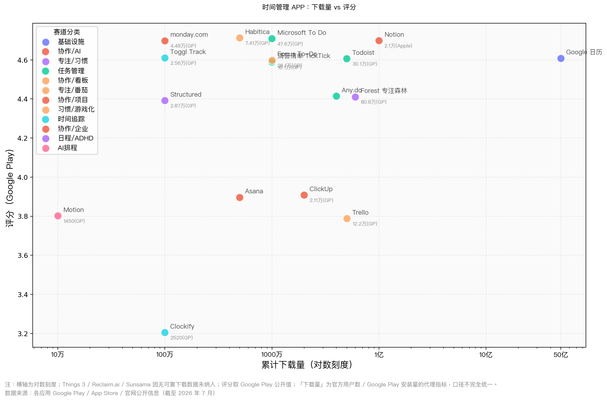
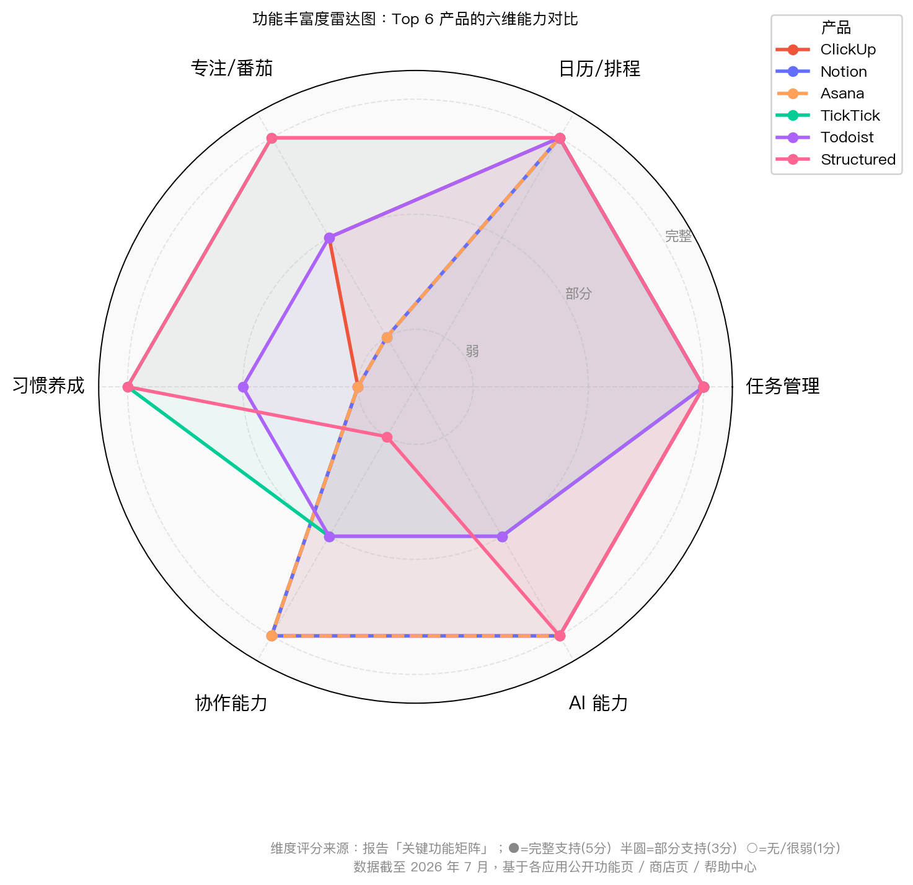

# 时间管理 APP 市场深度研究报告

## 执行摘要

本报告以 **2023–2026 年公开信息** 为主，选取了当前市场上最值得关注、且与你正在开发的时间管理产品最相关的 **TOP 20 时间管理 APP / 服务**。入选标准不是单纯“下载量最大”，而是综合了 **公开用户规模、应用商店表现、是否持续在 2024–2026 年迭代、是否覆盖关键场景（任务、日历、专注、习惯、团队、AI、时间追踪）** 之后形成的样本池。样本覆盖四条主赛道：**轻量任务管理、AI 自动排程、团队/项目协作、专注/时间追踪**。

核心结论有五点。
第一，**个人效率市场的“全能型”赢家主要是 TickTick、Todoist、Structured**：它们把待办、提醒、日历、专注、习惯或时间线视图做到了较高整合度，其中 TickTick 更像“个人效率瑞士军刀”，Todoist 更像“轻量团队 + 个人任务中枢”，Structured 则抓住了 **ADHD / 时间块 / 时间线规划** 需求。 

第二，**团队与 AI 协作市场的强势玩家是 ClickUp、Asana、monday.com、Notion、Motion、Reclaim.ai**。其中 ClickUp、Asana、monday.com、Notion 都在 2025–2026 年将 AI 从“智能助手”推进为 **agents / teammates / workflow automation**；Motion 与 Reclaim.ai 则把 AI 主要用于 **自动排程、冲突重排、焦点时间防守**。这代表未来时间管理产品的高端竞争，已经从“记录任务”转向“自动编排时间”。 

第三，**专注与成瘾管理赛道仍然非常强势**。Forest 的官方口径与应用商店文案都表明它已积累 **6000 万+ 用户 / 下载级别规模**，说明“专注承诺机制 + 情感反馈 + 轻社交”仍是大众需求；Focus To-Do 则证明“番茄钟 + 任务清单”的低学习成本组合，在安卓端仍具很强普适性。 

第四，市场存在明显空缺：**要么功能强但复杂，要么轻便但不够完整，要么 AI 强但价格高，要么隐私与数据治理说不清楚**。这意味着你们的新产品如果能把 **“个人效率的一体化体验” + “不吓人的 AI 自动排程” + “更强隐私承诺” + “中文本土体验”** 结合起来，仍然有明确机会。这个判断可以从 TickTick/Structured/Todoist 的个人效率优势、Motion/Reclaim 的自动排程优势、以及 Notion/ClickUp/Asana 的团队协作强势但复杂度偏高的格局中看出来。 

第五，商业模式上，**免费层广、升级路径清晰、学生/教育折扣、团队席位增购** 仍是最常见且最有效的做法；但在 AI 产品里，2025–2026 年开始出现 **AI credits / 限额 / 只付费不免费** 的趋势，Motion、ClickUp、Notion、monday.com 都在往这条路上走。对新产品而言，如果你的目标不是企业级大客单，定价一定要避免“过早重 AI 税”。 

## 研究方法与样本边界

本次样本将“时间管理 APP”定义为：**能帮助用户完成任务管理、时间规划、专注执行、习惯形成、项目推进、协同或时间复盘中的至少两项以上核心活动** 的产品。基于这个定义，报告没有只选传统 to-do list，也没有只选番茄钟，而是纳入了 **任务管理、日历/排程、AI 时间编排、团队 work management、专注/时间追踪** 五大类产品。

“最热”采用的是**多因素综合热度**，不是单一榜单。具体代理指标按优先级依次使用：**官方用户量/客户量公开口径**、**Google Play 累计下载量**、**App Store / Google Play 评分与评分数**、**2024–2026 是否持续更新**、**是否被官方主页突出宣传关键新功能**。因此，本报告里的“用户量排名”本质上是 **公开规模代理值排名**，不同产品之间并非完全同口径，可直接横比的程度有限。尤其是：有些公司公开的是 **注册用户数**，有些公开的是 **客户数 / 组织数**，有些只能用 **Google Play 安装量** 替代。报告在相关位置均做了标注。 

评分部分采用的是**公开商店综合判断**。当产品同时存在 iOS 和 Android 公开评分时，报告优先综合参考 **Google Play 的全球评论量** 与 **App Store 的可抓取评分数**；当产品仅在某一平台有可靠公开信息时，则使用该平台分数。由于 **App Store 的评分数具有国家/地区差异**，而 Google Play 的公开口径通常更接近全球，因此评分排名更适合看作“**相对口碑趋势**”，不宜理解为绝对精确的横向统一分布。 

功能丰富度、付费性价比、协作能力、隐私强度四个维度不是商店原生指标，而是本报告基于公开信息做的**分析性评分**。其中功能丰富度主要看：**任务管理、番茄/专注、日历同步、习惯、项目、协作、提醒/重复、时间追踪、报告、AI、模板、跨端/离线** 等能力；隐私强度主要看：**是否声明不向第三方出售/分享、是否传输加密、是否支持删除、是否有 SOC 2 / ISO / 企业信任中心、是否明确 AI 不训练用户数据**。这些排名是有方法论支撑的推断，不等同于厂商自述的官方结论。 

## TOP 20 汇总对比

下表先给出适合产品经理快速浏览的横向总表。**“公开规模代理值”优先使用官方用户数，其次使用 Google Play 下载量，再其次使用客户/组织数。** “评分概览”采用“Google Play / App Store”格式；若某平台无可靠公开值，则写“未找到/无”。各行末尾均附上来源。

| 应用 | 赛道定位 | 主要平台 | 公开规模代理值 | 累计下载量 | 评分概览 | 付费模式 | 一句话市场定位 |
|---|---|---|---|---|---|---|---|
| Google 日历 / Google Calendar | 日历与预约排程 | iOS / Android / Web / Watch | 5B+ 下载代理 | Google Play 50亿+ | GP 4.6 / App Store 4.2（971） | 免费；部分预约和企业能力随 Google Workspace/Google One 付费 | 日历基础设施型产品，强在生态与共享。 |
| Microsoft To Do | 免费待办清单 | iOS / Android / Web / Windows | 10M+ 下载代理 | Google Play 1000万+ | GP 4.7 / App Store 4.8（5.9万） | 免费 | 微软生态里的“零门槛待办中枢”。|
| Todoist | 个人与轻团队任务中枢 | iOS / Android / Web / Windows / macOS / Linux | 50M+ 用户 | Google Play 1000万+ | GP 4.6 / App Store 4.7（3333） | 免费 + Pro / Business 订阅 | 个人效率与轻团队协作的平衡型代表。 |
| 滴答清单 / TickTick | 全能个人效率 | iOS / Android / Web / Windows / macOS | 10M+ 下载代理 | Google Play 1000万+ | GP 4.6 / App Store 未稳定抓取 | 免费 + Premium | 任务、日历、番茄、习惯一体化程度很高。 |
| Any.do | 待办 + 日历 + 轻协作 | iOS / Android / Web / Watch | 40M+ 用户 | Google Play 1000万+ | GP 4.4 / App Store 4.8（2692） | 免费 + Premium / Teams | 面向家庭与轻团队的“提醒/日历/清单”一体化。 |
| Things 3 | Apple 生态 GTD | iPhone / iPad / Mac / Watch / Vision | 未公开 | 未公开 | App Store 4.8（2.8万） / 无 GP | 一次性付费 | Apple 端体验与设计标杆。 |
| Structured | 时间线式日程管理 | iOS / Android / Web / Mac / Watch | 1.5M 月活 | Google Play 100万+ | GP 4.4 / App Store 4.8（16.2万） | 免费 + Pro 订阅 / 终身买断 | 对 ADHD、时间块规划、可视化日程非常强。|
| Notion | 文档 + 项目 + AI 工作空间 | iOS / Android / Web / Windows / macOS | 1亿+ 用户 | Google Play 1000万+ | GP 未稳定抓取评分数 / App Store 4.7（2.1万） | 免费 + Plus / Business / Enterprise | 用一个平台替代多工具的“工作与知识中枢”。 |
| Trello | 看板协作 | iOS / Android / Web / Windows / macOS | 5000万注册用户 | Google Play 1000万+ | GP 3.8（12.2万） / App Store 4.3（6900） | 免费 + Standard / Premium / Enterprise | 轻量看板协作的长期头部产品。 |
| Asana | 项目与工作管理 | iOS / Android / Web / Windows / macOS | 未公开；以 500万+ 下载代理 | Google Play 500万+ | GP 约 3.9 / App Store 约 4.7（1.6万） | 免费 + Starter / Advanced / Enterprise | 中大型团队项目协作与资源管理强者。 |
| ClickUp | 全栈协作 + AI | iOS / Android / Web / Windows / macOS | 2000万+ 团队/用户信赖口径 | Google Play 100万+ | GP 3.9（2.11万） / App Store 4.7（9100） | 免费 + 订阅 + AI 加价 | 企图替代项目、文档、聊天、AI、时间追踪等所有工具。|
| monday.com | 工作管理平台 | iOS / Android / Web / Windows / macOS | 25万+ 客户 | Google Play 100万+ | GP 4.7（4.48万） / App Store 4.8（4.7万） | 免费试用 + 订阅 | 企业级工作流、自动化、AI blocks/agents 的代表。 |
| Motion | AI 自动排程 | iOS / Android / Web / 桌面 | 100万+ 专业人士/团队 | Google Play 10万+ | GP 3.8（1450） / App Store 4.1（1800） | 仅订阅，无永久免费 | 自动把任务、会议、项目排进日历的 AI 执行型工具。 |
| Reclaim.ai | AI 日历编排 | Web / Chrome / Google Calendar / Outlook | 未公开 | 未公开 | 商店评分未找到 | 免费 + 团队/企业付费 | “保护焦点时间”的 AI 日历层。 |
| Sunsama | 每日计划与工作节律 | Web / macOS / Windows / iOS companion | 未公开 | 未公开 | App Store 5.0（2） | 仅订阅；14 天试用 | “工作-生活平衡”导向的高客单日计划工具。 |
| Forest / 专注森林 | 专注 / 数字戒断 | iOS / Android / Web 扩展 / Watch | 6000万+ 用户 | 官方页面口径 6000万+；GP 1000万+ | GP 4.4（80.8万） / App Store 4.8（评分数未稳定抓取） | 免费 + Plus；历史买断用户保留权益 | 情感化专注产品的全球代表。 |
| Focus To-Do | 番茄钟 + 任务 | iOS / Android / macOS / Windows | 10M+ 下载代理 | Google Play 1000万+ | GP 4.6（28.1万） / App Store 4.7（20） | 免费 + 内购 | “低门槛番茄钟 + 待办”组合拳。 |
| Clockify | 时间追踪与报表 | iOS / Android / Web / Windows / macOS | 700万+ 用户 | Google Play 100万+ | GP 3.2（2520） / App Store 4.6（3800） | 免费 + 高级/企业 | 偏团队与企业的免费时间追踪器。 |
| Toggl Track | 时间追踪与盈利分析 | iOS / Android / Web / Windows / macOS | 官方称“used by millions” | Google Play 100万+ | GP 4.6（2.56万） / App Store 4.8（848） | 免费 + Starter / Premium | 设计更轻、更强调非监控式时间追踪。 |
| Habitica | 游戏化习惯与任务 | iOS / Android / Web / Wear OS | 500万+ 下载代理 | Google Play 500万+ | GP 4.7（7.41万） / App Store 4.0（348） | 免费 + 订阅 / Group Plans | 把任务、习惯、打卡做成 RPG 游戏。 |

图表使用的是上表可获得的**公开规模代理值**与**综合商店评分**；未公开规模的数据未放入散点图。横轴为对数刻度，所以能把 Google Calendar 这类超级基础设施型产品，与 Motion、Structured 这类高增长但体量较小的产品放在同一张图里看。图中可以清楚看到：**大体量不等于高评分**，而 **Structured、Microsoft To Do、Toggl Track** 等产品在口碑坐标上更靠近右

## TOP 20 逐款信息卡

下面按“**表格化条目**”给出每款产品的要点。为控制篇幅，每张信息卡把你要求的字段合并到四行中：**基本信息、功能与差异化、优缺点与目标用户、隐私/竞品/更新/来源**。

**Google 日历 / Google Calendar**

| 维度 | 信息 |
|---|---|
| 基本信息 | 开发商 Google；平台 iOS / Android / Web / Apple Watch；公开规模代理值以 Google Play 50 亿+ 安装计；App Store 中国区 4.2 分、971 个评分；Google Play 为头部大体量应用；付费模式是基础免费，预约页和部分企业功能附着在 Google Workspace/Google One 付费中。 |
| 功能与差异化 | 以**日历、共享、任务、预约、Meet 集成、工作地点、多人空闲时间查看**为核心，强项不是番茄钟或习惯，而是“时间基础设施”。差异化在于 Gmail / Meet / Workspace 的深集成，以及团队空闲时间和多日历叠加视图。 |
| 目标用户与优缺点 | 适合已经把生活或工作绑定在 Google 生态中的个人、家庭和轻团队。优点是共享能力、生态整合、跨端稳定；短板是任务/项目管理深度不足，番茄、习惯、统计分析弱。主要竞品是 Apple Calendar、Outlook Calendar、Motion、Reclaim.ai。 |
| 隐私 / 更新 / 来源 | Google 日历帮助页强调内容“安全存储在数据中心”，Workspace 层还提供 DLP 与安全检查项；但 App Store 同时显示其会收集较广泛的与身份关联数据，隐私保护属于“强企业安全、但数据面较大”型。近两年重要更新包括 **2025 年 Outlook 互操作性改进** 与 **2026 年自定义事件颜色扩展**。可信来源：官方产品页、App Store、Workspace Updates、隐私帮助页。 |

**Microsoft To Do**

| 维度 | 信息 |
|---|---|
| 基本信息 | 开发商 Microsoft；平台 iOS / Android / Web / Windows；规模代理以 Google Play 1000 万+ 下载计；Google Play 4.7、47.6 万评论；App Store 中国区 4.8、5.9 万评分；付费模式为免费。 |
| 功能与差异化 | 核心功能包括 **我的一天、列表、子任务、备注、提醒、重复、文件附件、共享清单、Outlook 任务同步、多端同步**。差异化不是“功能最多”，而是**免费、简洁、微软生态联动强**。它明显偏“低摩擦任务管理”而非项目管理。 |
| 目标用户与优缺点 | 适合学生、家庭用户、微软办公用户，以及刚从原生提醒事项升级的人。优点是免费、干净、跨端稳定；短板是看板、番茄、习惯、深度项目流和统计分析能力不足。主要竞品是 Todoist、Google Tasks、Apple Reminders、TickTick。 |
| 隐私 / 更新 / 来源 | 微软官方隐私页与 Trust Center 强调隐私控制与企业数据保护；整体属于“企业级治理成熟但数据处理范围较广”的典型 SaaS。近两年没有检索到像 AI Teammates 那样的大里程碑，更多是**持续版本迭代**，如 Windows 商店显示 2026-06-23 仍有更新。可信来源：Google Play、App Store、Microsoft To Do 产品页、Microsoft Privacy。 |

**Todoist**

| 维度 | 信息 |
|---|---|
| 基本信息 | 开发商 Doist；平台 iOS / Android / Web / Windows / macOS / Linux / 浏览器扩展；官方与商店口径显示 **5000 万+ 个人与团队** 使用；Google Play 1000 万+ 下载、4.6 分、30.1 万评论；App Store 中国区 4.7 分、3333 个评分；免费 + Pro / Business 订阅。 |
| 功能与差异化 | 核心功能覆盖 **任务、子任务、项目、板块、标签、优先级、截止日/循环任务、提醒、日历视图、模板、团队共享、评论、跨端同步**。新差异化在于 **Todoist Assist** 与 **Ramble/语音转任务**，但它仍保持“不过度膨胀”的轻量定位。 |
| 目标用户与优缺点 | 适合重度个人效率用户、自由职业者、夫妻/家庭、以及不想上来就用 Asana/ClickUp 的小团队。优点是上手快、跨平台全、语义录入强、团队边界清晰；短板是原生番茄/习惯相对弱，复杂资源协同不如 Asana/ClickUp。主要竞品是 TickTick、Microsoft To Do、Things 3、Trello。 |
| 隐私 / 更新 / 来源 | Doist 隐私政策区分个人场景下的 controller 与组织场景下的 processor；Todoist Assist 页面明确提到与符合隐私政策的数据处理供应商合作，且**不会用这些处理来训练模型**。近两年最重要的公开节点是 **2025 定价上调** 与 **2026 持续周更 changelog / AI 能力扩展**。可信来源：官方主页、Google Play、App Store、隐私政策、价格说明、AI 说明。 |

**滴答清单 / TickTick**

| 维度 | 信息 |
|---|---|
| 基本信息 | 开发商 TickTick Limited / Appest；平台 iOS / Android / Web / Windows / macOS / Wear OS；Google Play 1000 万+ 下载、4.6 分、16.1 万评论；App Store 中国区可抓取到订阅与更新信息，但评分数页面抓取不稳定；付费模式为免费 + Premium。 |
| 功能与差异化 | TickTick 是个人市场里功能最“满”的产品之一，覆盖 **任务、子任务、标签/优先级、日历、Pomo、白噪音、习惯、协作、清单共享、倒数日、时间线、跨端同步、AI 语音录入、录音总结**。它的最大差异化是把本来分散在 3–4 个效率工具里的功能压缩进一个产品里。 |
| 目标用户与优缺点 | 适合追求“一站式个人效率系统”的学生、知识工作者和小团队。优点是功能密度高、性价比高、本土中文体验强；短板是界面复杂度比 Todoist 更高，团队流程深度仍弱于 Asana/ClickUp。主要竞品是 Todoist、Any.do、Structured、Habitica。 |
| 隐私 / 更新 / 来源 | TickTick 隐私政策说明会收集账号信息、匿名聚合使用数据；安全页说明数据存储在 AWS，任务、账号、支付信息**静态加密**，并有漏洞监控与 72 小时 breach notification 承诺。最近两年重要更新包括 **2024 iOS 18/Tab Bar 自定义**、**2025–2026 AI 语音与录音摘要、Countdown** 等。可信来源：Google Play、App Store、功能页、隐私页、安全页、更新页。 |

**Any.do**

| 维度 | 信息 |
|---|---|
| 基本信息 | 开发商 Any.DO；平台 iOS / Android / Web / Apple Watch；App Store 页面写明 **5000 万+ 用户**；Google Play 1000 万+ 下载；App Store 中国区 4.8 分、2692 个评分；免费 + Premium 订阅 + 团队协作。 |
| 功能与差异化 | 核心能力包含 **任务、日历、提醒、地点提醒、循环、子任务、附件、共享列表、分配、语音输入、多端同步**。差异化在于把 **家庭、个人、轻团队** 三类场景揉在了一起，且“位置提醒”与“日历-待办融合”做得比多数任务应用更突出。|
| 目标用户与优缺点 | 适合家庭事务管理、轻团队共享、日程提醒型用户。优点是任务与日历结合自然、共享列表成熟；短板是项目管理不够深、AI 和分析能力一般。主要竞品是 TickTick、Todoist、Microsoft To Do。|
| 隐私 / 更新 / 来源 | App Store 隐私显示其可能用于跨 App/网站追踪的字段包括购买、联系方式和标识符，整体隐私强度低于“不追踪”型产品。最近两年未检索到强里程碑级发布，但商店页显示 2026 年仍在持续更新，价格与订阅方案清晰。可信来源：App Store、官方主页、Google Play。 |

**Things 3**

| 维度 | 信息 |
|---|---|
| 基本信息 | 开发商 Cultured Code；平台 iPhone / iPad / Mac / Apple Watch / Vision Pro；用户量与下载量未公开；App Store 4.8 分、2.8 万评分；付费模式为**一次性买断**，不同 Apple 设备单独购买。 |
| 功能与差异化 | 核心功能是 **GTD 风格的任务/项目/Area/标签/日程/搜索/Siri/日历集成/Things Cloud 同步**。差异化并不在“功能多”，而在 **Apple 原生体验、交互完成度、设计一致性**。它坚持不做复杂团队工作流。 |
| 目标用户与优缺点 | 适合 Apple 重度用户、个人 GTD 党、重视设计与稳定的人。优点是体验和完成度极高、无订阅焦虑；短板是只适合 Apple 生态、无 Android/Web、团队协作弱。主要竞品是 Todoist、Microsoft To Do、TickTick、OmniFocus。 |
| 隐私 / 更新 / 来源 | App Store 隐私只显示与身份关联的用户内容以及未关联的诊断数据，相对克制。近两年最重要更新是 **3.21 / 3.22 系列对 iOS 18、iOS 26、watchOS 26、Apple Watch 控制按钮与小组件的适配**。可信来源：App Store、官方价格页、支持页、博客。 |

**Structured**

| 维度 | 信息 |
|---|---|
| 基本信息 | 开发商 unorderly GmbH；平台 iOS / Android / Web / Mac / Apple Watch；App Store 文案给出 **每月 150 万人使用**；Google Play 100 万+ 下载、4.4 分、2.87 万评论；App Store 4.8 分、16.2 万评分；免费 + Pro 订阅 + 终身买断。 |
| 功能与差异化 | Structured 把 **任务、日历、习惯、时间块、时间线、番茄钟、重复任务、通知、AI Planner、Replan 自动改排** 做成一个视觉时间轴。它最大的差异化是 **ADHD / 神经多样性友好** 与“看一眼就知道今天怎么过”的低认知负担。 |
| 目标用户与优缺点 | 特别适合学生、自由职业者、ADHD 用户、时间块实践者。优点是可视化强、移动端体验优秀、易于坚持；短板是团队协作弱、项目管理深度有限。主要竞品是 TickTick、Sunsama、Motion、Google Calendar。 |
| 隐私 / 更新 / 来源 | App Store 隐私显示其会收集与身份关联的联系信息与用户内容，同时还有部分不与身份关联的购买/标识符/诊断数据；相比广告驱动产品仍较克制。重要节点包括 **2024 年定价调整** 与 **2026 年 AI Planner 持续增强**。可信来源：App Store、Google Play、官方主页、帮助中心、隐私页。 |

**Notion**

| 维度 | 信息 |
|---|---|
| 基本信息 | 开发商 Notion Labs；平台 iOS / Android / Web / Windows / macOS；官方披露 **全球用户超 1 亿**；App Store 中国区 4.7 分、2.1 万评分；Google Play 页面显示其为“AI 应用，包罗万象”，但抓取口径里未稳定返回评论数；免费 + Plus / Business / Enterprise。 |
| 功能与差异化 | 核心覆盖 **文档、知识库、数据库、项目、任务、自动化、模板、企业搜索、AI Meeting Notes、Notion Agent / Custom Agents**。差异化在于：它不是单纯任务应用，而是把“知识、任务、流程、AI”放进同一工作空间。 |
| 目标用户与优缺点 | 适合从个人知识管理向团队协作过渡的产品、内容、运营、创业团队。优点是可塑性极高、模板生态大、AI 叠加快；短板是初始配置成本高，对纯个人“轻任务”用户可能过重。主要竞品是 ClickUp、Coda、Asana、Confluence。 |
| 隐私 / 更新 / 来源 | App Store 显示其会收集与身份关联的联系信息、用户内容、搜索历史、标识符、使用数据；企业和 AI 能力则通过 SSO、Enterprise Search、Agent 等增强治理。近两年重要节点包括 **2025 recurring automations / 模板工作流** 与 **2026 Custom Agents**。可信来源：官方博客、产品页、App Store、Google Play。 |

**Trello**

| 维度 | 信息 |
|---|---|
| 基本信息 | 开发商 Atlassian / Trello；平台 iOS / Android / Web；App Store 4.3 分、6900 评分；Google Play 3.8 分、12.2 万评论、1000 万+ 下载；官方宣传加入了“5000 万注册用户”社区。付费模式为免费 + Standard / Premium / Enterprise。 |
| 功能与差异化 | 核心功能是 **Boards、Lists、Cards、Checklist、Power-Ups、Inbox、Planner、日历同步、焦点时间、AI 摘要**。差异化在于可视化看板和极强的“先上手、后扩展”能力。 |
| 目标用户与优缺点 | 适合营销、内容、小团队项目、个人看板党。优点是视觉清晰、扩展生态成熟、多人协作自然；短板是移动端体验和评分不如头部 to-do 产品，复杂项目层级能力不如 Asana/ClickUp。主要竞品是 Asana、monday.com、ClickUp、Notion。 |
| 隐私 / 更新 / 来源 | Trello 支持文档强调默认隐私与可见性控制，Enterprise 还提供集中安全控制；但 App Store 隐私显示其会收集联系信息、标识符、使用数据、诊断等。近两年重要更新是 **2025 年 Planner 上线，支持 Google / Outlook 日历连接和专注时间安排**。可信来源：App Store、Google Play、Atlassian 支持文档。 |

**Asana**

| 维度 | 信息 |
|---|---|
| 基本信息 | 开发商 Asana；平台 iOS / Android / Web / Windows / macOS；公开用户量未找到统一口径，规模以项目管理全球头部定位与商店下载代理；付费模式为免费 + Starter / Advanced / Enterprise。 |
| 功能与差异化 | Asana 核心强项是 **项目、任务、依赖关系、Portfolios、Goals、Reporting、Timesheets、资源管理、自动化、AI Teammates**。近两年更新节奏非常明显：**Fall 2024、Winter 2025、Fall 2025、Winter/Spring 2026** 连续发布新一代 AI 与资源管理能力。 |
| 目标用户与优缺点 | 适合中大型团队、跨部门项目、PMO、营销/研发组织。优点是流程治理、目标/项目/资源一体化很强；短板是个人使用显得偏重，学习曲线和价格都高于轻量产品。主要竞品是 ClickUp、monday.com、Jira、Smartsheet。 |
| 隐私 / 更新 / 来源 | Asana Trust 页面强调加密、最小权限、安全开发与公开 bug bounty；Trust Center 也提供自助安全文档。整体隐私安全处于企业 SaaS 的较强梯队。可信来源：官方定价页、Trust 页面、产品发布页、论坛 release notes。 |

**ClickUp**

| 维度 | 信息 |
|---|---|
| 基本信息 | 开发商 Mango Technologies；平台 iOS / Android / Web / Windows / macOS；官方与商店文案给出 **2000 万+ 团队/用户信赖** 口径；Google Play 100 万+ 下载、3.9 分、2.11 万评论；App Store 4.7 分、9100 评分；免费 + 分层订阅 + AI 加价。 |
| 功能与差异化 | ClickUp 覆盖面极广，包含 **项目管理、文档、聊天、白板、仪表盘、时间追踪、预算/资源、AI Super Agents、Brain、Meeting / Calls、CRM、审批**。它是本样本里功能“最全”的一类产品之一。 |
| 目标用户与优缺点 | 适合希望在一个平台集中项目、文档、沟通、AI 的团队。优点是功能覆盖广、可配置性强；短板是移动端口碑明显弱于 Web 叙事，上手复杂。主要竞品是 Asana、monday.com、Notion、Wrike。 |
| 隐私 / 更新 / 来源 | ClickUp 公开 security policy 与 AI pricing，说明其已把 AI 视为独立收费与治理对象。隐私/安全强度中上，但由于产品面非常宽、接入多，治理复杂度也更高。2025–2026 的大方向是**从工作管理平台升级为 AI Workspace / Agents 平台**。可信来源：Google Play、App Store、定价页、安全政策。 |

**monday.com**

| 维度 | 信息 |
|---|---|
| 基本信息 | 开发商 monday.com Ltd.；平台 iOS / Android / Web / 桌面；官方口径为 **25 万+ 客户**；Google Play 100 万+ 下载、4.7 分、4.48 万评论；App Store 4.8 分、4.7 万评分；订阅制。 |
| 功能与差异化 | 核心能力包括 **工作流、板视图/表格/甘特、自动化、集成、仪表板、AI blocks、AI agents、开放平台**。近两年最关键的变化是产品定位从 work management 向 **work execution / AI work platform** 明显升级。 |
| 目标用户与优缺点 | 适合跨部门团队、销售/运营/市场/IT 等流程密集型组织。优点是流程可配置性强、企业就绪度高；短板是价格与座位策略不够轻巧，对纯个人用户过重。主要竞品是 Asana、ClickUp、Airtable、Smartsheet。 |
| 隐私 / 更新 / 来源 | monday.com 公开 SOC 2 Type II、ISO 27001 / 27018、OWASP 等安全与合规信息，企业信任中心成熟。近两年大里程碑是 **Elevate 2025 上线 monday agents / magic / vibe / sidekick**。可信来源：客户页、定价页、Trust Center、What’s New、投资者页。 |

**Motion**

| 维度 | 信息 |
|---|---|
| 基本信息 | 开发商 Nexusbird / Motion；平台 iOS / Android / Web / 桌面；Motion 官网页与商店页给出 **100 万+ busy professionals and teams** 口径；Google Play 10 万+ 下载、3.8 分、1450 评论；App Store 4.1 分、1800 评分；付费模式为订阅制，无永久免费层。 |
| 功能与差异化 | 它的核心不是记录任务，而是 **自动优先级排序、自动把任务塞进时间块、会议协调、项目协作、AI Agenda、AI Calendar**。Motion 的产品哲学非常明确：让系统替你做“时间分配决策”。 |
| 目标用户与优缺点 | 适合繁忙职业人士、管理者、咨询/销售等会议密集角色，也适合小团队。优点是自动排程能力突出；短板是价格高、免费门槛高、移动端评价中等。主要竞品是 Reclaim.ai、Sunsama、SkedPal。 |
| 隐私 / 更新 / 来源 | Motion 官网与安全页强调 **SOC 2 Type II、传输与静态加密**；隐私政策更新时间为 2025-06-27。近两年重要公开节点包括 **Motion v3** 与 **AI Agenda / AI Task Manager / AI Calendar** 的强化。可信来源：定价页、官网、安全页、隐私政策、帮助中心、商店页。 |

**Reclaim.ai**

| 维度 | 信息 |
|---|---|
| 基本信息 | 开发商 Reclaim；主要平台 Web，作为 Google Calendar / Outlook Calendar 的 AI 编排层；用户量未公开；付费模式为免费 + 团队/企业订阅。 |
| 功能与差异化 | 核心能力是 **AI Focus Time、AI Habits、AI Tasks、Smart Meetings、Scheduling Links、Calendar Sync、AI Time Tracking、Workforce Analytics**。差异化在于它不是替代日历，而是“叠加在现有日历之上的智能编排引擎”。 |
| 目标用户与优缺点 | 适合 Google/Outlook 重度用户、时间碎片化的知识工作者、分布式团队。优点是焦点时间防守与自动编排逻辑清晰、免费层存在；短板是原生任务/文档体验弱于 Motion / Notion / ClickUp。主要竞品是 Motion、Clockwise、Sunsama。 |
| 隐私 / 更新 / 来源 | Reclaim 明确写出 **No AI training on your data**，支持删除时自动清除日历数据，还公开 **SOC 2 Type II**。2025–2026 的亮点更新包括 **改进 Smart event forms、Slack 升级、Year in Review / Reclaim Recapped**。这是本样本里隐私表述最清晰的产品之一。可信来源：官网、定价页、安全页、帮助中心、产品更新页。 |

**Sunsama**

| 维度 | 信息 |
|---|---|
| 基本信息 | 开发商 Summay；平台 Web / macOS / Windows / iOS companion；用户量未公开；官网价格为月付 22 美元、年付 17 美元/月，提供 14 天试用；App Store 评分样本量极小。 |
| 功能与差异化 | 核心能力为 **每日计划、Weekly Objectives、Pomodoro、双向日历同步、分析、Zapier、AI + MCP、任务导入、多工具聚合**。其差异化不是 AI 最强，而是“帮助专业人士以更平静的节律完成一天”。 |
| 目标用户与优缺点 | 适合高收入知识工作者、产品经理、自由职业者、容易被任务洪水淹没的人。优点是日计划体验极强、节律感好；短板是价格高、移动端是 companion、团队深度有限。主要竞品是 Motion、Structured、Todoist、Akiflow。 |
| 隐私 / 更新 / 来源 | Sunsama 主页强调 **SOC2 与 SAML/SSO**，隐私政策明确写出“我们从不出售你的数据”。2026 年 changelog 仍在高频更新，如 **Sunny 记住偏好**、移动端与看板细节增强。可信来源：官网、定价页、隐私政策、changelog。 |

**Forest / Forest 专注森林**

| 维度 | 信息 |
|---|---|
| 基本信息 | 开发商 Seekrtech；平台 iOS / Android / 浏览器扩展 / Apple Watch；官网与商店口径均显示 **6000 万+ 用户 / 下载**；Google Play 1000 万+ 下载、4.4 分、80.8 万评论；官网同时给出 App Store 4.8 星；付费模式现为免费 + Forest Plus，历史买断用户保留权益。 |
| 功能与差异化 | 核心能力是 **专注倒计时、种树承诺机制、应用阻断、Digital Wellbeing 工具、好友共专注、现实植树公益连接**。差异化非常清晰：不是“做项目”，而是“用损失厌恶 + 情绪反馈 + 游戏化”帮你离开手机。 |
| 目标用户与优缺点 | 适合学生、备考、深度工作、戒手机用户。优点是情绪激励强、品牌辨识度高；短板是任务与项目管理能力弱。主要竞品是 Focus To-Do、Opal、Freedom、One Sec。 |
| 隐私 / 更新 / 来源 | 中国大陆版隐私政策更新时间为 **2025-03-14**，强调最小必要、安全保护等原则。近两年关键产品节点是 **Forest Plus 订阅逐步推广** 与 **2026 对旧 Premium 买断用户权益保留**。可信来源：官网、FAQ、Google Play、隐私政策。 |

**Focus To-Do**

| 维度 | 信息 |
|---|---|
| 基本信息 | Android 官方条目显示开发商为 Shenzhen Tomato Software Technology / SuperElement 相关口径；平台 iOS / Android / macOS / Windows；Google Play 1000 万+ 下载、4.6 分、28.1 万评论；App Store 4.7 分、20 个评分；免费 + 内购。由于商店存在同名条目，iOS 数据只采用与产品描述一致的官方主条目。 |
| 功能与差异化 | 核心是 **Pomodoro timer + task management + reminders + habit tracker + time tracker**。它的差异化在于不走“全平台大而全”，而是坚持“先把专注和任务闭环做顺”。 |
| 目标用户与优缺点 | 适合学生、备考、自习、轻职场任务管理。优点是学习成本低、口碑稳定；短板是团队协作、AI 与复杂项目能力不足。主要竞品是 Forest、TickTick、Flora、Pomofocus。 |
| 隐私 / 更新 / 来源 | App Store 隐私页显示其可能收集但不与身份关联的数据包括用户内容与标识符；整体比广告密集产品更克制，但企业级治理公开信息不多。可信来源：Google Play、App Store。 |

**Clockify**

| 维度 | 信息 |
|---|---|
| 基本信息 | 开发商 CAKE.com；平台 iOS / Android / Web / Windows / macOS；官方写明 **700 万+ 用户**；Google Play 100 万+ 下载、3.2 分、2520 评论；App Store 4.6 分、3800 评分；免费 + 高级/企业。 |
| 功能与差异化 | 核心覆盖 **计时器、工时表、项目、计费、日历、报告、审批、排班、休假、费用、发票**。差异化在于“**免费层很强**，而且偏团队管理与财务场景”。 |
| 目标用户与优缺点 | 适合自由职业者、代理商、咨询团队、小型服务业公司。优点是免费层极强、报表价值高；短板是移动端安卓评分偏低，体验感不像 Forest/Todoist 那样“悦己型”。主要竞品是 Toggl Track、Harvest、Hubstaff。 |
| 隐私 / 更新 / 来源 | Clockify 价格页公开 EU/UK/US/AU 数据托管、SSO 等企业能力；整体更偏企业级信任建设。2026 年移动端仍持续迭代，App Store 版本记录可见大量修复与 UX 强化。可信来源：官网、定价页、Google Play、App Store。 |

**Toggl Track**

| 维度 | 信息 |
|---|---|
| 基本信息 | 开发商 Toggl OÜ；平台 iOS / Android / Web / Windows / macOS / Apple Watch；官方称桌面/产品“used by millions”；Google Play 100 万+ 下载、4.6 分、2.56 万评论；App Store 4.8 分、848 评分；免费 + Starter / Premium。 |
| 功能与差异化 | 功能覆盖 **一键计时、项目/客户/标签、报表、日历导入、番茄模式、收藏、提醒、小组件、离线同步**。差异化不在“全能”，而在**足够轻、足够清楚地让你看见时间去哪了**。 |
| 目标用户与优缺点 | 适合自由职业者、设计/开发、代理商、计费型团队。优点是移动端口碑好、时间追踪体验轻；短板是任务/项目协作不是它的主要场景。主要竞品是 Clockify、Harvest、Timely。 |
| 隐私 / 更新 / 来源 | Toggl 的安全与反监控立场非常突出：其公开写明**不会做屏幕录制、位置跟踪、按键记录、摄像头监控**，同时公布 ISO / security 文档。对时间追踪类产品而言，这一定位非常稀缺。可信来源：Google Play、App Store、隐私政策、安全页、反监控声明。 |

**Habitica**

| 维度 | 信息 |
|---|---|
| 基本信息 | 开发商 HabitRPG, Inc.；平台 iOS / Android / Web / Wear OS；Google Play 500 万+ 下载、4.7 分、7.41 万评论；App Store 4.0 分、348 评分；免费 + 订阅 + Group Plans。 |
| 功能与差异化 | 核心功能是 **习惯、每日任务、待办、连胜、升级、装备、宠物、挑战、组队、社交督促、提醒、小组件、跨端同步**。差异化极强：它把任务和习惯系统做成 RPG，长期激励机制与社群性明显强于普通任务应用。 |
| 目标用户与优缺点 | 适合需要外部激励的人、ADHD、自律打卡、社群共学。优点是游戏化强、免费层好玩；短板是严肃项目管理与日历/时间块能力薄弱。主要竞品是 Finch、Forest、Streaks、TickTick 习惯模块。 |
| 隐私 / 更新 / 来源 | Google Play 数据安全显示其可能与第三方分享部分个人信息和性能数据，但也支持传输加密与删除。2026 年仍保持更新，且翻译与开源社区活跃。可信来源：官网、Google Play、App Store、Group Plans。 |

## 排名、Top 10 与关键功能矩阵

下面的排名分成六个维度。需要特别强调两点：
其一，**用户量排名**使用“公开规模代理值”，口径不完全统一；
其二，**功能丰富度 / 性价比 / 协作 / 隐私** 是基于公开功能页、隐私页、价格页、更新页做的分析性评分，而不是厂商自评分。

**用户量 Top 10**
按“官方用户数优先，其次 Google Play 下载量，其次客户/组织数”排序：

| 排名 | 应用 | 公开规模代理值 | 说明 |
|---|---|---|---|
| 1 | Google 日历 | 50 亿+ 下载 | 基础设施型产品，远超其他时间管理应用。 |
| 2 | Notion | 1 亿+ 用户 | 任务不只是其中一部分，但已进入时间管理主战场。 |
| 3 | Forest | 6000 万+ 用户/下载 | 专注赛道的体量远高于多数人预期。 |
| 4 | Todoist | 5000 万+ 用户 | 个人与轻团队任务管理的全球头部。 |
| 5 | Trello | 5000 万注册用户 | 看板协作老牌巨头。 |
| 6 | Any.do | 4000 万+ 用户 | 家庭/个人事务管理体量可观。|
| 7 | ClickUp | 2000 万+ 团队/用户信赖口径 | 高增长，但口径偏“信赖/团队”。|
| 8 | Microsoft To Do | 1000 万+ 下载 | 免费心智极强。|
| 9 | TickTick | 1000 万+ 下载 | 中文场景与全能功能拉动增长。|
| 10 | Focus To-Do | 1000 万+ 下载 | 番茄钟赛道仍有巨大安卓需求。|

**评分 Top 10**
口径：以公开商店口碑做综合判断，**总样本明显过小的产品不进榜**。

| 排名 | 应用 | 评分判断 | 说明 |
|---|---|---|---|
| 1 | Things 3 | App Store 4.8 / 2.8万 | 设计与稳定性优势极强。|
| 2 | Structured | App Store 4.8 / 16.2万；GP 4.4 / 2.87万 | 高评分且评论量大。 |
| 3 | Microsoft To Do | GP 4.7 / 47.6万；App Store 4.8 / 5.9万 | 免费产品里口碑极佳。 |
| 4 | monday.com | GP 4.7 / 4.48万；App Store 4.8 / 4.7万 | 企业协作中少见的高口碑。 |
| 5 | Habitica | GP 4.7 / 7.41万 | 强动机人群喜欢它。|
| 6 | Notion | App Store 4.7 / 2.1万；美区 4.8 / 8.8万 | 通用工作空间类中口碑突出。 |
| 7 | Toggl Track | GP 4.6 / 2.56万；App Store 4.8 / 848 | 时间追踪类体验最稳。 |
| 8 | Todoist | GP 4.6 / 30.1万；App Store 4.7 / 3333 | 长期稳定。 |
| 9 | TickTick | GP 4.6 / 16.1万 | 评分与功能密度都很强。|
| 10 | Focus To-Do | GP 4.6 / 28.1万 | 番茄钟 + 待办的完成度高。|

**功能丰富度 Top 10**

| 排名 | 应用 | 判断 |
|---|---|---|
| 1 | ClickUp | 项目、文档、聊天、AI、时间追踪、审批、CRM、会议几乎全覆盖。 |
| 2 | Notion | 文档、数据库、项目、模板、Agent、搜索、AI 速记与知识库一体。 |
| 3 | TickTick | 个人时间管理功能最全：任务、日历、番茄、习惯、倒数日、协作、AI 录入。 |
| 4 | Asana | 项目、资源、报告、时间表、AI Teammates、治理强。 |
| 5 | monday.com | 工作流、自动化、仪表板、AI blocks / agents、企业治理完整。 |
| 6 | Todoist | 功能深度不如协作平台，但对个人/轻团队已相当全面。 |
| 7 | Motion | 自动排程、项目、会议、日历、AI Agenda，面向“执行安排”。 |
| 8 | Reclaim.ai | AI Focus/Task/Habit/Meetings/Analytics 的时间编排组合很独特。|
| 9 | Sunsama | 日计划、周目标、双向日历同步、分析、Pomodoro、AI。 |
| 10 | Structured | 时间线 + 习惯 + AI + Replan，让日程执行体验很完整。 |

下图把 **Top 功能丰富型产品** 的能力结构拆成六个维度。你会看到：ClickUp、Asana、monday.com 的优势在 **协作、项目、自动化**；TickTick 的优势在 **个人执行层**；Todoist 相对均衡；Notion 的强项在 **知识与 AI 中枢**。这对你们做产品定位非常关键。

**付费性价比 Top 10**

| 排名 | 应用 | 结论 |
|---|---|---|
| 1 | Microsoft To Do | 免费且跨端完成度高，性价比极强。 |
| 2 | Habitica | 免费层可玩性和长期激励很强。 |
| 3 | TickTick | Premium 定价相对克制，功能密度极高。 |
| 4 | Clockify | 免费层对团队都很能打。 |
| 5 | Reclaim.ai | 有免费层，且 AI 时间编排价值明确。 |
| 6 | Focus To-Do | 免费 + 内购，适合番茄刚需人群。 |
| 7 | Google 日历 | 对基础排程几乎“零成本”。 |
| 8 | Todoist | 免费可用，Pro 升级清晰，但 2025 提价。 |
| 9 | Structured | 免费够用，Pro/终身买断给了选择。 |
| 10 | Forest | 免费可用，新 Plus 在增值内容上更合理。 |

**企业 / 团队协作能力 Top 10**

| 排名 | 应用 | 结论 |
|---|---|---|
| 1 | ClickUp | 团队协作、资源、审批、文档、聊天、AI 一体。 |
| 2 | Asana | 流程治理、Portfolio、Reporting、Timesheets 非常强。 |
| 3 | monday.com | 自动化、集成、AI blocks/agents、企业控制成熟。 |
| 4 | Notion | 在知识协同和轻项目方面极强，尤其适合产品/运营/内容团队。 |
| 5 | Trello | 看板协作依然经典，适合中小团队。 |
| 6 | Clockify | 时间记录、审批、报表、计费更偏团队经营。 |
| 7 | Google 日历 | 共享、空闲时间、预约、Meet，协作基础设施属性强。 |
| 8 | Motion | 小团队排程协作有特色，但不是重流程平台。 |
| 9 | Reclaim.ai | 适合团队层面的时间策略与焦点时间治理。 |
| 10 | Toggl Track | 在时间追踪型团队协作中很强。 |

**隐私保护强度 Top 10**

| 排名 | 应用 | 结论 |
|---|---|---|
| 1 | Reclaim.ai | 明确写出不训练你的数据、支持快速删除，并公开 SOC 2 Type II。 |
| 2 | Toggl Track | 公开安全文档完备，且明确反监控立场。 |
| 3 | Todoist | AI 不训练用户数据，SOC2 Type II，Doist Trust Center 明确。 |
| 4 | Motion | SOC 2 Type II、传输与静态加密公开写明。 |
| 5 | monday.com | SOC 2、ISO 27001/27018、Trust Center 成熟。 |
| 6 | Sunsama | 明确“从不出售数据”，且 SOC2 / SAML 面向企业。 |
| 7 | Things 3 | 数据收集面相对克制，买断制减少持续商业化压力。 |
| 8 | Asana | 企业级 Trust Center、加密与治理说明完善。 |
| 9 | TickTick | 明确静态加密、AWS 托管、漏洞监测与通知承诺。 |
| 10 | Clockify | 企业级托管地区、SSO、审批与权限治理完善。 |

**关键功能矩阵**
标注规则：**● 完整支持；◐ 部分支持；○ 无/很弱**。
说明：矩阵用于产品比较，不代表细枝末节完全一致；同一行所列能力均来自该产品的公开功能页 / 商店页 / 帮助中心。

| 应用 | 任务 | 日历/时间块 | 番茄/专注 | 习惯 | 项目管理 | 协作 | 提醒/重复 | 时间追踪/报告 | AI 助理 | 模板/跨端 |
|---|---|---:|---:|---:|---:|---:|---:|---:|---:|---:|
| Google 日历 | ◐ | ● | ○ | ○ | ○ | ● | ◐ | ○ | ○ | ● |
| Microsoft To Do | ● | ◐ | ○ | ○ | ○ | ◐ | ● | ○ | ○ | ● |
| Todoist | ● | ● | ◐ | ◐ | ◐ | ◐ | ● | ◐ | ◐ | ● |
| TickTick | ● | ● | ● | ● | ◐ | ◐ | ● | ◐ | ◐ | ● |
| Any.do| ● | ● | ◐ | ◐ | ◐ | ◐ | ● | ○ | ○ | ● |
| Things 3 | ● | ◐ | ○ | ○ | ◐ | ○ | ● | ○ | ○ | ◐ |
| Structured | ● | ● | ● | ● | ◐ | ○ | ● | ◐ | ● | ● |
| Notion | ● | ● | ○ | ○ | ● | ● | ● | ◐ | ● | ● |
| Trello | ● | ● | ◐ | ○ | ● | ● | ● | ◐ | ◐ | ● |
| Asana | ● | ● | ○ | ○ | ● | ● | ● | ● | ● | ● |
| ClickUp | ● | ● | ◐ | ○ | ● | ● | ● | ● | ● | ● |
| monday.com | ● | ● | ○ | ○ | ● | ● | ● | ● | ● | ● |
| Motion | ● | ● | ◐ | ○ | ● | ● | ● | ◐ | ● | ● |
| Reclaim.ai| ● | ● | ○ | ● | ◐ | ◐ | ● | ● | ● | ◐ |
| Sunsama | ● | ● | ● | ◐ | ◐ | ◐ | ● | ● | ● | ● |
| Forest | ○ | ○ | ● | ◐ | ○ | ◐ | ◐ | ● | ○ | ◐ |
| Focus To-Do | ● | ◐ | ● | ◐ | ○ | ○ | ● | ● | ○ | ● |
| Clockify | ◐ | ● | ◐ | ○ | ● | ● | ◐ | ● | ○ | ● |
| Toggl Track | ◐ | ● | ● | ○ | ◐ | ◐ | ◐ | ● | ○ | ● |
| Habitica | ● | ○ | ◐ | ● | ○ | ◐ | ● | ◐ | ○ | ● |

## 结论与对你方产品的建议

从这 20 个样本看，时间管理市场已经很清晰地分成了三层。**底层是基础记录层**：Google Calendar、Microsoft To Do、Todoist 让用户“记下来、不忘记”；**中层是执行系统层**：TickTick、Structured、Forest、Focus To-Do 帮用户“今天真的做出来”；**高层是编排与协同层**：Notion、Asana、ClickUp、monday.com、Motion、Reclaim.ai 试图替用户“安排时间和组织资源”。新产品如果只是再做一个“待办清单”，竞争空间会非常窄；如果能把“记录层 + 执行层”先做强，再逐步接入“编排层”，成功概率会高很多。 |

我建议你们的功能优先级按下面来做。**第一优先级**，一定要把“低摩擦输入”做好，包括：自然语言录入、语音录入、统一收件箱、重复任务、强提醒、跨端同步、日历双向同步。这是 Todoist、TickTick、Microsoft To Do 之所以留存高的最基本原因。**第二优先级**，加入“执行层”能力：番茄钟、时间块、今天视图、周视图、自动重排、习惯/例程、轻统计。Structured、TickTick、Forest、Focus To-Do 都证明用户真正愿意留下来，是因为它们帮助用户把“计划”转换成“今天该怎么做”。**第三优先级**，在此基础上上 AI，但 AI 不应先变成聊天框，而应先变成：**自动拆解任务、自动建议时段、自动把任务装进日历、自动生成周回顾**。Motion、Reclaim.ai 和 Notion 的方向已经证明，“编排型 AI”比“炫技型 AI”更有产品价值。 |

差异化机会我认为有四个。第一，**中文用户友好的“一体化个人执行系统”仍有空间**。TickTick 最接近，但它已经很重；Todoist 更轻但不足以覆盖番茄/习惯；Structured 强在日程可视化，却不适合复杂任务系统。第二，**“AI 只做时间编排，不喧宾夺主”** 是机会。很多产品现在把 AI 做得过重、过贵；而大多数人真正想要的是“帮我决定今天先做什么”。第三，**隐私透明度可以成为竞争点**：多数产品都写隐私政策，但真正把“是否训练模型、是否可一键导出删除、是否默认不开广告追踪”说清楚的产品不多。第四，**面向 ADHD / 学生 / 年轻知识工作者的视觉执行体验** 仍有非常大空间，Structured 与 Forest 已经证明这不是小众需求。 |

定价上，我不建议一开始学习 Motion 或 Sunsama 的高价策略。更合理的做法是：**免费层足够强，先让用户建立日常依赖；专业版主要卖“自动排程、无限日历同步、深度统计、AI 助理、团队共享”；团队版再卖“协作、权限、审计、管理员控制、SAML/SSO”**。如果你们主打中文个人市场，价格带可以参考 TickTick / Forest / Structured 一侧，而不是直接跟 Motion / Sunsama 站在一起。一个更稳妥的定价框架是：个人 Pro 控制在 **低于国际 AI 工具半价** 的位置，团队版做阶梯席位，给教育和学生折扣。 |

隐私与合规建议必须从第一天就写进产品定义，而不是后补。建议你们至少做到：**传输与静态加密、可导出、可删除、清晰的数据保留周期、AI 默认不训练用户数据、AI 供应商列表透明、企业版提供 DPA / 审计日志 / SSO、国内市场同时考虑 PIPL，海外市场对齐 GDPR 基本要求**。如果未来要走团队版或海外版，尽早向 **SOC 2 Type II** 靠拢会比后面补成本更低。Reclaim.ai、Todoist、Motion、monday.com、Asana、Toggl Track 这些样本已经给出一个很清楚的方向：**好的时间管理产品，不只是帮用户更高效，也要让用户放心把“时间、任务、会议、脑中想法”交给你。** |

最后，如果你让我把市场定位用一句话概括出来，我会建议你们不要做“又一个待办应用”，而是做：**一个面向中文知识工作者与学生的、隐私可信的、视觉友好的、AI 辅助编排的个人执行系统**。在竞争格局上，它将位于 **TickTick 的全能、Structured 的执行、Todoist 的轻盈、Motion/Reclaim 的自动排程** 之间。这个位置目前依然没有被谁完整占住。