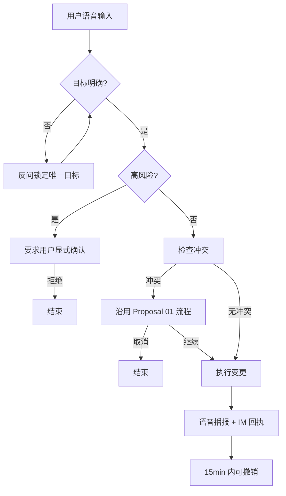

# Proposal: 已有日程变更与周期控制

## 动机 / 用户故事

| 场景 | 描述 | 痛点 |
| --- | --- | --- |
| 场景1：临时调整单次日程 | 我每天的日程都是17:30写日报，但是今天我要进行路演，需要延迟到19:00 | 手动修改一次提醒可能会影响后续提醒，或者需要我自己后续手动改回，很不便利 |
| 场景2：因外部原因变更日程时间 | 我今天本来是10:00开会的，但是会议室坏了需要维修，下午才能修好，故会议推迟到下午，需要修改我的日程 | 我需要打开日程安排，自己手动修改我的日程 |
| 场景3：跳过一次周期事项 | 我每周五都要去跑步，但是这周我有事要忙，不能跑步了，我想要跳过本周事项，但是不修改周期日程 | 我需要手动打开日程安排，本周关闭这个日程，后续再打开 |
| 场景4：删除一次性日程 | 我下周一下午三点有一个一次性会议，现在取消了，想彻底删掉 | 需要手动打开日程应用逐条翻找删除，操作繁琐 |
| 场景5：删除整个周期系列 | 我之前设的“每周一早会”已经不再需要了，想把整个周期事项都删掉 | 不敢直接在应用里点删除，怕误删其他日程或错过确认 |
| 场景6：撤销刚说错的修改 | 我刚说“把周五例会改到周六”，但其实我想说的是另一件事，想反悔 | 改完已经触发 IM 推送，得手动再改回来，麻烦且留痕混乱 |
| 场景7：撤销误删除 | 我刚说“删除下周一的那次会议”，说完就后悔了，想恢复到删除前的状态 | 删除后需要手动重新创建同名日程，容易遗漏参会人与时间信息 |

## 目标用户
- 需要暂时修改或者永久修改自己的日程，并希望能通过语音交互而不是进行繁琐点击交互
- 需要跳过一次日程，但是手动操作繁琐，且容易遗漏
- 改/删之后发现弄错了，想快速反悔而不用手动复原或重新创建的用户

## 现有做法及其不足

| 当前做法                      | 不足           |
| ------------------------- | ------------ |
| 手动变更一次日程后续再自己改回来，或是手动变更修改 | 需要手动变更，缺乏自动化 |
| 手动跳过一次（自己关闹钟）             | 操作繁琐，且容易遗忘   |
| 改/删之后发现弄错了，再手动改回去或重新创建    | 需要记住原始信息，且已触发 IM 推送，留痕混乱；误删后还会丢失参会人、地点等元数据 |

## 本期范围与明确不做

做：
- **修改单次日程**：用户通过语音修改只发生一次的日程（如标题、时间、地点、备注），修改成功后语音播报并发送 IM 回执。
- **跳过日程**：用户通过语音跳过本次日程（单次日程等同取消，周期日程仅影响本次实例），跳过成功后语音播报并发送 IM 回执。
- **修改周期实例（仅本次）**：用户通过语音只修改一个周期实例而不影响后续，修改成功后语音播报并发送 IM 回执。
- **修改周期事项（本次及以后）**：用户通过语音永久修改一项周期事项，修改成功后语音播报并发送 IM 回执。
- **删除日程**：用户通过语音删除单次日程或整个周期系列（高风险操作），删除成功后语音播报并发送 IM 回执。
- **高风险操作确认**：用户进行永久删除周期系列、修改周期事项（本次及以后）等高风险操作前，必须先获得用户显式确认，未确认不执行。
- **歧义消解**：用户修改日程时若命中多个候选，应通过反问锁定唯一目标后再执行。
- **不存在提示**：用户修改一个不存在的日程时，语音提示日程不存在并不执行任何变更。
- **冲突处理遵循 Proposal 01**：修改/跳过/删除日程时，如与已有日程发生时间冲突，沿用 Proposal 01 中定义的冲突检测与用户确认流程，不重复定义行为。
- **撤销**：用户可通过语音撤销最近一次成功的变更（包含修改、跳过、删除），撤销窗口为 15 分钟（按自然时间计算，跨会话也计入），超过窗口的不允许撤销；撤销成功后语音播报并发送 IM 回执。

不做：
- 批量修改或批量跳过多项日程（一次语音只对应一个目标）
- 语音创建新的日程或提醒（属于 Proposal 01）
- 语音对已有提醒表达"知道了"或延迟提醒（属于 Proposal 02）
- 自动为用户选取修改范围（"本次"还是"本次及以后"必须由用户明确指定）
- 冲突的处理（仅复用 Proposal 01 的冲突处理约定）
- 完整的工作日、节假日、调休日等复杂周期规则（仅支持简单"每天/每周/每月"等基础周期）
- 嵌套周期与周期例外（exception）的高级管理（如"每周一三五，但跳过下周—下周三"等组合）
- 跨日历源的日程读取与同步（如 Google/Exchange/飞书日历的拉取与回写）
- 跨时区与夏令时处理（仅以用户当前时区为准）
- 通过语音查询/列出日程（"我今天有什么"不在本期范围）

## 关键决策与依据

用户修改日程时有歧义
- 备选方案 A：询问细节进行确认
- 备选方案 B：命中最匹配的一项

选择 A，理由：需要用户阐明，避免改错

撤销时间窗口
- 备选方案 A：5 分钟（太短，易遗漏）
- 备选方案 B：15 分钟
- 备选方案 C：30 分钟（太长，占用资源、易误撤）

选择 B，理由：平衡“误操作后能否来得及反悔”与“减少长时间状态不一致带来的资源占用与误撤风险”；超出 15 分钟后只能通过手动再修改。

撤销是否覆盖删除
- 备选方案 A：撤销只覆盖修改与跳过（删除不可逆）
- 备选方案 B：撤销覆盖全部成功变更（含删除）

选择 B，理由：删除是高风险但常可补错的操作；不提供撤销会使用户叠加负担重建日程与参会人；高风险另有显式确认环节作为前置防线。

撤销窗口是否跨会话
- 备选方案 A：仅限当前会话，退出/超时后失效
- 备选方案 B：按自然时间计算，跨会话也计入

选择 B，理由：用户误删后可能在其他终端才发现（例如手机上删除、桌面端才看到参会人异议），跨会话不计入会导致“不能反悔”的隐性边界；按自然时间计算更可预测，但需要服务端持久化撤销记录。

## 基本概念与信息结构

### 核心概念

| 概念    | 含义                                      |
| ----- | --------------------------------------- |
| 单次日程  | 只发生一次的日程，例如“今天下午三点开会”                   |
| 周期事项  | 按固定规则重复发生的事项，例如“每周五下午五点提交周报”            |
| 周期实例  | 周期事项中的某一次，例如“本周五这一次周报”                  |
| 高风险操作 | 可能影响后续安排，有一定影响范围等事项                     |
| 本次    | 只改变当前指定的一个周期实例                          |
| 本次及以后 | 从指定实例开始改变后续安排，之前的实例保持不变                 |
| 跳过    | 对周期事项只影响一个实例，下一次仍按原周期继续；对单次事项等同取消，确认后执行 |
| 删除    | 移除指定日程或周期系列，属于高风险操作                     |
| 撤销    | 在 15 分钟内可恢复最近一次变更前的状态（包含修改、跳过、删除），按自然时间计算，跨会话也计入；超出窗口不允许撤销 |

### 变更流程

## 原型 / Demo

Todo

## 验收标准

成功路径：
- 用户语音交互修改一次单次事项时无冲突，完成修改，语音回复修改成功，并发送IM回执
- 用户语音交互修改一个周期实例，而不影响后续时，完成修改，语音回复单次修改成功，并发送IM回执
- 用户语音交互修改一个周期事项，并影响后续时，完成修改，语音回复周期事项修改成功，并发送IM回执
- 用户语音交互删除一个单次日程时，完成删除，语音回复删除成功并发送IM回执
- 用户语音交互删除一个周期系列时，系统先要求用户显式确认；用户确认后完成删除，语音回复删除该系列并发送IM回执；用户未确认则不执行删除
- 用户语音交互跳过一个周期事项时，仅该实例被跳过，后续实例不受影响，语音回复跳过成功并发送IM回执
- 用户语音交互跳过一个单次日程时，等同取消（本次取消后该日程不再生效），语音回复跳过成功并发送IM回执
- 用户语音交互要求撤销之前修改的事项时，完成恢复，语音回复撤销成功并发送IM回执
- 用户语音交互要求撤销之前删除的事项时，完成恢复，语音回复撤销删除成功并发送IM回执
- 用户在 15 分钟内跨会话（例如退出 App 后重进）发起撤销时，仍应成功恢复

异常路径：
- 用户语音交互要求撤销距离上次成功变更超过 15 分钟的操作时，系统拒绝撤销，语音提示超过撤销窗口
- 用户在一次成功变更后连续发起第二次“撤销”时，系统拒绝，语音提示无更多可撤销的变更
- 用户语音交互修改/删除一个不存在的日程时，语音提示日程不存在并不执行任何变更
- 用户通过语音交互修改日程时有歧义，系统应反问锁定唯一目标后再执行；确认为唯一后完成修改，语音回复修改成功并发送IM回执
- 用户语音交互修改一个日程与已有日程冲突时，沿用 Proposal 01 的冲突处理约定；不重复定义行为
