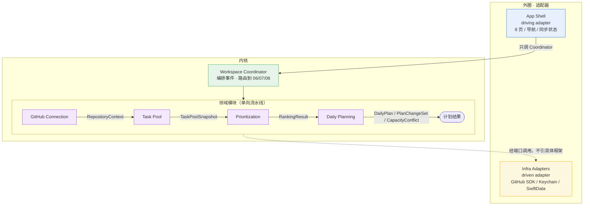
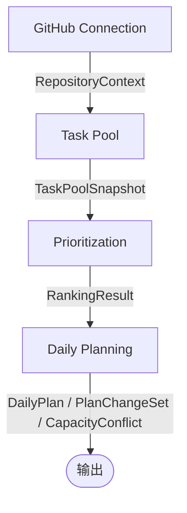

## 一、模块依赖

整体为六边形结构：内核是四个领域模块经 Workspace Coordinator 串联的单向流水线；外圈是两个方向的适配器——上方 App Shell 为 driving adapter（从外向内驱动 Coordinator），下方 Infra Adapters 为 driven adapter（被内核经端口调用）。依赖永远朝内指。



依赖方向永远朝内指：`App Shell → Coordinator → 领域`，`领域 → Infra`；领域之间为下游消费上游的单向流。

内核流水线（前后依赖，单向）：



约束：

- 后级模块只能消费前级输出，不能直接访问前级数据库。
- GitHub Token 不允许跨模块传递。
- GitHub 事实、个人规划、每日安排分别由不同模型持有。
- 单机应用由 `Workspace Coordinator` 直接串联，不必引入消息队列。
- App Shell 只调 Workspace Coordinator，不直连领域模块；Infra 适配器只实现领域端口，不能反向定义业务模型。依赖方向永远朝内：外圈 → Coordinator → 领域，领域之间 = 下游消费上游，任何模块不得 import 下游模块。
- 领域模块是纯领域代码，不依赖 SwiftUI / SwiftData / GitHub SDK 等具体框架；这些只在两个适配器层出现。

---

## 二、GitHub Connection

### 职责

- GitHub 授权。
- 保存当前账户。
- 查询用户可访问的 Repository。
- 绑定唯一 Repository。
- 判断 Token 或仓库权限是否失效。

### 核心模型

```text
GitHubAccount
- userId
- githubUserId
- login
- avatarUrl

RepositorySummary
- repositoryId
- owner
- name
- visibility
- url

RepositoryBinding
- bindingId
- userId
- repository
- currentMilestoneNumber?
- status: active | reauthorization_required
- boundAt
- version

RepositoryContext
- bindingId
- userId
- actorLogin
- repositoryId
- repositoryFullName
- currentMilestoneNumber?      // 当前选定的 Milestone；P0 收敛版作用域含仓库 + 当前 Milestone
```

`RepositoryContext` 是唯一允许传给 Task Pool 的对象，不包含 Token。Milestone 作用域由 Task Pool 的 `TaskPoolScope` 承载（见第三节），`RepositoryContext` 携带当前 Milestone 是为了让同步范围与展示上下文一致。

### 对 UI 提供的接口

```text
startAuthorization()
→ AuthorizationChallenge

checkAuthorization(challengeId)
→ pending | authorized(GitHubAccount) | denied | expired

listAccessibleRepositories(query?, cursor?)
→ RepositoryPage

bindRepository(repositoryId, expectedVersion?)
→ RepositoryBinding

listMilestones(repositoryId, state?)
→ MilestonePage                    // state: open | closed | all；供用户选择当前 Milestone

setCurrentMilestone(repositoryId, milestoneNumber?, expectedVersion?)
→ RepositoryBinding                // 传入 nil 清除当前 Milestone，回到仓库全量

getConnectionState()
→ disconnected | connected | reauthorization_required

disconnect()
→ 保留本地任务与规划数据，只清除凭据
```

### 需要基础设施实现的端口

```text
GitHubAuthorizationProvider
CredentialStore
GitHubRepositoryCatalog
GitHubMilestoneCatalog
AccountStore
RepositoryBindingStore
```

### 输出事件

```text
GitHubConnected
RepositoryBound
RepositoryPermissionLost
GitHubDisconnected
```

---

## 三、Task Pool

### 职责

- 从绑定仓库读取 GitHub 数据。
- 识别与当前用户有关的 Issue、本人 PR、Review 请求。
- 去重并归一为 `PersonalAction`。
- 保存 GitHub 事实缓存。
- 保存用户私有规划字段。
- 根据 GitHub 变化更新个人行动状态。
- 同步失败时保留上次成功数据。

### 核心模型

#### 源节点缓存（GitHub 原始对象）

```text
SourceReference
- repositoryId
- githubNodeId
- kind: issue | pull_request | review_request
- number
- url
```

`kind` 含 `review_request`：Review 请求是与 Issue、PR 并列的源节点，有独立的 `githubNodeId`、`requestedAt` 与 `ReviewRequestFacts`，因此作为独立 source 进入 `evidenceSources`（见 `ActionIdentityResolver` 规则 3），而不是 PR 的属性。

唯一性约束（作用于源节点缓存，不直接决定个人行动数量）：

```text
bindingId + githubNodeId = 唯一 SourceRecord
```

`SourceRecord` 只是 GitHub 原始节点的事实缓存，Task Pool 不保证它和个人行动一一对应。个人行动的归并由 `ActionIdentityResolver` 完成（见下）。

#### 事实层（按源类型分形）

`GitHubFacts` 是分类型联合，Issue、PR、Review、Check 的事实字段不同，不能压成一个扁平枚举：

```text
GitHubFacts =
    IssueFacts {
        title
        issueState: open | closed
        assignees
        milestone
        labels
        updatedAt
    }
  | PullRequestFacts {
        title
        prState: open | draft | merged | closed
        author
        requestedReviewers
        reviewDecision: approved | changes_requested | review_required | none
        closesIssues[]            // 解析 "Closes #N" / "Part of #N" 得到关联 Issue number
        checksState: pending | success | failure | neutral
        mergedAt?
        updatedAt
    }
  | ReviewRequestFacts {
        pullRequestId
        reviewState: pending | approved | changes_requested | commented
        requestedAt
        updatedAt
    }
```

`Done` 是统一主状态（在 `PersonalAction.workStatus` 上），但展示原因按源类型区分：

```text
完成原因（workStatus = done 时的 statusReasons 候选）
- merged              PR 已合并
- closed_unmerged     PR 已关闭未合并
- issue_closed        Issue 已关闭
```

#### 个人行动（归并后的规划原子）

真实场景里一个个人行动常常由 Issue 加 PR 共同构成，例如 Issue #31 仍为 Open，但 PR #45 已提交等待 Review。模型必须支持一个行动挂多个源，否则会把 Issue 和 PR 拆成两个任务，或误判“PR 已提交 = Issue 完成”。

```text
PersonalAction
- actionId
- primarySource: SourceReference        // 决定行动标题与跳转入口
- evidenceSources[]: SourceReference    // 关联的 PR / Review 请求等佐证源
- githubFacts                           // primarySource 对应的 GitHubFacts
- personalPlanning
- workStatus: on_progress | pending_review | done
- statusReasons[]
- firstSeenAt
- lastSyncedAt
- version
```

#### 行动归并器

```text
ActionIdentityResolver
- 输入：SourceRecord[]（仓库内与当前用户相关的 Issue、本人 PR、Review 请求）
- 规则：
    1. PR 通过 closesIssues / partOf 引用关联到 Issue → 归并为同一行动，Issue 为 primarySource，PR 进 evidenceSources
    2. 无关联的裸 PR → 独立行动，PR 自身为 primarySource
    3. Review 请求 → 归并到对应 PR 所在的行动，进 evidenceSources
    4. 仅与本人相关、无 PR、无 Review 的 Issue → 独立行动，Issue 为 primarySource
- 输出：PersonalAction[] 的身份边界与 primarySource / evidenceSources 归属
```

`PersonalAction` 的唯一性由 `ActionIdentityResolver` 的归并结果决定，不等于 `bindingId + githubNodeId`。归并键稳定：同一 GitHub 节点集合在同样关联关系下始终归并为同一 `actionId`，避免重排时身份漂移。

#### 归并与拆分的身份、规划迁移

GitHub 关系变化会触发行动合并（裸 PR 新增 `Closes #N` 关联到既有 Issue）或拆分（关联消失）。这类变化是正常同步事件，不能因此静默丢失用户的优先级、预估、截止或手动顺序。迁移规则：

```text
合并（两个独立行动 → 一个行动）
- actionId 存活：以 primarySource 所在行动的 actionId 为准（规则 1 中 Issue 为 primarySource，故 Issue 行动的 actionId 存活；规则 3 中 PR 行动的 actionId 存活）。
- PersonalPlanning 合并择优（两份冲突时按下列优先级取值）：
    priority       取更高优先级（P0 > P1 > P2 > unset）
    hardDeadline   取更早的硬截止（null 视为最晚）
    estimatedEffortMinutes  优先取非 null（都非 null 取较大值，保留更保守预估）
    manualOrderKey 取非 null（都非 null 取较小值，靠前位置优先）
    blocked        任一为 true 则为 true
- evidenceSources 的 actionId 不存活，但其 PersonalPlanning 按上述规则并入存活行动。

拆分（一个行动 → 两个独立行动，因 closesIssues/partOf 关联消失）
- 原行动的 actionId 废弃，按当前节点集合重新归并生成新 actionId（每个独立源各得一个）。
- PersonalPlanning 跟随 primarySource 迁移：原规划字段整体跟随仍为 primarySource 的那一方；纯 evidenceSource 升格为独立行动时，规划字段置为默认值（priority=unset、estimate=null、manualOrderKey=null），blocked=false。
- 拆分产生的新行动进入待估算/规划池等区域由其字段重新判定，不继承原行动的 plan_bucket。
```

迁移产生的 `affectedActionIds` 记入 `SyncResult`，Coordinator 据此触发下游重排；规划字段的择优结果通过 `PlanChange` 的 `reasonCode`（如 `merge_planning_inherited`、`split_planning_reset`）可追溯。

状态与原因必须分开，例如：

```text
workStatus = pending_review
statusReasons = [waiting_for_review]

workStatus = on_progress
statusReasons = [changes_requested]

workStatus = done
statusReasons = [closed_unmerged]
```

#### 规划层（产品侧私有字段）

```text
PersonalPlanning
- priority: P0 | P1 | P2 | unset
- hardDeadline
- estimatedEffortMinutes
- manualOrderKey          // 有序分数键：同一硬截止分组内用户手动指定的相对位置；非整数槽位
- blocked
```

`manualOrderKey` 是有序分数键而非绝对槽位：在同一硬截止分组内，键值大小决定相对先后，新插入任务取相邻两键的中值，避免碰撞与全表 reindex。未手动拖拽的任务 `manualOrderKey = null`，由排序引擎按规则计算位置。键值经长期插入后可能精度退化，由 Task Pool 在同步或重排时按需压实（compaction）：组内按键值排序后重新均匀分配，保持相对顺序不变。

这里不保存 `plannedDate`。任务安排日期由 Daily Planning 独占，避免两个模块同时维护计划状态。

`estimatedEffortMinutes` 只保存用户确认后的值。AI 预估可作为后置建议呈现（见 `EffortSuggestionProvider`），但 Task Pool 不凭建议落库；缺值时任务带 `missing_estimate` 原因进入待估算区，由用户补填后才参与容量安排。

### 对应用层提供的接口

```text
syncTaskPool(scope, trigger)
→ SyncResult

getTaskPoolSnapshot()
→ TaskPoolSnapshot

listActions(filter, cursor?)
→ PersonalActionPage

getAction(actionId)
→ PersonalAction

updatePlanning(actionId, patch, expectedVersion)
→ PersonalAction

listPendingEffortSuggestions()
→ EffortSuggestionPage
```

`scope` 为同步作用域，P0 收敛版已明确首版选择一个 GitHub 仓库和当前 Milestone，同步范围不能只靠 Repository：

```text
TaskPoolScope
- bindingId
- repositoryContext
- milestoneNumber?      // 当前选定的 Milestone；为空表示仓库全量
```

`updatePlanning` 的 `patch` 覆盖优先级、硬截止、预估投入、手动顺序、阻塞标记。预估投入由用户在此直接补填或修改，Task Pool 只保存确认后的 `estimatedEffortMinutes`。

`listPendingEffortSuggestions` 返回缺预估且系统可给出后置建议的任务，供 UI 渲染“需要你确认预计投入”区。`EffortSuggestion` 带任务标识、`suggestedMinutes` 与依据，UI 逐项让用户接受或修改；接受后的落库仍走 `updatePlanning`，不经过独立“接受建议”接口。

`trigger` 包括：

```text
initial
app_launch
app_became_active
scheduled_refresh
manual_retry
```

### SyncResult

```text
SyncResult
- syncId
- status: succeeded | not_modified | failed
- addedSourceIds[]           // 新缓存的 GitHub 源节点
- updatedSourceIds[]         // 事实变化的源节点
- removedSourceIds[]         // 已消失的源节点
- affectedActionIds[]        // 归并后身份受影响的个人行动（新增/合并/拆分/更新）
- completedAt
- nextCheckpoint
- staleDataAvailable
- error?
```

`addedSourceIds / updatedSourceIds / removedSourceIds` 反映 GitHub 原始节点层的增删改；`affectedActionIds` 反映 `ActionIdentityResolver` 归并后落到个人行动层的结果——一次源变化可能让多个行动受影响（例如新 PR 引用 Issue #31，使 #31 行动新增 evidenceSource）。Coordinator 据 `affectedActionIds` 决定是否触发下游重排。

同步失败不能返回空任务池，应返回：

```text
status = failed
staleDataAvailable = true
```

### TaskPoolSnapshot

传给 Prioritization 的只读投影：

```text
TaskPoolSnapshot
- snapshotVersion
- generatedAt
- actions[]
```

### 需要基础设施实现的端口

```text
GitHubTaskReader
PersonalActionStore
SyncCheckpointStore
EffortSuggestionProvider
```

其中 `GitHubTaskReader` 只返回 GitHub 原始节点数据，不产生 `PersonalAction`，也不做归并：

```text
readChanges(scope, checkpoint, trackedSourceIds)
→ GitHubTaskDelta
```

`scope` 为 `TaskPoolScope`（含 Repository 与可选当前 Milestone），`GitHubTaskDelta` 只含源节点增删改；归并由领域层的 `ActionIdentityResolver` 在 Task Pool 内部完成，`GitHubTaskReader` 不感知个人行动。

`EffortSuggestionProvider` 只给出后置预估建议，不落库、不覆盖 `estimatedEffortMinutes`：

```text
suggestEffort(actionId, githubFacts, relatedSources)
→ EffortSuggestion?      // suggestedMinutes + 依据；可为空
```

`PersonalActionStore` 同时保存源节点缓存与归并后的 `PersonalAction`，以及 `primarySource / evidenceSources` 归属。---

## 四、Prioritization

### 职责

- 根据任务池快照产生稳定顺序。
- 为每项任务给出结构化排序理由。
- 校验手动拖动是否合法。
- 不修改任务字段。
- 不修改每日计划。
- 不写 GitHub。

建议将它设计成纯计算模块：同样的输入、时间和规则版本，必须产生同样的输出。

### 输入投影

Prioritization 不直接引用 `PersonalAction` 全量字段，只投影排序所需的视图。投影过程是确定的——从 `PersonalAction` 到 `PrioritizationCandidate` 的映射不含随机、不含时间派生（时间由 `asOf` 统一传入），每次同一快照得到同一 Candidate。

```text
PrioritizationCandidate
- actionId                          // ← PersonalAction.actionId
- workStatus                        // ← PersonalAction.workStatus
- statusReasons[]                   // ← PersonalAction.statusReasons
- priority                          // ← PersonalPlanning.priority
- hardDeadline                      // ← PersonalPlanning.hardDeadline
- estimatedEffortMinutes            // ← PersonalPlanning.estimatedEffortMinutes（已是分钟，不再换算）
- manualOrderKey                    // ← PersonalPlanning.manualOrderKey
- blocked                           // ← PersonalPlanning.blocked
- sourceUpdatedAt                   // ← PersonalAction.githubFacts.updatedAt（GitHub 上游更新时间，老化计算原点）
- firstSeenAt                       // ← PersonalAction.firstSeenAt
```

`workStatus`、`priority`、`statusReasons` 取值：

```text
workStatus: on_progress | pending_review | done
statusReasons 候选: waiting_for_review | changes_requested | blocked | missing_estimate | merged | closed_unmerged | issue_closed
priority: P0 | P1 | P2 | unset
```

**完成任务的输入边界**：`workStatus = done` 的任务退出可执行任务池与重排（见 Daily Planning），不进入排序候选。Coordinator 在构造 `candidates[]` 前过滤掉 done 任务——排序引擎只处理仍需用户行动的任务（`on_progress`），待评审（`pending_review`）是否参与排序由 Daily Planning 的 plan_bucket 决定，通常不进今日容量排序。

### 排序接口

```text
rank(request)
→ RankingResult
```

```text
RankingRequest
- taskPoolSnapshotVersion
- candidates[]
- asOf                  // 排序基准时间，"当下"的锚点；老化、24h 置顶都相对它计算
- policyVersion
```

纯计算约束：同一 `RankingRequest`（同一 `taskPoolSnapshotVersion` + 同一 `candidates` + 同一 `asOf` + 同一 `policyVersion`）必须产生完全相同的 `RankingResult`。排序引擎内部仅依赖确定逻辑，不含随机、不含黑盒权重。

```text
RankingResult
- rankingId
- sourceSnapshotVersion
- policyVersion
- generatedAt          // ≈ asOf 的实际执行时刻
- rankedItems[]
```

```text
RankedItem
- actionId
- position             // 0-based 最终排序位置
- deadlineGroup        // 截止/老化分组标签
- reasons[]            // 结构化排序理由，按层级顺序
```

```text
DeadlineGroup
- urgent               // DDL ≤ 24h，紧急置顶
- soon                 // 有 DDL 但 > 24h
- normal               // 无 DDL，老化级别 0（< 7 天）
- aging                // 无 DDL，老化级别 ≥ 1（≥ 7 天）
```

`done` 不作为 `DeadlineGroup` 取值：已完成任务不进入排序候选（见输入边界），没有排序分组。

### 排序原因

排序原因不能只返回展示文字，应返回原因代码；UI 再把代码转为“24 小时内到期”等可读文本。

```text
RankingReason
- code
- parameters
```

```text
RankingReasonCode
- due_within_24_hours        // DDL ≤ 24h 紧急置顶
- priority_p0                // 优先级 P0
- priority_p1                // 优先级 P1
- priority_p2                // 优先级 P2
- no_priority                // 未设优先级，归入 P2 组末
- earlier_deadline           // 同组内 DDL 更近
- no_hard_deadline           // 无 DDL，进入老化通道
- aging_raised               // 老化上浮
- shorter_estimate           // 预估用时更短
- missing_estimate           // 缺预估，排同档末尾
- review_requested           // 等待你的 Review
- manual_order_preserved     // 手动拖拽保留
- completed_sort             // 已完成，沉底（仅在“已结束”视图对 done 任务单独解释，不参与今日排序）
```

```text
RankingReasonParams        // 各 code 对应的结构化参数，按需携带
- hoursUntilDeadline?      // due_within_24_hours：距 DDL 几小时
- rankInUrgentGroup?       // due_within_24_hours：紧急组内排位（1-based）
- priorityValue?           // priority_p0/p1/p2："P0"|"P1"|"P2"
- abovePriority?           // priority_*：排在哪个优先级组之上
- deadline?                // earlier_deadline：DDL 日期（ISO）
- rankInDdlGroup?          // earlier_deadline：同 DDL 子组内排位（1-based）
- groupSize?               // earlier_deadline：同 DDL 子组大小
- daysSinceUpdate?         // no_hard_deadline：距上次更新天数
- daysInactive?            // aging_raised：未活动天数
- band?                    // aging_raised：老化分档 7to14 | 14to21 | over21
- rankInAgingGroup?        // aging_raised：同档内排位（1-based）
- estimatedMinutes?        // shorter_estimate：预估用时（分钟）；missing_estimate 恒为 null
- rankByEstimate?          // shorter_estimate：同组内按预估排位（1-based）
- manualPosition?          // manual_order_preserved：手动槽位（0-based）
- completedAt?             // completed_sort：完成时间（ISO）
```

`groupSize` / `rankInXxxGroup` 这组“组内排位 + 组大小”让 UI 能渲染“同 P0 组里 DDL 最近（3 天后）”这类带相对位置的依据。

### 手动拖动接口

```text
validateManualMove(request)
→ accepted(ManualOrderPatch) | rejected(reason)
```

```text
ManualMoveRequest
- actionId              // 被拖拽的任务
- beforeActionId?       // 拖到某任务之前（与 afterActionId 互斥）
- afterActionId?        // 拖到某任务之后
- rankingId             // 当前排序结果 ID，用于校验版本
- expectedSnapshotVersion   // 期望快照版本，检测并发冲突
```

校验规则：

- `beforeActionId` 与 `afterActionId` 互斥，同时提供则 `rejected("不能同时指定 before 和 after")`。
- 目标任务必须存在于当前快照中，否则 `rejected("任务不存在")`。
- `expectedSnapshotVersion` 与 `rankingId` 对应的快照版本一致，否则 `rejected("排序已过期，请刷新")`。
- `manualOrderKey` 计算：用有序分数键，不取目标绝对 `position`。设目标位置相邻两任务的键为 `lo` 与 `hi`（拖到最前 `lo = null` 视为 −∞，拖到最后 `hi = null` 视为 +∞），则新键 = `(lo + hi) / 2`。这样 `before` 与 `after` 可靠区分（落在不同区间），且不会与已有键碰撞。
- 键值精度退化时由 Task Pool 在写入时触发压实：组内按键排序后重新均匀分配键值，相对顺序不变；压实对用户不可见。

```text
ManualOrderPatch
- actionId
- manualOrderKey        // 有序分数键，非整数槽位
```

与实际写入分离：Prioritization 只返回应保存的 `manualOrderKey`，实际写入仍通过 Task Pool 的 `updatePlanning` 完成。

### 不应提供的接口

以下接口不属于排序模块：

- `setPlannedDate` — 设置计划日期属于容量/计划模块。
- `changeDailyCapacity` — 修改每日容量属于容量管理模块。
- `updateGitHubPriority` — 写回 GitHub 标签不属于本模块，本模块只读本地优先级字段。
- `automaticallyAcceptAISuggestion` — AI 介入排序调整属可选后置层，本模块不自动采纳。

---

## 五、Daily Planning

### 职责

- 管理每日容量。
- 消费排序结果并生成今日计划。
- 处理待估算、阻塞、待评审和规划池。
- 自动应用可执行的重排。
- 记录计划变化。
- 检测硬截止容量冲突。
- 不重新解释优先级。

### 核心模型

```text
defaultCapacityMinutes           // 默认每日容量，用户首次设置后沿用；由 Daily Planning / Workspace Settings 持有，不藏在 Task Pool
- minutes
- version
```

```text
DailyCapacityOverride            // 特殊日期覆盖；某天的实际容量 = override 存在则取 override，否则取 defaultCapacityMinutes
- date
- totalMinutes
- version
```

某日的有效容量解析：

```text
effectiveCapacity(date) =
    override = DailyCapacityOverride(date)
    override != null ? override.totalMinutes : defaultCapacityMinutes
```

`DailyCapacity` 不再作为按日期逐一保存的实体，改为“默认值 + 特殊日覆盖”两层：默认容量自动沿用（对应产品规则 5），只有用户显式调整的日期才产生 `DailyCapacityOverride`。这样避免“沿用默认”靠逐日复制实现、且和每日计划耦合过紧。

```text
PlanBucket
- today
- planning_pool
- pending_review
- blocked
- unestimated

`done` 不作为 PlanBucket 取值：任务完成后退出计划系统，不再持有计划位置。完成通过 `PlanChange` 的 `type = removed` 配合 `reasonCode = merged | closed_unmerged | issue_closed` 表达（对应原型“已结束”区的“已合并 / 已关闭未合并 / Issue 已关闭”标签）。任务被 Reopen 时 `workStatus` 回到 `on_progress`，重新获得 today 或 planning_pool 位置。
```

```text
DailyPlanItem
- actionId
- bucket
- order
- allocatedMinutes

`allocatedMinutes` 是计划生成时刻冻结的分配额，不等于每次现算的 `estimate if bucket == today else 0`：只有 today 取该任务 `estimatedEffortMinutes`，其余 bucket 恒为 0（阻塞、待评审、规划池、待估算都不占今日容量，见不变量 #6）。冻结后即使任务 estimate 被改动，本份计划显示的已安排量也不跳变，直至下一次 replan。
```

```text
DailyPlan
- planId
- date
- capacity
- items[]
- sourceSnapshotVersion
- rankingId
- version
```

```text
PlanChange
- actionId
- type: added | removed | reordered | bucket_changed
- fromBucket?
- toBucket?
- reasonCode
```

`reasonCode` 取值：

```text
capacity_insufficient        容量不足，移回 planning_pool
hard_deadline_sooner         硬截止提前，覆盖手动顺序
changes_requested_returned   PR 被打回，从待评审回到进行中并入计划
new_task_added               新任务进入并加入计划
date_rollover                跨日顺延，昨日未完成进入下一日
manual_order_applied         用户手动顺序生效
merged                       PR 已合并，任务移出计划
closed_unmerged              PR 已关闭未合并，任务移出计划
issue_closed                 Issue 已关闭，任务移出计划
```

完成类（`merged` / `closed_unmerged` / `issue_closed`）固定配 `type = removed`、`toBucket` 省略。

```text
PlanChangeSet
- changeSetId
- previousPlanVersion
- currentPlanVersion
- trigger
- causeEvent
- changes[]
- createdAt
```

`trigger`、`causeEvent`、`reasonCode` 分三层，职责不重叠：

```text
trigger     路由级 — 决定 Coordinator 跑哪条链（见第六节差异化表）
causeEvent  事件级 — 记录“到底发生了什么”，喂给页 07 的变化说明
reasonCode  任务级 — 每条 PlanChange 自己的原因
```

`trigger` 保持粗粒度；`causeEvent` 采用 Proposal 03 的事件粒度：

```text
new_task | pr_resubmitted | changes_requested | issue_reopened
| blocked | unblocked | hard_deadline_changed | task_closed | pr_merged | date_rollover
```

### 冲突解决决策（持久化）

`resolveCapacityConflict` 的 `manually_exclude` 与 `accept_late_risk` 必须持久化，否则下一次 sync / 容量变化 / 跨日重排会重建同样的候选，把被排除的任务重新塞回今日计划，或再次报同样的冲突。决策模型：

```text
ExclusionRecord              // 用户在硬截止冲突中手动移出的任务
- recordId
- actionId
- date                       // 作用日期
- scope: today_only | until_resolved   // 仅当日排除，或持续至任务状态变化
- reasonCode                 // manual_exclude
- createdAt
- version
```

```text
LateRiskAcceptance           // 用户明确接受可能延期
- recordId
- actionIds[]                // 接受延期的任务集合
- date
- scope: today_only | until_resolved
- gapMinutes                 // 接受时的缺口
- reasonCode                 // accept_late_risk
- createdAt
- version
```

`replan` 在选入今日计划前读取当日有效的 `ExclusionRecord`（排除对应 `actionId`）与 `LateRiskAcceptance`（容忍其超载、不再报冲突）。`scope = today_only` 的记录在日期切换后失效；`until_resolved` 的记录在任务 `workStatus` 变为 `done` 或用户显式撤销时清除。`increase_capacity` 不产生决策记录（它改的是容量，由 `DailyCapacityOverride` 持久化）。

### 容量管理接口

```text
getDefaultCapacity()
→ defaultCapacityMinutes

setDefaultCapacity(minutes, expectedVersion)
→ defaultCapacityMinutes

getCapacityOverride(date)
→ DailyCapacityOverride?

setCapacityOverride(date, totalMinutes, expectedVersion?)
→ DailyCapacityOverride

clearCapacityOverride(date, expectedVersion)
→ void                       // 清除后该日回到默认容量

getEffectiveCapacity(date)
→ CapacityResolution         // minutes + source(default | override)
```

### 重排接口

```text
replan(request)
→ ReplanOutcome
```

```text
ReplanRequest
- date
- trigger
- causeEvent
- taskPoolSnapshotVersion
- rankingResult
- candidates[]
- expectedPlanVersion?
```

`trigger` 包括：

```text
initial_plan
task_pool_changed
planning_fields_changed
manual_order_changed
capacity_changed
date_rolled_over
conflict_resolved
```

### 返回结果

```text
ReplanOutcome =
    applied {
        dailyPlan
        changeSet
    }
    |
    requires_resolution {
        currentPlan
        capacityConflict
    }
```

正常情况直接 `applied`，符合当前原型的自动重排。

### 容量冲突

```text
CapacityConflict
- conflictId
- date
- availableMinutes
- requiredMinutes
- gapMinutes
- conflictingActionIds[]
- version
```

```text
resolveCapacityConflict(conflictId, resolution, expectedVersion)
→ ReplanOutcome
```

支持的解决方式：

```text
increase_capacity(newTotalMinutes)    // 改容量，持久化为 DailyCapacityOverride
manually_exclude(actionId)            // 排除任务，持久化为 ExclusionRecord
accept_late_risk(actionIds)           // 接受延期，持久化为 LateRiskAcceptance
```

`manually_exclude` 与 `accept_late_risk` 的 `scope` 默认 `today_only`；若用户选择"持续至解决"则记 `until_resolved`。撤销决策：

```text
revokeConflictDecision(recordId, expectedVersion)
→ void                  // 清除 ExclusionRecord 或 LateRiskAcceptance，下次 replan 重新评估
```

“修改任务预计投入”不直接由该接口完成：

```text
TaskPool.updatePlanning(...)
→ Prioritization.rank(...)
→ DailyPlanning.replan(...)
```

---

## 六、模块串联接口

UI 不应该自行连续调用四个模块，建议增加应用层协调器：

```text
refreshWorkspace(trigger)
→ WorkspaceRefreshResult
```

内部流程：

```text
1. GitHub Connection.requireActiveRepository()   → 得到 RepositoryContext（含当前 Milestone）
2. Task Pool.syncTaskPool(scope, trigger)        → scope = RepositoryContext + 当前 Milestone
3. 若 syncResult.status == failed：短路，跳过 4-5，返回上次持久化的 ranking/plan（见不变量 #9）
4. Task Pool.getTaskPoolSnapshot()
5. Prioritization.rank()
6. Daily Planning.replan()
7. 返回同步摘要、排序结果和计划结果
```

**同步失败短路**：`syncResult.status == failed` 时，Coordinator 不执行排序与重排——从 stale 数据重排会产生新的计划版本和误导性变更史，尽管并未成功刷新。此时 `WorkspaceRefreshResult` 返回上次成功持久化的 `rankingResult` 与 `planningOutcome`，`syncResult` 标记 `staleDataAvailable = true`，App Shell 据此展示"保留上次数据 + 重试同步"。`not_modified` 不触发短路（数据无变化，可走轻量重排或直接返回缓存）。

```text
WorkspaceRefreshResult
- connectionState
- syncResult
- taskPoolSnapshotVersion
- rankingResult
- planningOutcome
- staleRankingAndPlan?      // 同步失败时为 true，表示 ranking/planning 为上次持久化值
```

不同变化只执行必要链路：

| 变化 | 调用链 |
|---|---|
| GitHub 数据变化 | Task Pool → Prioritization → Daily Planning |
| 修改优先级/截止/预计投入 | Task Pool → Prioritization → Daily Planning |
| 手动拖动 | Prioritization 校验 → Task Pool 保存 → Prioritization → Daily Planning |
| 切换当前 Milestone | GitHub Connection → Task Pool → Prioritization → Daily Planning |
| 修改默认容量 / 某日容量覆盖 | Daily Planning |
| 硬截止冲突·改预计投入 | Task Pool.updatePlanning → Prioritization.rank → Daily Planning.replan |
| 日期切换 | Prioritization → Daily Planning |
| 重新授权 | GitHub Connection → Task Pool → Prioritization → Daily Planning |

## 七、必须固定的接口不变量

1. GitHub Connection 永远不把 Token 传给其他模块。
2. Task Pool 同步只能更新 `GitHubFacts` 与源节点缓存，不能覆盖 `PersonalPlanning`；归并由 `ActionIdentityResolver` 在领域层完成，`GitHubTaskReader` 不感知个人行动。
3. Prioritization 不能保存或修改每日计划。
4. Daily Planning 不能改变优先级、硬截止和预计投入。
5. 缺少预计投入的任务可以进入排序，但不能进入今日容量安排；`estimatedEffortMinutes` 只保存用户确认后的值，AI 建议不落库。
6. 阻塞、待评审任务不占今日容量；Done 任务退出计划，不在 DailyPlan.items 中。
7. 相同输入和规则版本必须得到稳定排序。
8. 所有写操作携带 `expectedVersion`，防止同步与用户编辑互相覆盖。
9. 同步失败保留上次成功快照和计划，不能伪装成“没有任务”；Coordinator 在 `syncResult.status == failed` 时短路，不执行排序与重排，返回上次持久化的 ranking/plan，不产生新计划版本或变更史。
10. 任何模块都不能写回 GitHub Issue、PR、Review 或团队字段。
11. 每次重排必须携带 causeEvent，记录触发本次重排的具体事件，供变化说明追溯；trigger 只负责路由，不能替代事件级追溯。
12. 行动归并键稳定：同一 GitHub 节点集合在同样关联关系下始终归并为同一 `actionId`，避免重排时身份漂移。
13. 每日有效容量 = 该日 override 存在则取 override，否则取 `defaultCapacityMinutes`；默认容量由 Daily Planning 持有，不藏在 Task Pool。
14. 行动合并/拆分时 `PersonalPlanning` 必须按既定择优/迁移规则保留，不得因 GitHub 关系变化静默丢失优先级、预估、截止或手动顺序。
15. 冲突解决决策（`manually_exclude` / `accept_late_risk`）必须持久化并带作用域；`replan` 读取当日有效决策，不得在后续重排中重建已被排除的任务或重复报同一冲突。
16. App Shell 只持有 `WorkspaceCoordinator` 引用，所有用户操作经 Coordinator façade 方法，不直接调用领域模块；领域方法名不出现在 App Shell。

---

## 八、App Shell（driving adapter）

App Shell 是桌面端的外壳层，作为 driving adapter 从外向内驱动 Workspace Coordinator。它只调 Coordinator，不直连任何领域模块，也不含排序、归并、重排等业务逻辑。

### 职责

- 承载原型定义的 8 个页面。
- 维护左侧导航与默认落地规则。
- 展示同步状态与失败重试入口。
- 把用户操作翻译为对 Coordinator 的调用。

### 页面与 Coordinator 调用映射

App Shell 只持有 `WorkspaceCoordinator` 引用，下表”调用入口”均为 Coordinator 暴露的 façade 方法；Coordinator 内部再分发到对应领域模块。领域方法名（如 `GitHubConnection.startAuthorization`）不出现在 App Shell。

| 原型页 | 用户目标 | App Shell 调 Coordinator 的 façade |
|---|---|---|
| 01 连接 GitHub | 完成身份授权 | `coordinator.startGitHubAuthorization()` / `checkAuthorization(challengeId)` |
| 02 选择单一仓库 | 绑定一个仓库 | `coordinator.listAccessibleRepositories(query?)` / `bindRepository(repositoryId)` / `listMilestones()` / `setCurrentMilestone(milestoneNumber?)` |
| 03 同步与时间建议 | 确认导入结果、补预计投入 | `coordinator.refreshWorkspace(initial)` → 渲染 `listPendingEffortSuggestions()`；接受后走 `coordinator.updatePlanning(actionId, patch)` |
| 04 全部待办 | 查看任务池与排序 | `coordinator.getWorkspaceView()`（经 Coordinator 投影 `TaskPoolSnapshot` + `RankingResult`） |
| 05 任务详情 | 区分事实与规划、改规划字段 | `coordinator.getAction(actionId)` / `updatePlanning(...)` → 触发重排 |
| 06 今日计划 | 按今日容量执行 | `coordinator.getTodayPlan()`（含 `DailyPlan` + `getEffectiveCapacity(today)`） |
| 07 自动重排 | 看变化与原因 | `coordinator.getLatestChangeSet()`（含 `causeEvent` 与逐条 `reasonCode`） |
| 08 硬截止容量冲突 | 选择处理方向 | `coordinator.resolveCapacityConflict(conflictId, resolution)`；选”改投入”则转 `updatePlanning` 链 |

Coordinator façade 方法清单（部分，按需扩展）：

```text
startGitHubAuthorization() / checkAuthorization(challengeId)
listAccessibleRepositories(query?) / bindRepository(repositoryId)
listMilestones(repositoryId) / setCurrentMilestone(milestoneNumber?)
refreshWorkspace(trigger)                    // 同步失败时短路，见第六节
getWorkspaceView()                           // 04 全部待办投影
getAction(actionId) / updatePlanning(actionId, patch, expectedVersion)
listPendingEffortSuggestions()
getTodayPlan()                               // 06 今日计划 + 有效容量
getLatestChangeSet()                         // 07 自动重排
getCapacityConflict() / resolveCapacityConflict(conflictId, resolution)
revokeConflictDecision(recordId)
```

App Shell 不直接拼排序文案或变化原因文字——它消费内核返回的 `RankingReason.code` / `PlanChange.reasonCode` / `causeEvent` 等机器码，再本地化成“24 小时内到期”“今日容量不足”等展示文字。

### 导航与默认落地

- 登录绑定后左侧导航固定：今日计划、全部待办、待评审、阻塞任务、设置。
- 已登录且已绑定仓库的用户打开产品默认落在 06 今日计划；04 全部待办为次级入口。
- 页面始终展示当前唯一 Repository 与当前 Milestone；MVP 不提供仓库切换器（切换 Milestone 经 `setCurrentMilestone`）。

### 同步状态条

- 同步成功：显示最近同步时间。
- 同步失败：保留上次成功数据（内核保证 `staleDataAvailable = true`），显示失败时间与“重试同步”（调 `refreshWorkspace(manual_retry)`）。
- 权限失效：展示 `reauthorization_required` 并要求重新连接，不自动改绑其他仓库。

### 边界约束

- App Shell 只持有 Coordinator 引用，不 import 任何领域模块。
- 所有用户写操作经 Coordinator 编排，App Shell 不跨模块连续调用四个领域模块。
- App Shell 可依赖 SwiftUI 等框架；这些不出现在领域层。

---

## 九、Infra Adapters（driven adapter）

Infra 层为内核的端口提供具体实现。端口定义分散在各领域模块的“需要基础设施实现的端口”小节，由拥有它的模块定义——本节不重复端口定义，只收适配器侧：端口到适配器的映射、骨架期桩实现，以及把规则 C/D 钉成结构约束。

### 端口 → 适配器映射

| 所属模块 | 端口 | 适配器实现（骨架期先桩） |
|---|---|---|
| GitHub Connection | `GitHubAuthorizationProvider` | GitHub OAuth（loopback redirect / device flow）适配器 |
| GitHub Connection | `CredentialStore` | Keychain 适配器 |
| GitHub Connection | `GitHubRepositoryCatalog` | GitHub SDK 仓库列表适配器 |
| GitHub Connection | `GitHubMilestoneCatalog` | GitHub SDK Milestone 列表适配器 |
| GitHub Connection | `AccountStore` | SwiftData / SQLite 适配器 |
| GitHub Connection | `RepositoryBindingStore` | SwiftData / SQLite 适配器 |
| Task Pool | `GitHubTaskReader` | GitHub SDK Issue/PR/Review 拉取适配器（轮询；桌面端无公网 webhook） |
| Task Pool | `PersonalActionStore` | SwiftData / SQLite 适配器（源节点缓存 + 归并后行动 + 规划字段） |
| Task Pool | `SyncCheckpointStore` | SwiftData / SQLite 适配器（同步游标） |
| Task Pool | `EffortSuggestionProvider` | AI 预估建议适配器（后置建议，不落库；骨架期可返回空） |
| Daily Planning | 计划/容量/变更史存储端口 | SwiftData / SQLite 适配器（DailyPlan / PlanChangeSet / 容量默认值与覆盖） |

### 桌面端同步策略

桌面应用没有公网服务器，无法接收 GitHub webhook。实时同步收敛为客户端轮询 + 手动触发：`GitHubTaskReader` 适配器按 `scheduled_refresh` 周期轮询，App Shell 的“重试同步”调 `refreshWorkspace(manual_retry)`。这同时把战略文档中“webhook / 轮询 / 组合待评审”在桌面 MVP 下拍死为轮询。

### 骨架期桩实现清单

对应“接口为真、实现留空或桩实现”，骨架期为每个适配器造桩：
- GitHub 系适配器返回预置 Issue/PR/Milestone 样本，不真实联网。
- 存储适配器用内存结构或本地 SQLite 空表，保证端口可调、字段可读写。
- `EffortSuggestionProvider` 返回空建议，保证“缺预估进待估算”路径可跑通。

桩实现足以支撑主干串联：登录 → 绑仓库 → 同步 → 排序 → 重排 → 出计划/冲突页。

### 边界约束

- 领域模块是纯领域代码，不 import SwiftUI / SwiftData / GitHub SDK；这些只在 App Shell 与 Infra 出现。
- 适配器实现领域模块定义的端口，不能反向定义业务模型；`Task` / `PersonalAction` / `RankingResult` / `DailyPlan` 等类型归领域内核，适配器只做存储/网络格式与领域类型之间的翻译。
- 依赖方向永远朝内：Infra 依赖领域端口，领域不依赖 Infra；编译期可查（领域模块不得 import 任何适配器具体类型）。
- 适配器不持有跨模块的领域知识：`GitHubTaskReader` 只产 GitHub 原始节点，不感知 `PersonalAction` 归并；存储适配器按所属模块的端口存取，不跨模块串联业务流程。
