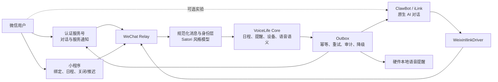

# VoiceLife 微信优先接入方案调研与选型报告

> 调研日期：2026-07-29  
> 范围：忽略此前企业微信 WSS 方案，重点评估普通微信用户的接入体验、主动提醒能力，以及 Satori / Koishi、腾讯 ClawBot / iLink、OpenClaw、OpeniLink 等实现路径。

## 1. 结论先行

VoiceLife 不应把“能在微信里聊天”和“未来某个时刻一定能提醒”当成同一个能力。

- **面向大众用户的主方案：认证服务号 + 小程序。**
  - 服务号负责关注、消息入口和经审核的服务通知/模板消息。
  - 小程序负责设备绑定、日程列表、关闭提醒、稍后提醒等富交互。
  - 这是当前合规性、用户覆盖面、持续运营和多用户能力最均衡的组合。
  - 最大前置风险不是技术，而是 VoiceLife 的“日程/提醒”场景能否获得合适的服务通知模板和类目权限。必须先用真实主体、真实类目做验证。

- **腾讯官方 ClawBot / iLink 值得并行做 PoC，但不适合作为唯一提醒通道。**
  - 它的优势非常明确：用户直接在个人微信的 ClawBot 会话里用文字或语音和 AI 对话，体验最接近理想中的“微信好友助手”。
  - 腾讯官方已开源 OpenClaw 微信插件，并披露了 `getUpdates`、`sendMessage`、`context_token`、媒体 CDN 等接口形态，技术上可以绕过完整 OpenClaw，只写一个薄适配器接入 VoiceLife。
  - 但 iLink 存在会话上下文和约 24 小时活跃窗口约束；社区项目也明确表示窗口不能在后台静默续期。因此它适合对话和短期跟进，不应承诺“用户几天没说话也一定收到提醒”。
  - ClawBot 的开放范围、终端覆盖和商业多租户边界仍需在真实账号及最新微信客户端上验证。

- **Satori / Koishi 值得采用“协议思想”，不建议一开始就作为微信主链路的强依赖。**
  - Satori 是跨平台消息抽象协议；官方 WeChat Official 适配器接的是微信公众号，不是个人微信或 ClawBot。
  - 现有适配器适合快速验证公众号收发消息，但 VoiceLife 最关键的模板通知、订阅消息、发送窗口、回执和重试属于平台原生能力，仍需要自定义接口。
  - 推荐在 VoiceLife 内定义一个 Satori 风格的规范化事件模型和能力声明，同时先实现原生 `WeChatOfficialDriver` 与实验性的 `WeixinIlinkDriver`。

- **不建议生产使用模拟个人微信登录、PC Hook、Pad 协议或非官方 Puppet。**
  - 这些方案短期体验像“微信好友”，也能主动发送，但封号、协议漂移、隐私和供应链风险无法作为消费硬件服务的基础。

一句话决策：

> **大众版先做“服务号通知 + 小程序操作”，同时用官方 ClawBot/iLink 做原生 AI 对话实验；内部统一消息模型，但不要让某个机器人框架绑架产品能力。**

---

## 2. VoiceLife 真正需要的微信能力

结合当前 README 中“语音创建/查询日程、语音和 IM 提醒、关闭/稍后提醒、修改日程”的定位，微信通道至少应满足以下要求。

### P0：必须满足

1. **计划性主动通知**  
   用户即使几天没有打开对话，预约时间到达后仍应有合法的发送路径。

2. **简单绑定**  
   普通用户不应部署机器人、配置服务器或理解 Token。理想流程是扫码、微信授权、输入设备短码即可。

3. **可靠性闭环**  
   具备幂等键、发送结果、失败重试、死信、审计和用户退订状态。不能把 API 返回成功直接等同于用户已读。

4. **合规和可持续性**  
   能够支撑多用户商业服务，不依赖模拟登录和逆向协议。

### P1：显著影响体验

1. 用户能在微信里发文字、语音创建和查询日程。
2. 提醒消息可以一键“关闭”或“推迟 10 分钟”。
3. 无需安装独立 App。
4. 身份可以稳定映射到设备、家庭和账户。
5. 语音、图片、文件等能力按通道渐进增强。

这组要求决定了：**只有会话回复能力而没有长期主动通知能力的方案，不能单独成为 VoiceLife 主通道。**

---

## 3. 微信接入方法全景

| 路径 | 用户看到的入口 | 自然对话 | 长期主动提醒 | 富交互 | 合规/稳定性 | 适合 VoiceLife 的角色 |
|---|---|---:|---:|---:|---:|---|
| 认证服务号 | 公众号会话、服务通知 | 较好 | **较强，但依赖模板与类目审核** | 中等，可跳小程序/H5 | 高 | **主通知与消息入口** |
| 微信小程序 | 小程序页面、服务通知 | 弱 | 中低；一次性订阅通常一授权一条 | **强** | 高 | **绑定、日程管理、提醒动作** |
| 腾讯 ClawBot / iLink | 微信内 ClawBot 会话 | **最佳** | 中低；受上下文/24 小时窗口约束 | 低，主要是消息与链接 | 官方入口高，但开放边界待验证 | **实验性 AI 对话通道** |
| 微信客服 | 微信客服会话 | 较好 | 低；用户发言后 48 小时内有限条数 | 中等 | 高 | 帮助、售后、人工接管 |
| 非官方个人微信 Bot | 普通好友/群聊 | 最佳 | 强 | 中等 | **低** | 仅研究，不进入生产 |

这里还有一个容易混淆的层次：

| 名称 | 本质 | 它能否改变微信的发送权限 |
|---|---|---:|
| Satori | 跨 IM 的通用协议和资源模型 | 否 |
| Koishi | 机器人运行时、插件生态，内部使用 Satori 体系 | 否 |
| OpenClaw | AI Agent 运行时 | 否 |
| 腾讯 `openclaw-weixin` | 官方 ClawBot/iLink 的 OpenClaw 通道插件 | 使用 iLink 已授予的权限 |
| OpeniLink Hub | 社区自托管的 iLink Bot 管理和中继平台 | 否 |

框架解决的是“怎么接得快、怎么统一”，平台解决的是“什么消息允许发”。选型顺序必须是后者优先。

---

## 4. 各路径详细分析

### 4.1 认证服务号：最接近可靠提醒主通道

#### 用户体验

推荐的首次使用流程：

1. 用户扫描设备或包装上的小程序码。
2. 在小程序内微信登录，输入设备 LED 显示的 6～8 位绑定码。
3. 页面引导关注 VoiceLife 服务号，并说明提醒用途。
4. 系统发送一条测试通知。
5. 到点后，用户在微信服务通知中收到提醒；点击进入小程序，选择关闭或推迟。

用户不需要安装 App，也不需要扫码登录一个机器人运行时，认知成本最低。

#### 能力

- 公众号服务器通过 HTTPS 回调接收文字、语音、关注、菜单等事件。
- 用户主动发消息后，可使用被动回复和客服消息完成对话。
- 认证服务号可申请模板消息/服务通知，用固定模板发送重要服务进度。
- 模板消息可跳转到与公众号关联的小程序页面，用于关闭、推迟或修改日程。

#### 关键约束

- 模板不是自由文本推送，必须来自账号类目下的可用模板，并遵守服务场景、内容字段和频率规则。
- VoiceLife 是否能获得合适的“日程提醒/待办提醒/服务进度通知”模板，不能仅凭文档推断，必须在真实公众平台后台验证。
- 普通客服消息有交互时间窗口，不能拿它替代定时服务通知。
- 公众号 OpenID 和小程序 OpenID 不相同。若账号都绑定到同一微信开放平台，可优先通过 UnionID 关联；否则需要显式绑定流程。

#### 判断

**如果真实服务号能通过类目和模板审核，这是 VoiceLife 微信首发的最佳主通道。**

它不一定是最自然的 AI 聊天入口，但它是几个候选中最可能同时满足大众覆盖、合规和计划性通知的方案。

---

### 4.2 微信小程序：最佳操作面，不应独自承担提醒

#### 最适合做的事

- 微信授权登录与设备绑定。
- 展示今日/未来日程。
- 创建、编辑、删除日程。
- 关闭提醒、推迟 5/10/30 分钟。
- 展示设备在线状态和消息发送记录。
- 从公众号模板消息直接跳到指定提醒详情。

#### 订阅消息限制

小程序订阅消息要求用户自主授权：

- 一次性订阅通常是用户同意一次，开发者可以在未来发送一条相应服务消息。
- 长期订阅只对部分公共服务类目开放，并不是普通工具产品默认可得。
- 授权动作需要由用户点击触发，后端不能替用户无限续订。

因此，如果用户直接在硬件上说“下周三提醒我交电费”，但没有在小程序里为这次或这类通知完成订阅，单靠小程序不能保证到时推送。

#### 判断

**小程序是服务号的最佳搭档，但不是 VoiceLife 的单通道答案。**

若服务号模板能力最终无法获批，小程序订阅消息可以覆盖用户明确授权的提醒，但产品文案必须如实表达其边界，并保留硬件本地语音提醒或其他兜底。

---

### 4.3 腾讯 ClawBot / iLink：体验突破很大，可靠提醒仍有硬边界

#### 为什么值得重视

腾讯官方仓库 `Tencent/openclaw-weixin` 提供了 OpenClaw 微信通道插件，支持扫码授权。公开代码说明其底层采用：

- `getupdates` 长轮询收消息；
- `sendmessage` 发文本、图片、视频和文件；
- `getuploadurl` 处理媒体上传；
- `getconfig`、`sendtyping` 获取配置和输入状态；
- Bearer Token 和 `context_token` 维护账号及会话上下文；
- 文本、图片、语音、文件、视频等消息类型。

这意味着 ClawBot 不只是一个只能装进 OpenClaw 的黑盒。官方 README 已给出后端 API 形态，VoiceLife 可以实现一个薄的 `WeixinIlinkDriver`，把消息直接映射到自己的日程领域服务。

#### 用户体验优势

- 用户在微信里直接进入 ClawBot 会话，不需要关注传统公众号后再寻找菜单。
- 文本和语音都很自然，适合“明天下午三点提醒我开会”。
- 使用长轮询，设备或边缘服务位于 NAT 后也能主动连出，不要求设备暴露公网回调。
- 对本地部署、用户自有设备的 AI 助手场景，产品形态与 ClawBot 的定位较契合。

#### 不能忽略的限制

1. **24 小时窗口**  
   OpeniLink Hub 的公开说明明确写到：微信 24 小时窗口不能由后台静默续期，只能在到期前提醒用户回复，收到回复后重新计时。它是社区项目的观测，不是腾讯官方 SLA，但足以成为必须实测的高风险项。

2. **`context_token` 不是普通用户 ID**  
   外发需要携带会话上下文。它天然表达“在一次用户会话上下文中回复或继续交互”，不是无限期的通用推送授权。

3. **主动消息能力正在变化**  
   OpenClaw 生态中曾有定时任务无法主动发送、长 Agent 响应后 Token 失效等问题，也有报告称服务端恢复后定时发送可用。不能简单下结论“完全不能主动发”，应使用最新版插件分别测试 1 小时、23 小时、25 小时和 7 天后的发送。

4. **开放与商业边界**  
   仍需确认目标用户的微信版本是否都有 ClawBot 入口、每个用户如何授权，以及官方条款对商业多租户 SaaS 的要求。社区转载的条款不能替代用户扫码时展示的官方协议和法务确认。

5. **交互形态偏消息**  
   公开消息类型以文字和媒体为主，没有公众号模板卡片或小程序那样稳定的按钮模型。“关闭/推迟”需要文字指令或跳转小程序/H5。

#### 对 VoiceLife 的正确定位

**把 ClawBot 当作高质量对话入口，不把它当作唯一通知 SLA。**

可用于：

- 用户刚完成对话后的确认、短期提醒和追问；
- 技术尝鲜用户或本地部署用户；
- 验证“在微信中用语音管理日程”的核心价值；
- 服务号之外的第二对话通道。

不应单独用于：

- 七天后、一个月后的强保证提醒；
- 用户长期不互动时的关键事项；
- 在未验证条款前直接承载大规模商业多租户。

---

### 4.4 微信客服：适合服务，不适合日程推送

微信客服可以从公众号菜单、小程序、网页和二维码等入口进入，用户仍在微信内交流，适合：

- 首次绑定帮助；
- 设备故障与售后；
- AI 无法处理时转人工；
- 解释通知权限或重新授权。

它的 API 通常只允许在客户主动发送消息后的 48 小时内，由企业发送有限数量消息。公开接口资料显示当前上限为 5 条；正式实现时仍应以企业微信后台和官方接口文档为准。

因此它不能承担“一周后提醒开会”，但可以作为整个微信方案的客服补充。

---

### 4.5 Satori / Koishi：适合做统一层，但不要高估现成微信适配

#### Satori 能解决什么

Satori 将不同平台统一为：

- 基于 HTTP 的发送/API 调用；
- 基于 WebSocket 或 WebHook 的事件接收；
- 统一的登录、用户、频道、消息、资源和消息元素模型；
- 平台原生能力通过 internal interface 逃生。

这个方向非常适合未来同时支持微信、飞书、钉钉、Slack 等渠道。VoiceLife 的领域层只消费规范化事件，不应该理解微信 XML、飞书卡片或 Slack block。

#### 现成微信适配器实际接的是什么

`@satorijs/adapter-wechat-official` 的配置项是公众号 AppID、AppSecret、Token、EncodingAESKey 和客服消息开关。它接的是 **Wechat Official / 微信公众号**，并不接个人微信，也不接 ClawBot/iLink。

这意味着：

- 它可能加速公众号文字/媒体收发 PoC；
- 它不能自动获得公众号模板消息、小程序订阅消息或 ClawBot 的权限；
- 模板通知、UnionID 绑定、发送窗口、回执和重试仍需要平台原生扩展；
- 在生产选型前，应实测语音消息下载、加密回调、重复投递、客服消息和错误码。

#### 是否需要完整 Koishi

对当前 VoiceLife，不建议为了接一个微信通道先引入完整机器人运行时。原因不是 Koishi 不成熟，而是产品核心是“日程与提醒”，不是命令式群聊机器人：

- 日程解析、调度、幂等、重试和设备状态都应该留在 VoiceLife 服务中；
- 微信适配层应尽量薄；
- Koishi 插件生命周期、会话、中间件和数据库不应成为领域模型。

推荐做法：

1. 借鉴或直接采用 Satori 的事件/资源命名；
2. 自己定义能力矩阵和可靠发送语义；
3. 公众号首版直接使用官方 API；
4. 如需快速验证，可把 Koishi/Satori 作为 sidecar，不把它变成业务真相源；
5. 未来增加其他 IM 时，再决定是否将 sidecar 提升为统一网关。

---

### 4.6 OpenClaw、官方插件和 OpeniLink：三者不是一回事

#### 方案 A：完整使用 OpenClaw

优点：

- 最快跑通 ClawBot + AI Agent；
- 工具调用、上下文和多通道能力现成；
- 官方微信插件直接兼容。

缺点：

- 对 VoiceLife 来说运行时较重；
- 日程领域、设备身份、可靠提醒容易被塞进 Agent 会话；
- 升级和故障面变大。

适用：演示、内部原型、验证用户是否愿意在微信里用语音管理日程。

#### 方案 B：基于腾讯官方插件代码写薄驱动

优点：

- 只保留二维码授权、长轮询、消息、媒体和 Token 管理；
- 能直接接入 VoiceLife 现有领域服务；
- 官方仓库仍在快速修复网络错误、发送返回值校验、宿主兼容和登录流程。

缺点：

- 需要自己承担协议变化、状态监控和多账户隔离；
- API 是否被允许脱离 OpenClaw 用于商业产品，需要进一步确认。

适用：**ClawBot PoC 的推荐工程路线。**

#### 方案 C：OpeniLink Hub

OpeniLink Hub 提供多 Bot 扫码管理、Web 控制台、WebSocket/Webhook 转发、消息追踪和应用市场，工程体验优于从零写中继。

但其仓库明确声明：

- 基于公开 iLink 协议独立开发；
- 仅供学习交流与技术研究；
- 与 iLink 官方团队无关联或授权；
- 权利方提出异议时可能下架。

因此：

- 可以用于理解协议、内部 PoC、测试中继架构；
- 若要进入产品，需要安全审计、固定版本、关闭不必要的远程 Registry，并有可替换方案；
- 不建议直接把它当成 VoiceLife 商业版唯一生产依赖。

#### 方案 D：社区独立 iLink SDK

社区还出现了 `wechat-ilink-client`、`weixin-bot` 等把扫码、长轮询、媒体加密和发送封装成 TypeScript/多语言 SDK 的实现。它们适合：

- 对照腾讯官方插件理解协议；
- 快速写一段不依赖 OpenClaw 的验证程序；
- 作为测试夹具或备用实现评估。

但这些项目的接口大多来自对公开插件代码和网络行为的整理，并非腾讯承诺兼容的官方 SDK。提交数量、测试覆盖、协议跟进和维护者持续性也普遍弱于腾讯官方仓库。生产实现应以官方插件代码为权威参考，自行保存协议契约测试，不宜直接押注单一社区 SDK。

---

### 4.7 非官方个人微信机器人

常见类别包括 Wechaty 的非官方 Puppet、PC Hook、WeChatFerry、Pad/iPad 协议、模拟器或自动化操作。

它们的诱惑是：

- 像普通好友一样聊天；
- 可以主动发送；
- 支持群聊和相对完整的个人微信能力。

但代价包括：

- 登录协议和客户端升级后随时失效；
- 账号限制或封禁；
- 用户聊天数据经过未知实现；
- 无法提供稳定 SLA；
- 商业化、隐私合规和安全审计困难。

AstrBot 对 WeChatPadPro 的接入文档也明确标记为非官方支持，并建议优先使用企业微信、微信客服或公众号。VoiceLife 属于会长期保存用户日程的消费硬件服务，不应把这类路径放入生产路线。

---

## 5. 推荐架构



### 通道接口不要只定义 `sendMessage`

建议显式表达平台能力：

```ts
type ProactiveMode =
  | "approved-template"
  | "per-message-consent"
  | "active-window"
  | "unsupported";

interface ChannelCapabilities {
  receive: Set<"text" | "voice" | "image" | "file">;
  send: Set<"text" | "voice" | "image" | "file" | "template" | "link">;
  proactiveMode: ProactiveMode;
  interactiveActions: "native" | "deeplink" | "text-command" | "none";
  identityScope: "openid" | "unionid" | "ilink-user" | "external-user";
}
```

发送一个提醒前，调度器应根据能力选择：

1. 服务号已批准模板：发送模板通知；
2. 用户有本次小程序订阅授权：发送订阅消息；
3. ClawBot 上下文仍有效：同步发送会话消息；
4. 均不可用：硬件本地提醒，并记录通道降级；关键提醒可再引入短信等兜底。

### 身份与绑定

统一身份表至少需要：

- `account_id`
- `device_id`
- `wechat_official_openid`
- `wechat_mini_openid`
- `wechat_unionid`（可用时）
- `ilink_user_id`
- `channel_consent`
- `template_permission`
- `last_user_interaction_at`
- `context_expires_at`

所有小程序操作链接使用短时、一次性签名 Token，不在 URL 暴露设备 ID 或 OpenID。

---

## 6. 建议实施路线

### 阶段 0：先验证平台资格，3～5 个工作日

这是整个方案的 Go/No-Go 门槛。

1. 使用计划投入生产的主体注册或确认认证服务号。
2. 在真实类目中搜索可用的提醒、待办或服务进度模板。
3. 提交一份符合实际业务的模板申请，不用泛化的营销文案。
4. 用公众号测试号跑通回调、语音下载和模板发送，但不把测试号结果等同于生产资质。
5. 确认服务号与小程序能否绑定同一开放平台账号并取得 UnionID。

通过标准：

- 真实账号可以向已绑定用户发送符合 VoiceLife 场景的服务通知；
- 通知可以跳转小程序具体提醒页；
- 产品法务和运营确认触达文案、隐私政策和退订机制。

若模板能力不通过，应立刻调整产品承诺，而不是用客服消息或非官方个人微信绕过限制。

### 阶段 1：微信大众版 MVP，2～4 周

实现：

- `WeChatOfficialDriver`
  - 签名校验、XML 加解密；
  - 关注、取关、文字、语音、菜单事件；
  - Access Token 缓存与刷新；
  - 模板消息发送、错误码分类和幂等。
- 小程序/H5
  - 微信登录；
  - 设备短码绑定；
  - 日程列表；
  - 关闭和推迟；
  - 通知权限状态。
- Reliable Outbox
  - `reminder_id + channel + scheduled_at` 幂等键；
  - 指数退避和死信；
  - 发送结果与用户动作审计；
  - 用户退订后立即停止相应通道。

### 阶段 2：ClawBot/iLink 并行 PoC，1～2 周

不要一开始做完整 OpenClaw 集成，先使用腾讯官方插件最新版完成协议验证。

测试矩阵：

| 测试项 | 必测条件 |
|---|---|
| 登录 | 首次扫码、重复扫码、二次验证码、Token 失效 |
| 入站 | 文字、语音、图片、重复消息、乱序 |
| 出站 | 即时、1 小时、23 小时、25 小时、7 天 |
| Agent 时延 | 5 秒、60 秒、180 秒后回复 |
| 稳定性 | 网络断开、进程重启、游标恢复 |
| 多用户 | 多 ClawBot 账号隔离、错误路由 |
| 终端覆盖 | 主流 iOS/Android 微信版本、未开放 ClawBot 的账号 |
| 条款 | 用户授权页面、商业多租户、数据处理和注销 |

只有 25 小时和 7 天主动发送通过并得到官方规则确认，才可以提高它在提醒链路中的等级；否则始终是辅助通道。

### 阶段 3：抽象为多 IM，1～2 周

在已有两种微信驱动后再冻结规范化接口：

- 入站事件、消息元素、媒体引用；
- 用户和设备身份；
- 主动消息能力模式；
- 发送回执、失败类别、限流；
- 交互动作和 Deep Link；
- 一组跨驱动契约测试。

此时再评估：

- 直接发布 Satori Server；
- 让 Koishi 作为独立 Bot Gateway；
- 或仅保留内部 Satori 风格模型。

这样抽象来自真实差异，而不是先假定所有 IM 都支持同一种 `sendMessage`。

---

## 7. 最终选型

### 推荐组合

| 层级 | 选型 |
|---|---|
| 大众用户主入口 | 认证微信服务号 |
| 设备绑定与富交互 | 微信小程序，早期也可先用 H5 验证 |
| 主动提醒 | 服务号经审核的模板/服务通知 |
| 自然语言对话 | 服务号消息；并行实验 ClawBot/iLink |
| 实验性个人微信入口 | 腾讯官方 ClawBot/iLink 薄驱动 |
| 通用消息模型 | Satori 风格模型 + VoiceLife 能力扩展 |
| 首版运行时 | VoiceLife 自身服务，不强制引入 Koishi/OpenClaw |
| 客服与人工接管 | 微信客服 |
| 明确排除 | PC Hook、Pad 协议、模拟个人微信登录 |

### 两种不同产品阶段的取舍

如果当前目标是 **最快验证“用户会不会在微信里和设备助手说话”**：

- 先用腾讯官方 OpenClaw 微信插件跑 ClawBot 原型；
- 用 VoiceLife Core 接收解析结果；
- 提醒仍由硬件本地完成；
- 不对外承诺长期微信推送。

如果当前目标是 **给普通消费者上线一款可持续的提醒产品**：

- 先验证认证服务号模板；
- 建服务号 + 小程序正式链路；
- ClawBot 作为可选增强，而不是注册必经步骤。

---

## 8. 需要尽快回答的五个决策问题

1. 生产主体能否申请认证服务号和对应服务类目？
2. 公众平台后台是否存在或能否申请符合 VoiceLife 的提醒模板？
3. 提醒是否属于“必须送达”的产品承诺，还是“尽力通知 + 硬件本地提醒”？
4. 第一批用户是普通消费者，还是愿意扫码配置 ClawBot 的技术尝鲜用户？
5. 设备没有屏幕时，二维码由包装、小程序/H5 还是临时电脑页面承载？

前两个问题决定平台可行性，后三个问题决定先做服务号还是先做 ClawBot PoC。

---

## 9. 参考资料

### 腾讯与微信

- [腾讯官方 OpenClaw 微信插件仓库](https://github.com/Tencent/openclaw-weixin)
- [腾讯官方 OpenClaw 微信插件中文说明及后端 API 协议](https://github.com/Tencent/openclaw-weixin/blob/main/README.zh_CN.md)
- [腾讯官方插件变更日志](https://github.com/Tencent/openclaw-weixin/blob/main/CHANGELOG.zh_CN.md)
- [微信公众号：接收普通消息](https://developers.weixin.qq.com/doc/offiaccount/Message_Management/Receiving_standard_messages.html)
- [微信公众号：客服消息](https://developers.weixin.qq.com/doc/offiaccount/Message_Management/Service_Center_messages.html)
- [微信公众号：模板消息接口](https://developers.weixin.qq.com/doc/offiaccount/Message_Management/Template_Message_Interface.html)
- [微信小程序：订阅消息](https://developers.weixin.qq.com/miniprogram/dev/framework/open-ability/subscribe-message.html)
- [微信小程序：wx.requestSubscribeMessage](https://developers.weixin.qq.com/miniprogram/dev/api/open-api/subscribe-message/wx.requestSubscribeMessage.html)
- [微信客服：发送消息](https://developer.work.weixin.qq.com/document/path/94677)

### Satori / Koishi

- [Satori 简介](https://satori.chat/en-US/introduction.html)
- [Satori 协议概览](https://satori.chat/en-US/protocol/)
- [Satori 跨平台原生接口](https://satori.chat/en-US/advanced/internal.html)
- [Satori WeChat Official 适配器](https://satori.chat/en-US/adapters/wechat-official.html)
- [Koishi 官方插件列表](https://koishi.chat/en-US/plugins/)

### 社区实现与风险参考

- [OpeniLink Hub](https://github.com/openilink/openilink-hub)
- [社区 TypeScript iLink 客户端：wechat-ilink-client](https://github.com/photon-hq/wechat-ilink-client)
- [社区 weixin-bot 协议资料](https://github.com/epiral/weixin-bot)
- [Wechaty Puppet 规范](https://wechaty.js.org/docs/specs/puppet/)
- [AstrBot 对 WeChatPadPro 非官方接入的风险说明](https://astrbot.app/deploy/platform/wechat/wechatpadpro.html)

> 注意：OpeniLink、Wechaty 非官方 Puppet 和 AstrBot 文档属于社区资料，用于识别实现现状和风险，不等于腾讯官方能力承诺。微信平台规则、模板类目和接口额度会变化，正式上线前必须以真实账号后台和最新官方协议为准。
