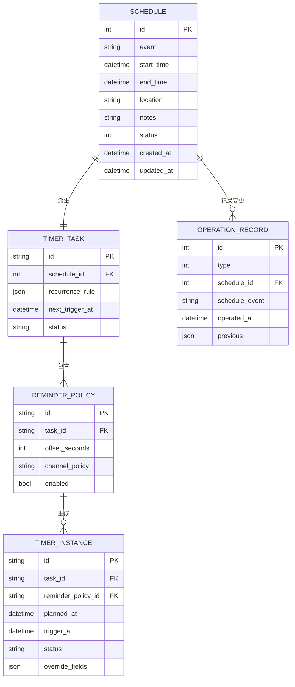
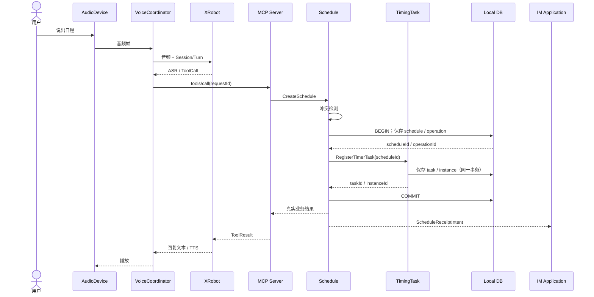
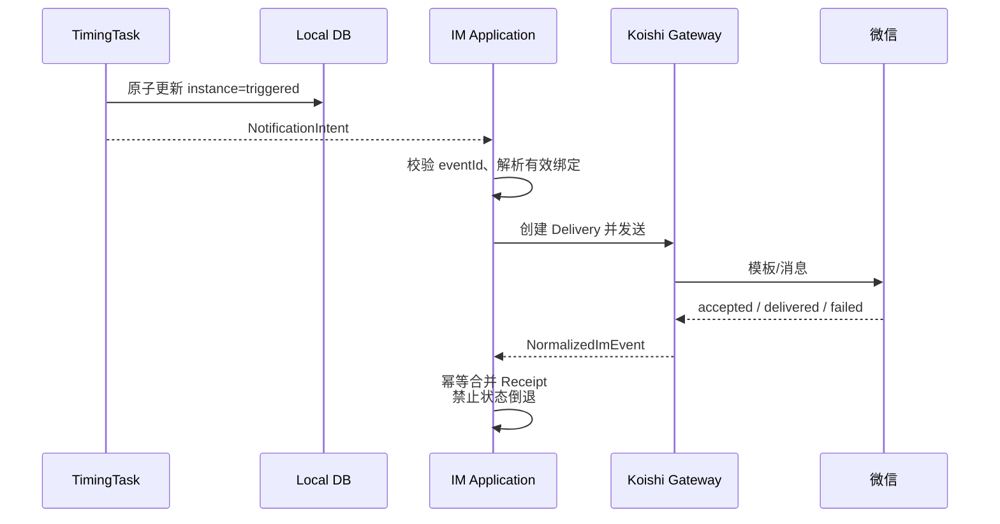
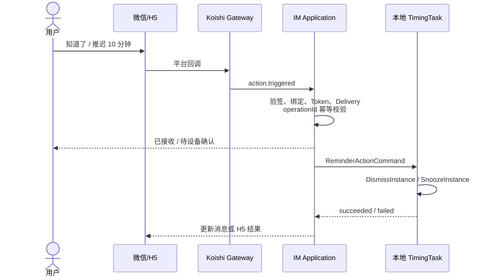

# VoiceLife（声活）MVP 整体架构设计

> 文档状态：目标架构草案
>
> 基线日期：2026-07-30
>
> 适用范围：VoiceLife MVP（小智设备 + XRobot + 本地日程/调度 + VoiceLife IM Gateway + 微信）

## 1. 文档目的

本文档是 VoiceLife MVP 的总领架构说明，用来统一模块边界、主干调用关系、数据归属、部署方式和跨模块契约。各模块的详细字段、接口参数和内部实现仍以对应模块设计文档为准。

本文档遵循 [XEngineer 架构设计规范](https://github.com/1024XEngineer/XEngineer/wiki/02-%E6%9E%B6%E6%9E%84%E8%AE%BE%E8%AE%A1%E8%A7%84%E8%8C%83) 的要求：

- 先明确系统主干，再在其上叠加功能；
- 从需求与风险出发划分模块，不以目录或技术栈代替架构；
- 以真实的接口、数据结构和可编译空骨架作为系统架构的主要载体；
- 本文档只补充代码不易表达的模块划分依据、整体协作逻辑与演进约束，不能替代后续空骨架代码。

### 1.1 输入依据

| 来源 | 贡献 |
| --- | --- |
| [PR #76：定时任务模块](https://github.com/1024XEngineer/XE6-15/pull/76) | `Schedule → TimerTask → TimerInstance` 三层模型、重复规则、实例例外、推迟与关闭 |
| [PR #86：MCP 模块](https://github.com/1024XEngineer/XE6-15/pull/86) | 工具注册、发现、`tools/list`、`tools/call` 与 JSON-RPC 路由 |
| [PR #87：日程管理模块](https://github.com/1024XEngineer/XE6-15/pull/87) | 日程 CRUD、冲突检测、操作记录与撤销 |
| [PR #81：语音模块](https://github.com/1024XEngineer/XE6-15/pull/81) | AudioDevice、VoiceSessionCoordinator、XRobot 接入、会话/轮次/代次模型 |
| [PR #85：IM 模块](https://github.com/1024XEngineer/XE6-15/pull/85) | IM Application、Koishi Gateway、绑定、投递、回执、动作与 Outbox |
| VoiceLife MVP 整体架构图 | 本地、外部平台、服务端三个部署边界及同步调用、持久化、异步事件、反馈回传关系 |

上述 PR 在本基线日期均未合并，因此本文描述的是需要共同评审和固化的**目标架构**。当前代码完成度见第 11 节。

## 2. 架构目标与约束

### 2.1 MVP 目标

VoiceLife 是一个“语音优先、IM 辅助”的日程提醒系统。MVP 主链路需要支持：

1. 用户通过小智语音创建、查询、修改和取消日程；
2. 单次或周期日程被转换为可执行的定时任务与触发实例；
3. 到点后通过语音和/或微信发送提醒；
4. 用户可在语音或微信中关闭、推迟某次提醒；
5. 重要操作产生可回看的 IM 回执；
6. 本地日程、任务和实例是业务事实源，外部平台不保存可替代它们的副本。

### 2.2 核心质量目标

| 优先级 | 质量目标 | 可验证场景 |
| --- | --- | --- |
| P0 | 数据归属清晰 | 本地日程、任务和实例是完整事实源，IM 与 XRobot 不保存可替代副本 |
| P0 | 跨边界幂等 | 工具调用、提醒投递、平台回执或用户动作重复到达时，不产生重复日程、重复实例或重复业务动作 |
| P0 | 状态可追踪 | 一次语音操作能从 `sessionId` 追踪到 `toolCallId`、`scheduleId`、`taskId` 和 IM `deliveryId` |
| P1 | 外部能力可替换 | 业务模块不依赖 XRobot 原始消息、Koishi Session、微信 XML 或平台专属字段 |
| P1 | 失败可恢复 | IM 临时失败可检测并明确降级，迟到回执不使状态倒退，设备重启后可恢复未完成调度 |

### 2.3 已知约束与运行假设

- MVP 本地侧采用**单进程**：语音协调、MCP、日程和定时任务在小智本地运行；
- VoiceLife 服务端只承载 IM Gateway，不承载日程、调度或 MCP 业务事实；
- XRobot 是外部 ASR/LLM/TTS 与 MCP Client 平台，也是 MVP 语音交互和语音播报的必需依赖；
- 微信是首个 IM，后续平台通过 Koishi Adapter + Capability Plugin 扩展；
- 所有跨模块 ID 均视为不透明标识，不允许调用方从数值或格式推断业务语义；本地 `scheduleId/operationRecordId` 按 PR #87 使用自增整数；
- 所有时间使用带时区的 ISO 8601；持久化建议使用 UTC，业务计算必须保留 IANA 时区；
- MVP 可使用进程内方法调用，但接口语义不得绑定具体传输方式。

> **MVP 运行假设：**设备运行期间网络持续可用，能够连接 XRobot 与 VoiceLife IM Gateway。本阶段不设计、不测试也不验收断网或离线运行场景。

## 3. 系统上下文与部署架构


### 3.1 MVP 部署单元

| 部署单元 | 包含内容 | 可用性边界 |
| --- | --- | --- |
| 小智本地单进程 | AudioDevice Adapter、VoiceSessionCoordinator、MCP Server、Schedule、TimingTask、Local DB | 在持续联网假设下负责语音交互、本地业务与调度 |
| XRobot 外部平台 | ASR、LLM、TTS、MCP Client | 不保存 VoiceLife 业务事实 |
| VoiceLife IM Gateway | IM Application、Koishi Runtime、平台适配与能力插件、IM DB/Outbox | 可独立扩缩容；不接管本地日程和调度 |
| 微信 / 其他 IM | 消息、模板、卡片、平台回调 | 平台政策和能力差异由 Gateway 隔离 |

## 4. 总体设计原则

### 4.1 本地优先，IM 辅助

`Schedule`、`TimerTask` 和 `TimerInstance` 的权威数据位于本地。IM 服务端保存的是外部身份、绑定、通知投递、平台回执和用户动作审计，不保存可替代本地事实源的日程副本。

“本地优先”只描述数据归属；系统运行条件见第 2.3 节。

服务端收到“关闭”或“推迟”动作后，只能向本地提交带幂等键的业务命令；业务成功以本地返回结果为准。

### 4.2 领域事实与适配器分离

- XRobot 负责理解意图，但不直接写本地数据库；
- MCP Server 负责协议终止、工具注册和路由，但不拥有日程或提醒状态；
- Koishi 负责 IM 通用消息模型和平台接入，但业务核心不持有 Koishi `Session` 或 `Bot`；
- 微信模板、签名、参数二维码和 H5 动作等专属能力封装在微信 Capability Plugin；
- 业务事件由完成事务的领域模块产生，不由 MCP 或 IM 适配层推测。

### 4.3 命令同步确认，事件异步传播

- 进程内领域操作使用同步 Port，调用方获得明确成功或失败；
- 跨网络的回执、通知和状态传播使用异步事件；
- “已接收”“业务已提交”“消息已投递”“语音已播放”是不同状态，不得合并为一个成功布尔值；
- 异步事件必须携带幂等标识；本地到 IM 的投递保证和失败重试策略由后续协议设计确定，本文不预设本地持久化队列。

### 4.4 接口语义独立于传输

模块设计中的 HTTP 路径用于表达稳定语义。MVP 单进程内可映射为方法调用；跨本地与 IM Gateway 的接口可使用 HTTPS 或受控消息通道。不得因为 MVP 选择进程内调用而删除请求 ID、错误码、状态和幂等语义。

## 5. 模块划分与职责

| 模块 | 核心职责 | 明确不负责 | 数据所有权 |
| --- | --- | --- | --- |
| AudioDevice Adapter | 麦克风采集、编解码、播放、设备能力 | 会话状态、工具路由、业务数据 | 短期音频缓冲 |
| VoiceSessionCoordinator | Session/Turn/Generation、录音/播放编排、取消、XRobot WebSocket、协议转换与重连 | 日程 CRUD、工具业务实现、IM 投递 | 会话运行态；必要时保存恢复元数据 |
| MCP Server / ToolGateway | 工具注册、Schema 校验、`tools/list`、`tools/call`、结果封装 | 日程/调度实现、业务状态 | 工具定义和路由表 |
| Schedule Service | 日程 CRUD、冲突检测、操作记录、撤销 | 周期触发、音频、IM 平台发送 | `schedule`、`operation_record` |
| TimingTask | 重复规则、提醒策略、任务注册、实例生成、触发、单次例外、关闭与推迟 | 日程内容编辑、IM 适配 | `timer_task`、`reminder_policy`、`timer_instance` |
| IM Application | 身份绑定、路由选择、通知投递、回执归并、动作校验、Outbox | 修改日程事实、平台协议细节 | IM 领域表 |
| Koishi Gateway | 通用 IM Session、收发适配、标准事件归一化 | VoiceLife 业务规则 | 仅运行态 |
| Platform Capability Plugin | 微信/企微/飞书/钉钉专属模板、卡片、验签和回调 | 平台无关业务规则 | 平台配置与必要映射 |

### 5.1 关键边界决策

1. **Schedule 与 TimingTask 分离**：Schedule 回答“用户安排了什么”，TimingTask 回答“系统何时、以何种规则触发哪一次”。
2. **Schedule 不保存 `reminder_id` 标量字段**：MVP 中一条 Schedule 对应一个 TimerTask，一个 TimerTask 包含多个具名 `ReminderPolicy`；实例通过 `reminderPolicyId` 表明由哪条提醒策略生成。这样同时保留“一个日程系列对应一个调度任务”和“一个日程可提前提醒多次”的语义。
3. **MCP Registry 与语音 ToolGateway 是同一逻辑模块**：本地只保留一份工具定义和路由，不建立两套注册中心。
4. **业务回执由领域模块产生**：例如 Schedule 事务提交成功后，由 Schedule Application 向 IM Application 发送 `ScheduleReceiptIntent`；MCP 只转发工具结果。
5. **IM 用户动作不直写本地库**：动作经过绑定、Token、目标实例和 `operationId` 校验后，以命令回传本地 TimingTask。
6. **MVP 不暴露任务暂停状态**：`timer_task.status` 首期只使用 `active/terminated`。后续若引入 `paused`，必须同时增加 `PauseTimerTask/ResumeTimerTask`、状态转换和错过触发的补偿规则。
7. **XRobot 接入属于 VoiceSessionCoordinator 内部实现**：架构上不单列适配模块；如需可替换性和测试隔离，可在 Voice 模块内部定义 `SpeechProviderPort`，由 XRobot 实现该 Port。

## 6. 关键数据模型与标识链

### 6.1 本地核心模型



约束：

- Schedule 的创建、修改和取消必须在同一业务事务内写入一条 OperationRecord；
- OperationRecord 只保存撤销所需的历史快照，不作为当前 Schedule 状态的事实源；
- `timer_task.schedule_id` 唯一，注册采用幂等 upsert；
- `(reminder_policy.task_id, reminder_policy.id)` 唯一；
- `(timer_instance.task_id, timer_instance.reminder_policy_id, timer_instance.planned_at)` 唯一；
- `dismissed`、`skipped` 为实例终态，不允许迟到事件使其回退；
- 未来日程查询基于重复规则展开 occurrence，再叠加已物化实例的例外；不能只查询实例表；
- 撤销日程操作必须同时触发 TimingTask 的补偿更新，不能只恢复 Schedule 表。

### 6.2 IM 服务端模型

IM 侧沿用 PR #85 的领域拆分：

- `ChannelAccount`：平台账号与 Koishi Bot 配置；
- `ExternalIdentity`：平台用户身份；
- `ImBinding`：内部用户/设备与外部身份的有效绑定；
- `InboundEvent`：规范化入站事件及去重记录；
- `Delivery`：一次业务通知发往一个绑定的逻辑投递；
- `DeliveryAttempt`：每次真实平台 API 调用；
- `DeliveryReceipt`：accepted/delivered/read/acted/failed 回执；
- `ImAction`：用户动作及业务执行结果；
- `ImOutboxEvent`：IM 域内可靠事件发布。

### 6.3 全链路关联标识

| 阶段 | 标识 | 用途 |
| --- | --- | --- |
| 语音会话 | `sessionId`、`turnId`、`generation` | 隔离轮次、取消和迟到音频 |
| 工具调用 | `toolCallId`、`requestId` | 工具幂等与结果回传 |
| 日程业务 | `scheduleId`、`operationRecordId` | 业务事实与撤销 |
| 调度执行 | `taskId`、`reminderPolicyId`、`instanceId`、`plannedAt` | 周期规则、提醒策略和某次触发 |
| 业务事件 | `eventId`、`correlationId` | 跨服务去重和链路追踪 |
| IM 投递 | `notificationIntentId`、`deliveryId`、`attemptId` | 投递与重试审计 |
| 用户动作 | `actionId`、`operationId` | 防止重复关闭或推迟 |

`correlationId` 应从入口开始贯穿事件、日志与出站消息；各阶段不得用一个 ID 替代另一阶段的业务主键。

## 7. 跨模块接口契约

### 7.1 Voice ↔ XRobot

VoiceSessionCoordinator 直接通过 XRobot WebSocket 处理：

- 上行音频与录音控制；
- 下行 TTS 音频与播放控制；
- ASR 转写、LLM 状态和 MCP 控制消息；
- 重连、取消和迟到消息过滤。

`generation` 只使旧语音结果失效，不能回滚已提交的日程操作。迟到的工具结果仍需记录，并以 `orphanedTurn=true` 发送状态事件。

语音模块在架构上是“交互编排层”，不是新的业务中心：

- AudioDevice、ToolGateway 和 VoiceEvent 通过 Port 接入；`SpeechProviderPort` 仅作为 Voice 模块内部的可选抽象；
- 同一物理设备同一时间只允许一个 Session 持有麦克风/扬声器租约；
- 新 Turn、主动播报和高优先级打断必须经过设备级仲裁，明确 `reject/wait/interrupt`，不得由多个 Session 同时操作 Codec；
- `interrupt` 会递增 generation，并使被中断 Turn 进入 `interrupted` 或 `cancelled`，首期不支持播报结束后自动恢复旧 TTS；
- 如果对外暴露 SSE，必须支持 `Last-Event-ID`、有限重放、权限过滤和背压；Turn/ToolCall 的最终状态还必须可查询，不能只依赖瞬时事件流；
- 主动播报必须先检查 Provider capability；不支持时返回确定的 `capability_not_supported`，由 Application 降级到 IM。

### 7.2 XRobot ↔ MCP Server

MCP Server 至少实现：

- `initialize`；
- `ping`；
- `tools/list`；
- `tools/call`；
- `notifications/tools/list_changed`。

工具定义统一包含 `name`、`description`、`inputSchema`、`schemaVersion` 和 `ownerModule`。注册时校验命名唯一性与 JSON Schema；调用时按名称路由，并返回标准 JSON-RPC 错误。

MVP 的 ToolCall 采用进程内直接调用 Application Port：

- MCP Server 在执行前按 `inputSchema` 校验参数；
- 业务模块接收 `toolCallId/requestId` 并保证重放返回相同结果；
- 同一 Turn 的多个写操作默认串行执行；只有工具声明 `parallelSafe=true` 时才可并行；
- 每次调用有超时和取消信号，但取消是尽力而为，不能回滚已提交事务；
- 部分成功时必须返回每个子操作的真实结果，并由 Application 执行补偿或要求用户确认，不能只返回笼统成功；
- Handler 抛错、超时和无效结果必须转换为有界、结构化的 ToolResult/JSON-RPC 错误，不能悬空请求。

推荐命名空间：

- `voicelife.schedule.*`
- `voicelife.timer.*`
- `voicelife.binding.*`

### 7.3 MCP Server ↔ Schedule

稳定业务语义：

- `CreateSchedule`
- `QuerySchedule`
- `UpdateSchedule`
- `CancelSchedule`
- `QueryRecentOperations`
- `UndoScheduleOperation`

变更操作必须携带 `requestId`。创建 Schedule 的本地业务事务按以下顺序执行：

1. 写入 Schedule 与 OperationRecord；
2. 使用已生成的 `scheduleId` 同步调用 TimingTask Port 注册任务；
3. Schedule 与 TimingTask 均成功后提交事务，返回包含 `scheduleId` 和受影响 `taskId/instanceId` 的真实结果；
4. 事务提交后，由 Schedule Application 向 IM Application 发送 `ScheduleReceiptIntent`。

更新和取消操作同样先保存 Schedule/OperationRecord，再更新或取消关联 TimingTask。

如果本地存储暂不支持跨模块数据库事务，应采用 Saga/补偿并记录 `reconciliation_required`，不能静默留下 Schedule 与 TimingTask 不一致。

补充约束：

- 取消 Schedule 必须同步终止关联 TimerTask、ReminderPolicy 和未终态实例；
- `QueryRecentOperations` 返回 `undoableUntil` 与 `undoable`，默认只列出仍可撤销的记录；
- `UndoScheduleOperation` 对 Schedule 和 TimingTask 执行同一语义的反向变更。

### 7.4 Schedule ↔ TimingTask

主要 Port：

- `RegisterTimerTask(scheduleId, startAt, recurrenceRule, reminderPolicies[])`
- `UpdateTimerTask(taskId, changeScope, ...)`
- `CancelTimerTask(taskId, changeScope, ...)`
- `ListCalendarView(rangeStart, rangeEnd, ...)`
- `SnoozeInstance(instanceId, delay)`
- `DismissInstance(instanceId)`

`changeScope` 统一为：

- `single`：只影响一次 occurrence；
- `future`：从 `effectiveFrom` 起影响本次及以后；
- `all`：影响整个系列，保留历史终态实例。

`GenerateInstances` 必须接收有限的 `windowStart/windowEnd/limit`，以 `taskId + reminderPolicyId + plannedAt` 生成稳定 occurrence key。无限重复规则不得一次性完全展开。

### 7.5 本地 ↔ IM Application

本地向 IM Gateway 发送两类平台无关意图：

```text
ScheduleReceiptIntent
  eventId, correlationId, userId/deviceId,
  operationType, scheduleId, result, occurredAt

NotificationIntent
  eventId, correlationId, userId/deviceId,
  kind, scheduleId, taskId, instanceId,
  title, plannedAt, triggerAt, actions[], occurredAt
```

IM Gateway 向本地返回：

```text
ReminderActionCommand
  operationId, correlationId, deviceId,
  action(dismiss|snooze), instanceId,
  delayMinutes?, actorBindingId, occurredAt
```

约束：

- 本地业务事务不依赖 IM 调用是否成功，IM 发送失败不得伪装成业务失败或成功；
- 接收端以 `eventId` 或 `operationId` 去重；
- 动作结果必须返回 `accepted/pending/succeeded/failed`，其中 `accepted` 不等于业务完成；
- 传输层必须鉴权、加密，并限制设备只能读取属于自己的命令。

本文不规定本地持久化消息队列。`ScheduleReceiptIntent`、`NotificationIntent` 发送失败后的重试、补偿或放弃策略，作为本地 ↔ IM Gateway 协议的待决策项处理。

### 7.6 IM Application ↔ Koishi Gateway

- 出站：IM Application 提交平台无关发送意图，Koishi Renderer 转为平台内容；
- 入站：Koishi/Capability Plugin 将消息、卡片回调、模板回执或 H5 动作转为 `NormalizedImEvent`；
- 同进程部署可直接调用 Application Port，独立部署可使用受认证的内部接口；
- Satori 仅是可选的通用 HTTP/WS 出口，不是 VoiceLife 业务边界。

## 8. 核心业务流程

### 8.1 语音创建日程



失败语义：

- 冲突未确认：不创建 Schedule 和 TimerTask；
- TimingTask 注册失败：同一事务内回滚 Schedule/Operation；无法共享事务时执行补偿并标记 `reconciliation_required`，不返回创建成功；
- Schedule 已提交但原 Turn 被取消：保留业务结果，标记为 orphaned 并通过 IM 回执；
- IM 不可用：本地操作仍成功，回执发送失败被记录并告警；是否重试由后续协议决定。

### 8.2 到点提醒与 IM 投递



### 8.3 微信关闭或推迟提醒



## 9. 一致性、失败与恢复

### 9.1 一致性策略

| 边界 | 策略 |
| --- | --- |
| Schedule + TimingTask | 同库事务优先；否则使用 Saga、补偿与对账任务 |
| 本地业务 + IM 通知 | 本地业务提交不等待 IM；当前采用直接发送意图，失败重试与补偿策略待定 |
| IM Delivery + Attempt | 一个 Delivery 对应多次 Attempt，重试不新建 Delivery |
| 平台回执 | 按平台事件 ID 去重；状态只允许单向推进 |
| 用户动作 | `operationId` 去重；重复请求返回原执行结果 |
| 周期实例 | `(taskId, plannedAt)` 唯一；单次例外覆盖规则展开结果 |

### 9.2 失败分类

| 失败 | 处理 |
| --- | --- |
| MCP 未知工具/参数错误 | 标准 JSON-RPC 错误，不进入业务模块 |
| 本地数据库失败 | 当前业务操作失败，不发送成功回执 |
| IM Gateway 不可用 | 记录发送失败并告警，不回滚本地业务；是否重试由后续协议决定 |
| 平台限流/5xx | DeliveryAttempt 指数退避，达到阈值进入死信 |
| 平台永久拒绝 | Delivery 标记 failed，保留错误分类和原始平台码 |
| 迟到/乱序事件 | 通过 generation、eventId、operationId 和状态机丢弃或归档 |

### 9.3 可观测性

日志和事件至少包含：

- `correlationId`、`requestId`；
- `sessionId`、`turnId`、`toolCallId`；
- `scheduleId`、`taskId`、`instanceId`；
- `eventId`、`deliveryId`、`operationId`；
- 模块名、状态变化、错误分类和耗时；
- 不记录 Token、AppSecret、AESKey、完整 OpenID 或音频正文。

关键指标：

- 工具调用成功率与 P95 延迟；
- 到点触发延迟；
- 本地到 IM 的意图发送失败率；
- IM 投递成功率、重试次数和死信量；
- 动作端到端确认延迟；
- XRobot/Koishi 连接状态和重连次数。

## 10. 安全与隐私边界

- XRobot MCP 接入点、微信 AppSecret、AESKey、服务间凭证不得提交到 Git；
- 微信回调在进入 Koishi 前完成 URL 验证、签名校验和必要的解密；安全模式必须先解密再判断 `MsgType/Event`；
- H5 Action Token 必须签名、短时有效、绑定 `instanceId`/`deliveryId`，并防重放；
- 本地与 IM Gateway 的通信使用 TLS 和设备级身份认证；
- 除显式隔离的 Demo 模式外，服务启动时必须拒绝空值、样例值或共享默认凭证，不允许以 `change-me` 等默认值监听公网地址；
- IM Application 查询绑定时按用户/设备隔离，外部身份对非必要调用方脱敏；
- 平台原始报文只在排障所需的最短期限内保存，并设置访问控制；
- 用户解绑后停止新投递，但历史审计记录按数据保留策略处理。

## 11. 当前实现映射与差距

当前分支主要包含 PR #85 的微信 + 小智 Demo，属于 IM 与 MCP 链路验证，不等于完整目标架构。

| 能力 | 当前状态 | 代码/文档位置 | 与目标架构的差距 |
| --- | --- | --- | --- |
| 微信 + Koishi + Satori | 已有 PoC | `demos/wechat-xiaozhi/` | 需拆出稳定 Port、平台 Capability Plugin 和生产配置 |
| MCP 工具发现与调用 | Demo 已验证 | `src/xiaozhi-mcp.js` | 工具表仍为文件内常量，需统一 Registry、Schema 版本和 ownerModule |
| 微信绑定/提醒/回执 | Demo 已验证 | `src/service.js`、`src/wechat-domain.js` | 需采用 IM 领域模型、数据库事务、Delivery/Attempt/Receipt/Outbox；发送前需原子 claim，防止重叠调度重复投递 |
| 本地持久化 | JSON PoC | `src/store.js` | 需迁移到支持事务、索引、迁移和恢复的本地数据库 |
| Schedule | 仅 PR 设计 | PR #87 | 尚无可编译接口骨架和主干串联 |
| TimingTask | 仅 PR 设计 | PR #76 | 尚无调度器、重复规则实现和重启恢复 |
| Voice Coordinator | 仅 PR 设计 | PR #81 | 尚未与现有 Demo 串联；主动 TTS 能力需实测 |
| Local ↔ IM 链路 | 架构图/设计阶段 | 本文 | 协议、认证、失败处理和对账尚未实现 |

## 12. 关键技术风险与待决策项

### 12.1 P0：先于业务编码解决

1. **建立可编译空骨架**
   在仓库中定义模块 package、Port、DTO、事件和主干装配；用内存桩串联“语音 ToolCall → Schedule → TimingTask → IM”。

2. **统一 Schedule/TimingTask 事务边界**
   明确两者是否同库。MVP 推荐同一本地数据库事务，减少补偿复杂度。

3. **定义本地 ↔ IM Gateway 协议**
   固化事件信封、命令信封、认证、重试、游标和过期语义。

4. **统一 ID 与错误模型**
   骨架阶段固定 `scheduleId/operationRecordId` 为整数，`taskId/instanceId/deliveryId` 为字符串；接口调用方均将其视为不透明标识，并统一使用结构化错误和传输无关 Port。

5. **确认主动语音播报能力**
   小智/XRobot 当前是否支持可靠的 `Announcement(text)` 需真实链路验证；若不支持，只能降级到 IM。

### 12.2 P1：详细设计继续深化

- RFC 5545 子集、夏令时、月底和工作日语义；
- 撤销操作对 TimerTask/Instance 的补偿规则；
- 本地向 IM 发送失败后的重试、补偿或放弃策略；
- 多设备、多用户和多绑定的默认路由策略；
- Schedule 查询是直接读规则展开视图，还是通过 TimingTask `ListCalendarView` 聚合。

## 13. 建议的空骨架结构

目录名仅作建议，最终以所选语言和构建系统为准；重要的是依赖方向与真实接口。

```text
src/
├── app/                         # 本地进程装配与生命周期
├── voice/
│   ├── domain/                  # Session / Turn / Generation
│   ├── ports/                   # AudioDevice / VoiceEvent / 内部 SpeechProvider
│   └── infrastructure/xrobot/   # VoiceCoordinator 内部的 XRobot 接入实现
├── mcp/
│   ├── registry/                # ToolDefinition / Registry
│   └── gateway/                 # JSON-RPC 与 Tool 路由
├── schedule/
│   ├── domain/                  # Schedule / OperationRecord
│   ├── application/             # CRUD / Conflict / Undo
│   └── ports/                   # SchedulePort / TimingTaskPort
├── timing/
│   ├── domain/                  # TimerTask / TimerInstance / Recurrence
│   ├── application/             # Register / Generate / Snooze / Dismiss
│   └── ports/                   # Clock / Repository / EventPublisher
├── messaging/
│   └── contracts/               # Intent / Command / EventEnvelope
└── infrastructure/
    ├── audio/
    ├── persistence/
    └── im-gateway-client/

services/im-gateway/
├── application/                 # Binding / Delivery / Receipt / Action
├── domain/
├── ports/
├── koishi/                      # VoiceLife Koishi Plugin
├── capabilities/wechat/
└── persistence/
```

依赖规则：

- `domain` 不依赖 XRobot、Koishi、微信或数据库 SDK；
- `application` 只依赖领域模型和 Port；
- `infrastructure` 实现 Port；
- MCP、Voice 和 IM 都通过 Application Port 调用业务，不跨层访问 Repository；
- 平台专属类型不得进入 `schedule`、`timing` 和 `messaging/contracts`。

## 14. 架构验收标准

总架构过线至少满足：

- [ ] 本地与服务端空骨架代码可编译、可启动；
- [ ] 模块边界、Port、DTO、事件和数据模型已入库；
- [ ] 用 Mock XRobot/Mock IM 跑通创建日程、触发提醒、关闭/推迟主链路；
- [ ] Schedule/TimingTask 数据一致性策略有自动化测试；
- [ ] 工具调用、跨边界意图、IM 投递和用户动作有重复请求测试；
- [ ] 平台限流、迟到事件有明确状态与恢复测试，且不会产生虚假的播报或投递成功；
- [ ] 日志可以用一个 `correlationId` 还原端到端链路；
- [ ] 各详细设计与总架构不存在相互矛盾的数据所有权或调用方向。

## 15. 架构演进记录

| 版本 | 日期 | 变化 | 原因 |
| --- | --- | --- | --- |
| V0 | 2026-07-30 | 汇总语音、MCP、日程、定时任务和 IM 五个模块；确定“本地事实源 + 服务端 IM Gateway”的 MVP 主干 | 收敛 PR #76/#81/#85/#86/#87 与整体架构图中的边界和契约 |
| V0.1 | 2026-07-30 | 校准本地与 IM Gateway 的边界，不预设本地持久化消息队列 | 与已确认的整体架构图保持一致 |
| V0.2 | 2026-07-30 | 将 XRobot 协议接入收回 VoiceSessionCoordinator 内部，不再作为独立系统模块 | 与整体架构图的模块边界保持一致 |
| V0.3 | 2026-07-30 | 明确 MVP 采用持续联网运行假设，不设计或验收断网与离线场景 | ASR、LLM、TTS 和 IM 均依赖在线平台 |
| V0.4 | 2026-07-30 | 按 PR #87 修正 Schedule 与 OperationRecord 字段、类型和记录约束 | 统一日程模块详细设计与总架构数据模型 |

后续每个 Milestone 复盘时追加记录，不覆盖历史决策。涉及数据归属、部署边界或跨模块契约的调整，应单独新增 ADR，并在此处链接。
