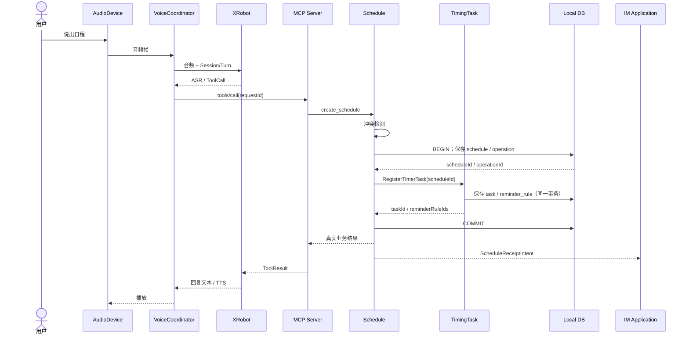
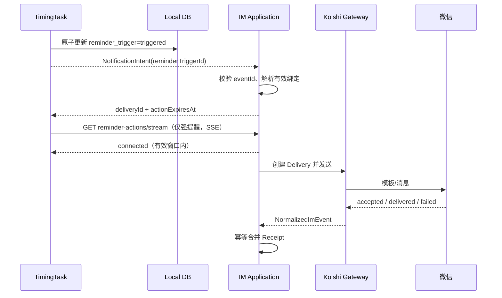
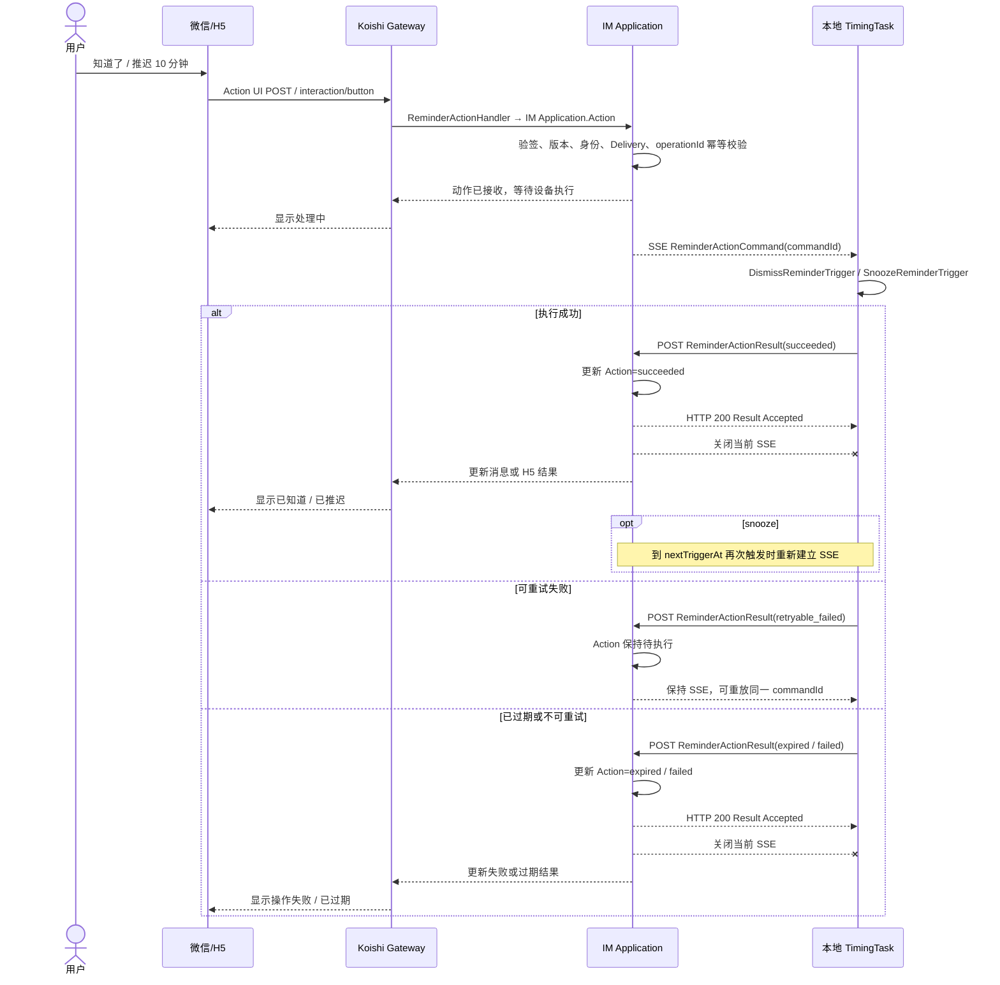
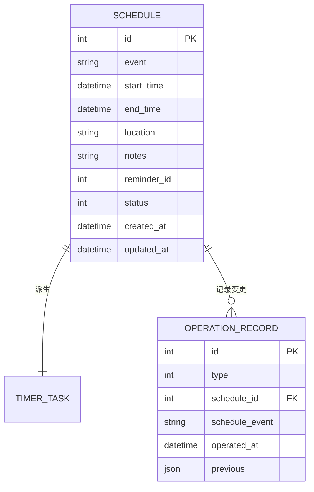
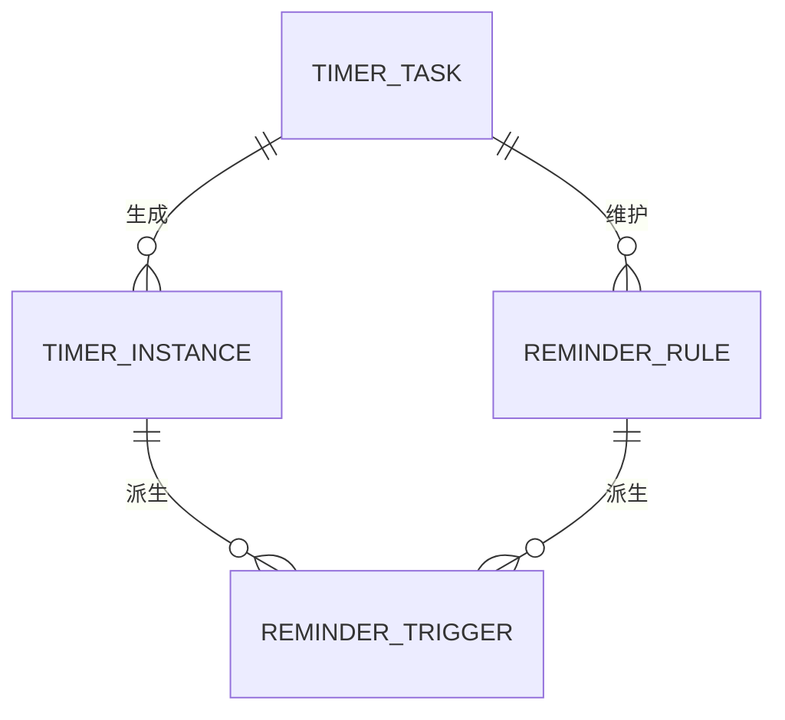

# VoiceLife（声活）MVP 整体架构设计 V0

> 文档状态：模块架构草案
> 
> 基线日期：2026-07-31
> 
> 适用范围：VoiceLife MVP（小智设备 + XRobot + 本地日程/调度 + VoiceLife IM Gateway + 微信）

## 1. 核心目标

### 1.1 一句话目标

> 构建一个"语音优先、IM 辅助"的日程提醒系统，以本地为业务事实源，通过清晰的模块划分实现语音交互、日程管理、定时调度和 IM 消息投递的主链路闭环。

### 1.2 V0 范围

VoiceLife MVP 整体架构覆盖：

- 语音交互编排（AudioDevice → VoiceSessionCoordinator → XRobot）
- MCP 工具注册与调用路由（MCP Server）
- 日程 CRUD、冲突检测与操作追溯（Schedule Service）
- 定时任务注册、实例生成与触发（TimingTask）
- IM 身份绑定、通知投递与用户动作处理（IM Application + Koishi Gateway）

不进入 V0：

- 多设备、多用户、多绑定路由策略
- 企业微信、飞书、钉钉正式接入（仅通过 Koishi Adapter 预留扩展）
- 群聊提醒
- 断网/离线运行场景
- Satori 对外协议

**运行假设**：MVP 运行期间设备保持联网，XRobot/灵矽语音服务可用；系统不承诺断网时的语音交互、播报或日程操作能力。

### 1.3 核心质量目标

| 优先级 | 质量目标 | 可验证场景 |
| --- | --- | --- |
| P0 | 数据归属清晰 | 本地日程、任务、实例、提醒规则和提醒触发是完整事实源，IM 与 XRobot 不保存可替代副本 |
| P0 | 跨边界幂等 | 工具调用、提醒投递、平台回执或用户动作重复到达时，不产生重复日程或重复业务动作 |
| P0 | 状态可追踪 | 一次语音操作能从 `sessionId` 追踪到 `toolCallId`、`scheduleId`、`taskId` 和 IM `deliveryId` |
| P1 | 外部能力可替换 | 业务模块不依赖 XRobot 原始消息、Koishi Session、微信 XML 或平台专属字段 |
| P1 | 失败可恢复 | IM 临时失败可检测并降级，设备重启后可恢复未完成调度 |

---

## 2. 核心概念定义

### 2.1 部署单元

- **`小智本地进程`**：部署在小智设备上的单进程，包含 AudioDevice、VoiceSessionCoordinator、MCP Server、Schedule、TimingTask、Local DB。MVP 的业务事实源。
- **`灵矽（XRobot）`**：直接调用的外部 ASR/LLM/TTS 与 MCP Client 平台，通过 WebSocket 与灵矽平台进行语音识别、LLM 理解和 TTS 合成。MVP 语音交互和语音播报的必需依赖，不保存 VoiceLife 业务事实。
- **`VoiceLife IM Gateway`**：独立部署的服务端，承载 IM Application、Koishi Runtime、平台适配与能力插件。可独立扩缩容，不接管本地日程和调度。

### 2.2 模块角色

- **`AudioDevice Adapter`**：麦克风采集、音频编解码、播放。不持有会话状态或业务数据。
- **`VoiceSessionCoordinator`**：管理 Session/Turn/Generation，编排录音/播放，处理 XRobot WebSocket 连接与重连。不负责日程 CRUD 或 IM 投递。
- **`MCP Server`**：工具注册、Schema 校验、`tools/list`、`tools/call`、结果封装。不拥有日程或提醒状态。
- **`Schedule Service`**：日程 CRUD、冲突检测、操作记录、撤销。回答"用户安排了什么"。
- **`TimingTask`**：重复规则、提醒规则、任务注册、Occurrence 实例生成、提醒触发、单次例外、关闭与推迟。回答"事件何时发生、围绕事件何时提醒、某次提醒如何响应"。
- **`IM Application`**：身份绑定、路由选择、通知投递、回执归并和动作执行入口。不修改日程事实。
- **`Koishi Gateway`**：通用 IM Session、收发适配、标准事件归一化。不包含 VoiceLife 业务规则。
- **`Platform Capability Plugin`**：微信/企微/飞书/钉钉专属模板、卡片、验签和回调。不涉及平台无关业务规则。

### 2.3 关键标识

| 阶段 | 标识 | 用途 |
| --- | --- | --- |
| 语音会话 | `sessionId`、`turnId`、`generation` | 隔离轮次、取消和迟到音频 |
| 工具调用 | `toolCallId`、`requestId` | 工具幂等与结果回传 |
| 日程业务 | `scheduleId`、`operationRecordId` | 业务事实与撤销 |
| 调度执行 | `taskId`、`instanceId`、`reminderRuleId`、`reminderTriggerId`、`plannedAt` | 周期规则、Occurrence、提醒规则和单次提醒动作 |
| 业务事件 | `eventId`、`correlationId` | 跨服务去重和链路追踪 |
| IM 投递 | `notificationIntentId`、`deliveryId`、`attemptId` | 投递与重试审计 |
| 用户动作 | `actionId`、`commandId`、`operationId` | 关联 SSE 命令、执行结果并防止重复关闭或推迟 |

---

## 3. 核心业务流程

### 3.1 语音创建日程



### 3.2 到点提醒与 IM 投递



### 3.3 微信关闭或推迟提醒



---

# 整体架构 - 详细技术设计 V1

## 一、总体架构

VoiceLife 是一个"语音优先、IM 辅助"的日程提醒系统。MVP 的部署分为三个边界：


| 部署单元 | 职责概要 |
| --- | --- |
| **小智本地进程** | 语音交互、MCP 工具路由、日程管理、定时调度、本地数据库 |
| **XRobot 平台** | ASR/LLM/TTS、MCP Client（外部依赖，不保存业务数据） |
| **VoiceLife IM Gateway** | IM 身份绑定、消息投递、回执管理、平台适配（可独立部署） |

### 六个核心模块

| 模块 | 一句话职责 | 数据归属 |
| --- | --- | --- |
| **AudioDevice Adapter** | 麦克风采集、音频编解码、播放（小智已实现） | 短期音频缓冲 |
| **VoiceSessionCoordinator** | 管理会话/轮次，编排语音交互，连接 XRobot | 会话运行态 |
| **MCP Server** | 工具注册、参数校验、调用路由 | 工具定义表 |
| **Schedule Service** | 日程 CRUD、冲突检测、操作记录与撤销 | `schedule`、`operation_record` |
| **TimingTask** | 重复规则解析、Occurrence 实例与提醒触发生成、推迟/关闭强提醒 | `timer_task`、`timer_instance`、`reminder_rule`、`reminder_trigger` |
| **IM Application** | 身份绑定、通知投递、回执归并、用户动作校验 | IM 领域表（独立服务端） |

### 关键边界决策

1. **Schedule 与 TimingTask 分离**：Schedule 回答"用户安排了什么"，TimingTask 回答"系统何时、以何种规则触发哪一次"。
2. **Occurrence 与提醒动作分离**：MVP 中一条 Schedule 对应一个 TimerTask；TimerTask 派生 TimerInstance，并维护零到多条 `ReminderRule`；每个 TimerInstance 与生效规则共同派生 `ReminderTrigger`。推迟/关闭作用于强提醒 Trigger，不改变 Occurrence 本身。
3. **MCP Registry 与语音 ToolGateway 是同一逻辑模块**：本地只保留一份工具定义和路由。
4. **业务回执由领域模块产生**：例如 Schedule 事务提交成功后，由 Schedule 向 IM Application 发送 `ScheduleReceiptIntent`；MCP 只转发工具结果。
5. **IM 用户动作不直写本地库**：动作经过绑定、Token、目标 ReminderTrigger 和 `operationId` 校验后，以命令回传本地 TimingTask。
6. **用户动作采用临时 SSE 下行**：只有强提醒进入可操作窗口时，本地才建立 SSE；IM 通过 SSE 下发命令，本地通过 HTTPS 回传结果。连接在 dismiss、snooze 或 `actionExpiresAt` 到期时关闭，不维持第二条永久 WebSocket，也不引入 Local Outbox。

### 设计原则

1. **本地优先，IM 辅助**：Schedule、TimerTask、TimerInstance、ReminderRule 和 ReminderTrigger 的权威数据位于本地。IM 服务端只保存外部身份、绑定、通知投递和用户动作审计。
2. **领域事实与适配器分离**：XRobot、Koishi 和微信类型不进入业务核心模型。MCP 不拥有业务状态，Koishi Session 不进入领域逻辑。
3. **命令同步确认，事件异步传播**：进程内领域操作使用同步 Port；跨网络回执、通知和状态传播使用异步事件，必须携带幂等标识。

---

## 二、语音模块（Voice）

### 1. 行业调研

语音模块参考了小智官方架构（xiaozhi-esp32），核心链路为：

```text
MIC -> Audio Engine -> Opus Encoder -> Protocol -> XRobot Server
XRobot Server -> Protocol -> Opus Decoder -> Playback Queue -> Speaker
```

小智官方架构适合单设备固件，但在 XE6-15 中需解决：Application 中心化导致业务模块耦合；无开放 Session/Turn/Generation 模型；无通用主动文本播报接口。因此 XE6-15 在保留小智音频链路基础上增加稳定接口层。

### 2. 核心概念定义

| 概念 | 理解 | 作用 |
| --- | --- | --- |
| `AudioDevice` | 耳朵和嘴巴 | 采集麦克风声音并播放回复音频 |
| `SpeechProvider` | 外接大脑 | 把语音转文字、理解意图。XRobot 是 V0 实现 |
| `VoiceSessionCoordinator` | 总调度员 | 安排录音、处理、工具调用、播放、取消和结束 |
| `ToolGateway` | 派单中心 | 按工具名路由到日程、提醒等模块 |
| `VoiceEvent` | 状态通知 | 告知 UI、IM 和诊断模块当前状态 |
| `Announcement` | 主动播报 | 无用户提问时，由模块主动请求播报 |

**三个关联标识**：

- `VoiceSessionID`（会话 ID）：一次完整语音交互，可包含多轮问答
- `VoiceTurnID`（轮次 ID）：用户一句话到系统回复的过程
- `Generation`（有效代次）：处理版本号，新一轮/取消时递增，识别迟到消息

例如：

```text
Session S1
├── Turn T1：明天下午三点帮我开会
├── Turn T2：提前十五分钟提醒
└── Turn T3：算了，取消刚才的安排
```

`Generation` 只能阻止旧结果播放，不能回滚已提交的业务操作。

### 3. 核心业务流程

**流程一：用户通过语音创建日程**

```text
按键/唤醒词 → 创建 Session/Turn → 采集音频 → XRobot 转写
→ XRobot 发出 ToolCall → ToolGateway 路由到业务模块
→ 业务执行并返回 ToolResult → XRobot 生成回复 → 播放
→ VoiceEvent 发布结果
```

**流程二：提醒模块发起主动播报**

```text
Reminder 到点 → 提交 Announcement
→ 检查 Provider 是否支持播报
→ 支持：排队/打断当前播放 → 完成后发布 completed
→ 不支持：返回错误，降级到 IM
```

**流程三：用户取消**

```text
用户停止/唤醒 → 取消当前 Turn → Generation +1
→ 停止旧处理 → 清理旧代次 → 丢弃迟到消息
```

### 4. 模块接口

#### 4.1 接口总览

**语音会话管理**

| Method | Path | 说明 |
| --- | --- | --- |
| POST | `/v1/voice/sessions` | 创建语音会话 |
| GET | `/v1/voice/sessions/{sessionId}` | 查询会话状态 |
| DELETE | `/v1/voice/sessions/{sessionId}` | 关闭会话 |
| POST | `/v1/voice/sessions/{sessionId}/turns` | 开始一轮语音输入 |
| POST | `/v1/voice/sessions/{sessionId}/turns/{turnId}/stop-input` | 结束本轮录音 |
| POST | `/v1/voice/sessions/{sessionId}/turns/{turnId}/cancel` | 取消本轮处理 |

**业务工具接入**

| Method | Path | 说明 |
| --- | --- | --- |
| POST | `/v1/voice/tools` | 注册业务工具 |
| GET | `/v1/voice/tools` | 查询已注册工具 |
| POST | `/v1/voice/tool-calls/{toolCallId}/result` | 返回工具执行结果 |
| POST | `/v1/voice/tool-calls/{toolCallId}/cancel` | 请求取消工具调用 |

**主动播报**

| Method | Path | 说明 |
| --- | --- | --- |
| POST | `/v1/voice/announcements` | 提交主动播报 |
| GET | `/v1/voice/announcements/{announcementId}` | 查询播报状态 |
| POST | `/v1/voice/announcements/{announcementId}/cancel` | 取消播报 |

**事件订阅**

| Method | Path | 说明 |
| --- | --- | --- |
| GET | `/v1/voice/events` | SSE 订阅语音事件 |

#### 4.2 关键接口参数

**创建语音会话**

| 参数 | 类型 | 必填 | 说明 |
| --- | --- | --- | --- |
| `requestId` | string | 是 | 请求幂等 ID |
| `deviceId` | string | 是 | 逻辑设备 ID |
| `agentId` | string | 是 | XRobot Provider 配置 ID |
| `userId` | string | 否 | 当前用户 ID |
| `trigger` | string | 是 | `button` / `wake_word` / `ui` / `system` |

**提交主动播报**

| 参数 | 类型 | 必填 | 说明 |
| --- | --- | --- | --- |
| `requestId` | string | 是 | 幂等 ID |
| `sourceModule` | string | 是 | 请求来源，如 `reminder` |
| `text` | string | 是 | 播放文本 |
| `interruptPolicy` | string | 是 | `wait_current_turn` / `interrupt_output` / `reject_if_busy` |
| `deviceId` | string | 是 | 目标设备 ID |

### 5. 状态模型

**Session 状态**：`opening → ready → closing → closed`，任一步到 `failed`

**Turn 状态**：`created → capturing → processing → speaking → completed`，任一步到 `cancelled` / `failed`

**Announcement 状态**：`queued → preparing → playing → completed`，或 `failed / expired / cancelled / rejected`

---

## 三、MCP 模块

### 1. 行业调研

1. [OpenClaw](https://github.com/openclaw/openclaw) — 开源工具调用框架
2. [ClaudeCode](https://github.com/claude-code-best/claude-code) — Claude MCP 工具集成
3. 灵矽平台 — MCP 硬件接入协议

### 2. 核心概念定义

- **注册器（Registry）**：所有工具统一注册，校验合法性，保证名称不重复
- **工具（Tool）**：OpenAI 格式工具定义 + 业务逻辑 handler
- **Tool Definition**：约束各模块工具定义标准
- **业务 Tool**：面向 Agent 暴露的稳定语义接口；负责在 Schedule 与 TimingTask 之间编排，不让 Agent 直接操作底层调度实体

### 3. 核心业务流程

**流程一：工具初始化**

1. 各模块完成工具定义（name、description、inputSchema、handler）
2. 通过注册器注册，校验命名唯一性
3. 响应 `tools/list` 将工具列表发送给灵矽平台

**流程二：工具回调**

1. 灵矽平台发 `tools/call` 请求（含工具名和参数）
2. Registry 查找工具，校验参数
3. 调用 handler 执行业务逻辑；日程 Tool 在内部编排 Schedule 与 TimingTask Port
4. 返回标准 JSON-RPC 响应

**流程三：日程与提醒 Tool 编排**

1. `create_schedule` 先创建 `schedule` 和 `operation_record`，成功后再注册 `timer_task`
2. `update_schedule` / `delete_schedule` 根据 `change_scope` 同步更新或终止调度
3. `query_calendar_view` 通过 `ListCalendarView` 展开周期事项，不能只查询已物化实例
4. `update_schedule_reminders` 将配置编译为 `reminder_rule`
5. `snooze_strong_reminder` / `dismiss_strong_reminder` 先定位强提醒 `reminder_trigger`，再执行运行态操作

### 4. 核心数据模型

```text
ToolDefinition
  ├── name           // String，工具名，全局唯一，建议命名空间格式
  ├── description    // String，工具功能描述，发送给模型
  ├── inputSchema    // Object，JSON Schema 入参定义
  ├── schemaVersion  // String，Schema 版本
  └── ownerModule    // String，归属模块（schedule / timer / binding）
```

### 5. 模块接口

#### 5.1 接口总览

**Registry 内部接口**

| 方法 | 说明 |
| --- | --- |
| `register_tool(name, description, input, handler)` | 注册一个工具定义 |
| `get_tool(name)` | 查询已注册的工具 |
| `list_tools()` | 获取全部已注册工具 |

**当前 XRobot JSON-RPC 接口**：`tools/list`、`tools/call`。`initialize`、`ping` 或工具列表变更通知仅在灵矽接入协议明确要求时补充，不作为当前业务基线。

**面向 Agent 的业务 Tool**

| Tool | 说明 | 内部主要编排 |
| --- | --- | --- |
| `create_schedule` | 创建日程并检测冲突 | Schedule 写入 → `RegisterTimerTask` / `UpdateTimerTask` |
| `query_schedule` | 查询日程主记录 | Schedule Query |
| `update_schedule` | 修改日程与调度范围 | Schedule Update → `UpdateTimerTask` |
| `delete_schedule` | 删除/取消日程 | Schedule Delete → `CancelTimerTask` |
| `query_calendar_view` | 查询时间范围内的用户可见安排 | `ListCalendarView` |
| `query_recent_operations` | 查询最近 15 分钟内最多 10 条可撤销操作 | Operation Query |
| `undo_operation` | 撤销指定日程操作 | Schedule Undo → TimingTask 补偿 |
| `update_schedule_reminders` | 创建、修改或关闭提醒规则 | `UpsertReminderRules` / `DeleteReminderRule` |
| `query_active_strong_reminders` | 定位可响应的强提醒触发 | `ListReminderTriggers` |
| `snooze_strong_reminder` | 推迟强提醒 | `SnoozeReminderTrigger` |
| `dismiss_strong_reminder` | 关闭强提醒 | `DismissReminderTrigger` |

#### 5.2 关键接口参数

**注册工具**

| 参数 | 类型 | 必填 | 说明 |
| --- | --- | --- | --- |
| `name` | String | 是 | 命名空间格式，全局唯一 |
| `description` | String | 是 | 功能描述，发送给模型 |
| `input` | Object | 否 | JSON Schema 入参定义 |
| `handler` | Function | 是 | 回调函数 |

**`tools/call` 请求/响应示例**

```json
// 请求
{ "jsonrpc": "2.0", "id": "req-001", "method": "tools/call", "params": { "name": "create_schedule", "arguments": { "event": "明天下午三点开会" } } }
// 响应
{ "jsonrpc": "2.0", "id": "req-001", "result": { "content": [{ "type": "text", "text": "日程创建成功" }], "isError": false } }
// 未知工具
{ "jsonrpc": "2.0", "id": "req-001", "error": { "code": -32601, "message": "unknown tool" } }
```

### 6. 关键约定

- 注册时校验命名唯一性与 JSON Schema
- MVP 采用进程内直接调用 Application Port
- Handler 抛错必须转换为结构化 ToolResult，不能悬空请求
- Tool 返回结构化业务结果，不把底层 Port 或数据库对象直接暴露给 Agent
- 提醒配置态操作面向 `reminder_rule`；强提醒推迟/关闭面向 `reminder_trigger`

---

## 四、日程模块（Schedule）

### 1. 行业调研

1. [oh-my-task](https://github.com/qq33357486/oh-my-task) — 开源任务/日程管理
2. [Agentscope-example](https://github.com/AlfredChaos/agentscope-example) — 多 Agent 工具调用模式

### 2. 核心概念定义

- **ScheduleID（日程 ID）**：定位每一个日程，包含时间、地点、事件状态、备注
- **OperationRecord（操作记录）**：记录创建、修改和删除操作，支持撤销

### 3. 核心业务流程

**流程一：日程增删改查**

1. **创建**：ASR → LLM → Schedule Create Tool → DB → LLM → TTS
2. **查询**：ASR → LLM → Schedule Query Tool → LLM → TTS
3. **修改**：ASR → LLM → Query → LLM → Update → LLM → TTS（支持二次确认）
4. **删除**：ASR → LLM → Query → LLM → Delete → LLM → TTS（支持二次确认；同步清理关联提醒）

**流程二：操作撤销**

1. **记录**：增删改完成后记录操作前的数据状态快照
2. **撤销**：查询最近操作（默认最近 15 分钟），推断用户要撤销的操作

### 4. 核心数据模型



### 5. 模块接口

#### 5.1 接口总览（MCP Tool 形式）

| 工具名 | 说明 |
| --- | --- |
| `create_schedule` | 创建日程（含冲突检测），有时间语义时注册 TimingTask |
| `query_schedule` | 查询日程主记录（ID/关键词/时间范围） |
| `update_schedule` | 修改日程并按范围同步 TimingTask |
| `delete_schedule` | 删除/取消日程并终止对应后续调度 |
| `query_calendar_view` | 按时间范围展开周期事项并合并单次例外 |
| `query_recent_operations` | 查询最近 15 分钟内最多 10 条可撤销操作 |
| `undo_operation` | 撤销操作并补偿同步 TimingTask |

#### 5.2 关键接口参数

**创建日程**

入参：

| 参数 | 类型 | 必填 | 说明 |
| --- | --- | --- | --- |
| `event` | String | 是 | 事件标题 |
| `start_time` | String | 否 | 事件开始时间 |
| `end_time` | String | 否 | 事件结束时间 |
| `location` | String | 否 | 事件地点 |
| `notes` | String | 否 | 事件备注 |
| `recurrence_rule` | Object | 否 | 周期规则；不传表示单次事项 |
| `reminder_config` | Object | 否 | 提醒配置；不传表示仅记录日程 |
| `ignore_conflict` | Boolean | 否 | 是否忽略时间冲突，默认 False |

出参：`created`、`schedule`、`task_id`、`conflicts`（冲突列表）、`error`

**查询日程**

| 参数 | 类型 | 必填 | 说明 |
| --- | --- | --- | --- |
| `schedule_id` | Number | 否 | 按 ID 精确查询 |
| `keyword` | String | 否 | 事件标题模糊匹配 |
| `start_from` / `start_to` | String | 否 | 时间范围筛选 |
| `status` | String | 否 | 默认 active，可选 all / cancelled |
| `limit` | Number | 否 | 默认 10，最大 50 |
| `offset` | Number | 否 | 默认 0 |

**撤销操作**

| 参数 | 类型 | 必填 | 说明 |
| --- | --- | --- | --- |
| `operation_id` | Number | 是 | 由 listOperations 获取 |

出参：`undone`、`operation`、`schedule`、`error`

### 6. 关键约定

- 创建事务顺序：写入 Schedule + OperationRecord → 调用 TimingTask 注册 → 提交 → IM 回执；不得先注册 TimingTask 再保存日程
- 取消 Schedule 必须同步终止关联 TimerTask 和未终态实例
- 每次修改同时写入 OperationRecord
- 撤销限制最近 15 分钟内操作
- `query_schedule` 返回主记录；“明天有什么安排”一类查询必须走 `query_calendar_view`

---

## 五、定时任务模块（TimingTask）

### 0. 核心目标

> 将用户输入的日程数据转化为调度层数据，旨在规划每一个事件的 recurrence，使得系统按照用户意图将单一或周期性事件实例化，并在每次 occurrence 上派生若干弱提醒与一个可推迟的强提醒，让每一层执行对象均可以被精确改动与触发。

### 1. 行业调研

参考以下成熟方案：

1. Google Calendar API Document <https://developers.google.cn/workspace/calendar/api/concepts/events-calendars?hl=zh-cn>
2. iCalendar(RFC 5545) <https://icalendar.org/RFC-Specifications/iCalendar-RFC-5545/>
3. Microsoft Outlook <https://learn.microsoft.com/en-us/graph/api/resources/calendar?view=graph-rest-1.0&preserve-view=true>

根据调研结果，在对象处理方面，各家产品均做到了业务模型、调度模型、执行模型分离。结合 VoiceLife 当前"若干弱提醒 + 事件开始时强提醒"的业务约束，本模块进一步区分 occurrence 与 reminder trigger。与本模块的主要业务对象对应关系如下表：

| 本模块业务对象 | Google Calendar | Outlook | RFC5545 |
| --- | --- | --- | --- |
| Schedule<br/>业务模型 | Event | Event | VEVENT |
| TimerTask<br/>调度模型 | Master Event | Series Master | RRULE |
| Instance<br/>执行模型 | Instance | Occurrence | RECURRENCE-ID |

### 2. 核心概念定义

定义系统核心实体，以更精确地匹配业务模型。调度与提醒拆分关系如下：

- **`schedule_id`** **日程标识**
  - 对应上游模块的日程实体，是用户业务意图的引用。
  - 本模块仅读取与转发，不负责维护其业务状态。
  - 解决 What 的问题，即"用户想做什么"。

- **`task_id`** **定时任务标识**
  - 模块核心实体，由 `schedule_id` 派生而来。
  - 承载具体的调度策略与参数，如 `next_trigger_at`、`recurrence_rule` 等。
  - 负责把一条日程转换成可执行的调度任务，解决"系统应该如何安排触发"的问题。

- **`instance_id`** **实例标识**
  - 由定时任务生成的单次 occurrence 实体，代表某一个具体事件发生时刻。
  - 它是 reminder trigger 的父级对象，适合承载单次 occurrence 修改、例外处理和触发确认。
  - 解决"这一次具体 occurrence 是什么"的问题。

- **`reminder_trigger_id`** **提醒触发标识**
  - 由 `timer_instance` 和 `reminder_rule` 共同派生出的单次提醒动作实体。
  - 弱提醒 trigger 仅支持触发、送达、跳过或取消；强提醒 trigger 额外支持 snooze / dismiss。
  - 解决"这一次提醒动作本身发生了什么"的问题。

### 3. 核心业务流程

**流程一：上游日程接入与任务注册**

1. 上游日程模块创建或更新一条 `schedule`，并将日程内容、开始时间、循环规则等传入本模块。
2. 本模块以 `schedule_id` 为引用，创建或更新对应的 `timer_task`。
3. `timer_task` 保存调度所需的核心字段，如 `next_trigger_at`、`recurrence_rule`、`effective_from` 等。
4. 任务注册后创建默认 `reminder_rule`：默认可包含一个事件开始前 10 分钟的弱提醒，以及一个事件开始时间的强提醒；用户通过 `UpsertReminderRules` 追加或覆盖提醒规则。
5. 对于一次性日程，任务通常只派生一个实例；对于周期日程，任务会持续维护下一次触发时间。

**流程二：实例生成与提醒触发执行**

1. 当 `timer_task` 到达 `next_trigger_at` 时，系统生成对应的 `timer_instance`。
2. 系统基于该 `timer_instance` 和生效中的 `reminder_rule` 派生出一个或多个 `reminder_trigger`。
3. 弱提醒 `reminder_trigger` 在对应偏移时间自动触发并结束，不支持 snooze。
4. 强提醒 `reminder_trigger` 在事件开始时间触发，支持 snooze / dismiss 等运行态操作。
5. 执行完成后，系统根据规则推进任务的下一次触发时间，并生成后续实例与提醒触发。
6. 如果某次提醒执行失败，系统只回写本次 `reminder_trigger` 状态，不直接破坏整条任务链路。

**流程三：单次改动、例外处理与重算**

1. 用户如果只修改"本次"，通常只影响某一个 `timer_instance`，不改整条 `timer_task`。
2. 用户如果修改"本次及以后"，系统以 `effective_from` 为边界，重算后续的调度规则、实例与提醒触发。
3. 用户如果取消某一条弱提醒规则，仅影响未来由该规则派生出的 `reminder_trigger`，不影响 occurrence 本身。
4. 用户如果取消日程，本模块会停止后续实例和提醒触发生成，并将对应任务标记为终止态。
5. 整个过程中，`schedule` 作为上游业务意图，`timer_task` 作为调度规则载体，`timer_instance` 作为 occurrence 结果，`reminder_trigger` 作为最终提醒动作，四者职责分离、单向影响。

**流程四：用户查询与时间范围展开**

1. 当用户查询"明天有什么安排""下个月 5 号有哪些安排"时，系统应优先基于 `timer_task` 与 `recurrence_rule` 在目标时间范围内展开 occurrence。
2. 查询过程中需合并该范围内已存在的 `timer_instance`，用于叠加单次修改、跳过等 occurrence 例外状态。
3. 若某个未来 occurrence 尚未进入实例生成窗口，只要其规则可被展开，仍应在查询结果中返回。
4. 因此，用户查询结果不以实例是否已预生成作为前提；`timer_instance` 主要服务于 occurrence 承接与例外持久化。

**流程五：提醒规则管理与运行态操作**

1. 用户可新增、修改、取消弱提醒规则，例如"默认提前 10 分钟提醒"和"再提前 30 分钟提醒一次"。
2. 用户可关闭某条弱提醒规则，但弱提醒一旦触发后不支持 snooze。
3. 用户在强提醒触发中可执行 snooze / dismiss；系统作用对象为 `reminder_trigger`，而非 `timer_instance`。
4. 规则层变化只影响未来 `reminder_trigger` 的生成；已终态的历史提醒动作保留。

### 4. 核心数据模型

实体关系如下：



#### 4.1 `timer_task`

| 字段名 | 类型 | 约束 | 说明 |
| --- | --- | --- | --- |
| `id` | string | 主键，唯一，非空 | 定时任务唯一标识 |
| `schedule_id` | string | 外键，非空 | 关联的日程 ID |
| `status` | string | 枚举，非空 | 任务状态，`active` / `terminated` |
| `next_trigger_at` | datetime | 可空 | 下一次预计触发时间 |
| `created_at` | datetime | 非空 | 创建时间 |
| `updated_at` | datetime | 非空 | 最后一次更新时间 |
| `deleted_at` | datetime | 可空 | 软删除时间，`NULL` 表示未删除 |

#### 4.2 `recurrence_rule`

| 字段名 | 类型 | 约束 | 说明 |
| --- | --- | --- | --- |
| `frequency` | string | 枚举，非空 | 周期频率，仅支持 `day` / `week` / `month` / `year`，分别表示每日、每周、每月、每年 |
| `start_at` | datetime | 非空 | 周期锚点时间 |
| `timezone` | string | 非空 | 时区，当前一期统一使用 `+08:00` |
| `by_weekdays` | array\<string> | 可空 | 每周循环时指定星期几 |
| `by_month_day` | array\<integer> | 可空 | 每月或每年循环时指定日期 |
| `by_month` | array\<integer> | 可空 | 每年循环时指定月份 |

约束：

- 循环固定为每 1 日、每 1 周、每 1 月或每 1 年，不支持自定义周期间隔。
- 循环任务持续生效，直至通过 `CancelTimerTask` 终止，不支持按截止时间或执行次数自动结束。
- `frequency=day` 时，不使用 `by_weekdays`、`by_month_day` 和 `by_month`。
- `frequency=week` 时，可使用 `by_weekdays`；未传时使用 `start_at` 对应的星期。
- `frequency=month` 时，可使用 `by_month_day`；未传时使用 `start_at` 对应的日期。
- `frequency=year` 时，可使用 `by_month` 和 `by_month_day`；未传时使用 `start_at` 对应的月份和日期。

#### 4.3 `timer_instance`

| 字段名 | 类型 | 约束 | 说明 |
| --- | --- | --- | --- |
| `id` | string | 主键，唯一，非空 | 实例唯一标识 |
| `task_id` | string | 外键，非空 | 所属定时任务 ID |
| `planned_at` | datetime | 非空 | occurrence 的原始开始时间 |
| `planned_end_at` | datetime | 可空 | occurrence 的原始结束时间 |
| `status` | string | 枚举，非空 | 实例状态，支持 `pending` / `modified` / `triggered` / `completed` / `skipped` |
| `override_fields` | object | 可空 | 本次实例相对原规则的覆盖字段 |
| `last_action_at` | datetime | 可空 | 最后一次用户操作或系统状态变更时间 |
| `created_at` | datetime | 非空 | 创建时间 |
| `updated_at` | datetime | 非空 | 最后一次更新时间 |
| `deleted_at` | datetime | 可空 | 软删除时间，`NULL` 表示未删除 |

补充说明：

- `timer_instance` 是持久化对象，可由近端调度窗口预生成，也可在单次修改、单次取消等需要承载例外时按需生成。
- 同一 `task_id` 下，`planned_at` 应具备唯一性约束，用于保障 instance 幂等与例外合并。

#### 4.4 `reminder_rule`

| 字段名 | 类型 | 约束 | 说明 |
| --- | --- | --- | --- |
| `id` | string | 主键，唯一，非空 | 提醒规则唯一标识 |
| `task_id` | string | 外键，非空 | 所属定时任务 ID |
| `reminder_type` | string | 枚举，非空 | `weak` / `strong` |
| `offset_minutes` | integer | 非空 | 相对 occurrence 开始时间的偏移分钟 |
| `max_snooze_count` | integer | 可空，>= 0 | 强提醒允许的最大推迟次数 |
| `snooze_interval_minutes` | integer | 可空，> 0 | 强提醒默认推迟间隔 |
| `channel` | string | 可空 | 提醒渠道 |
| `source` | string | 枚举，非空 | `system_default` / `user_defined` |
| `status` | string | 枚举，非空 | `active` / `disabled` |
| `created_at` | datetime | 非空 | 创建时间 |
| `updated_at` | datetime | 非空 | 最后一次更新时间 |
| `deleted_at` | datetime | 可空 | 软删除时间，`NULL` 表示未删除 |

约束：

- 同一 `task_id` 下，只允许一条 `reminder_type=strong && offset_minutes=0` 的强提醒规则处于 `active`。
- 弱提醒规则允许多条并存且不支持 snooze。

#### 4.5 `reminder_trigger`

| 字段名 | 类型 | 约束 | 说明 |
| --- | --- | --- | --- |
| `id` | string | 主键，唯一，非空 | 提醒触发唯一标识 |
| `reminder_rule_id` | string | 外键，非空 | 来源提醒规则 ID |
| `task_id` | string | 外键，非空 | 所属定时任务 ID |
| `instance_id` | string | 外键，非空 | 所属 occurrence 实例 ID |
| `reminder_type` | string | 枚举，非空 | `weak` / `strong` |
| `planned_trigger_at` | datetime | 非空 | 按规则计算出的原始提醒时间 |
| `actual_trigger_at` | datetime | 非空 | 当前实际触发时间；snooze 后会变化 |
| `status` | string | 枚举，非空 | 提醒触发状态 |
| `snooze_count` | integer | 非空，>= 0 | 当前提醒已被推迟次数 |
| `delivered_at` | datetime | 可空 | 成功送达时间 |
| `last_action_at` | datetime | 可空 | 最后一次用户操作或系统状态变更时间 |
| `payload` | object | 可空 | 下游播报或展示所需内容快照 |
| `created_at` | datetime | 非空 | 创建时间 |
| `updated_at` | datetime | 非空 | 最后一次更新时间 |
| `deleted_at` | datetime | 可空 | 软删除时间，`NULL` 表示未删除 |

约束：

- 同一 `instance_id + reminder_rule_id` 下仅允许存在一条未删除 `reminder_trigger`。
- 弱提醒 `reminder_trigger` 不允许进入 `snoozed` 状态。

### 5. 模块接口

#### 5.1 接口总览

| 接口 | 说明 |
| --- | --- |
| RegisterTimerTask | 注册定时任务 |
| UpdateTimerTask | 更新定时任务 |
| CancelTimerTask | 取消定时任务 |
| UpsertReminderRules | 创建或更新提醒规则 |
| DeleteReminderRule | 取消某条提醒规则 |
| ListCalendarView | 按时间范围查询用户可见安排 |
| ListReminderTriggers | 查询提醒触发列表 |
| SnoozeReminderTrigger | 推迟强提醒触发 |
| DismissReminderTrigger | 关闭强提醒触发 |

#### 5.2 关键接口参数

**RegisterTimerTask**

请求参数：

| 参数名 | 类型 | 必填 | 约束 | 说明 |
| --- | --- | --- | --- | --- |
| schedule_id | string | 是 | 来源于上游 schedule | 日程 ID |
| start_at | datetime | 是 | ISO 8601 | 首次触发时间 |
| recurrence_rule | object | 否 | 一次性日程可为空 | 周期规则 |

返回参数：

| 参数名 | 类型 | 约束 | 说明 |
| --- | --- | --- | --- |
| task_id | string | 唯一 | 定时任务 ID |
| status | string | 枚举 | 注册结果状态，通常为 `active` |
| next_trigger_at | datetime | 可空 | 下一次预计触发时间 |

**UpdateTimerTask**

请求参数：

| 参数名 | 类型 | 必填 | 约束 | 说明 |
| --- | --- | --- | --- | --- |
| task_id | string | 是 | 非空 | 定时任务 ID |
| schedule_id | string | 否 | 来源于上游 schedule，需与 task_id 绑定记录一致 | 关联日程 ID |
| start_at | datetime | 否 | ISO 8601 | 更新后的开始时间 |
| recurrence_rule | object | 否 | `change_scope=single` 时不适用 | 更新后的周期规则 |
| change_scope | string | 是 | `single` / `future` / `all` | 修改范围 |
| instance_id | string | 否 | `change_scope=single` 时可用 | 目标实例 ID |
| target_occurrence_at | datetime | 否 | `change_scope=single` 时可用 | 原计划触发时间 |
| effective_from | datetime | 否 | `change_scope=future` 时可用 | 生效开始时间 |

返回参数：

| 参数名 | 类型 | 约束 | 说明 |
| --- | --- | --- | --- |
| task_id | string | 唯一 | 被更新的任务 ID |
| status | string | 枚举 | 更新后的任务状态；`single` 场景下目标实例通常为 `modified` |
| next_trigger_at | datetime | 可空 | 重算后的下一次触发时间 |
| instance_id | string | 可空 | `single` 场景下目标实例 ID |
| override_fields | object | 可空 | `single` 场景下本次覆盖字段 |
| affected_instance_count | integer | 可空，>= 0 | `future` / `all` 场景下受影响的实例数量 |

**CancelTimerTask**

请求参数：

| 参数名 | 类型 | 必填 | 约束 | 说明 |
| --- | --- | --- | --- | --- |
| task_id | string | 是 | 非空 | 定时任务 ID |
| schedule_id | string | 否 | 来源于上游 schedule，需与 task_id 绑定记录一致 | 关联日程 ID |
| change_scope | string | 是 | `single` / `future` / `all` | 取消范围 |
| instance_id | string | 否 | `change_scope=single` 时可用 | 目标实例 ID |
| target_occurrence_at | datetime | 否 | `change_scope=single` 时可用 | 原计划触发时间 |
| effective_from | datetime | 否 | `change_scope=future` 时可用 | 向后取消的起点 |

返回参数：

| 参数名 | 类型 | 约束 | 说明 |
| --- | --- | --- | --- |
| task_id | string | 唯一 | 被取消的任务 ID |
| instance_id | string | 可空 | `single` 场景下目标实例 ID |
| status | string | 枚举 | 整体取消通常为 `terminated`；`single` 场景下目标实例通常为 `skipped` |
| affected_instance_count | integer | 可空，>= 0 | `future` / `all` 场景下受影响的实例数量 |

**UpsertReminderRules**

请求参数：

| 参数名 | 类型 | 必填 | 约束 | 说明 |
| --- | --- | --- | --- | --- |
| task_id | string | 是 | 非空 | 定时任务 ID |
| schedule_id | string | 否 | 可为空 | 关联日程 ID |
| rules | array\<object> | 是 | 至少 1 条 | 要创建或更新的提醒规则 |

`rules` 子项建议字段：

| 字段名 | 类型 | 约束 | 说明 |
| --- | --- | --- | --- |
| reminder_rule_id | string | 可空 | 更新已有规则时传入 |
| reminder_type | string | 枚举，必填 | `weak` / `strong` |
| offset_minutes | integer | 必填 | 相对 occurrence 开始时间的偏移分钟；弱提醒通常小于 0，强提醒通常为 0 |
| max_snooze_count | integer | 可空，>= 0 | 强提醒允许的最大推迟次数 |
| snooze_interval_minutes | integer | 可空，> 0 | 强提醒默认推迟间隔 |
| channel | string | 可空 | 提醒渠道，如 `voice` / `im` |
| source | string | 枚举，可空 | `system_default` / `user_defined` |

约束：

- 同一 `task_id` 下只允许 1 条 `reminder_type=strong && offset_minutes=0` 的强提醒规则。
- `weak` 规则不支持 snooze。

返回参数：

| 参数名 | 类型 | 约束 | 说明 |
| --- | --- | --- | --- |
| task_id | string | 唯一 | 所属任务 ID |
| reminder_rules | array\<object> | 可空 | 创建或更新后的完整规则列表 |

**DeleteReminderRule**

请求参数：

| 参数名 | 类型 | 必填 | 约束 | 说明 |
| --- | --- | --- | --- | --- |
| reminder_rule_id | string | 是 | 非空 | 提醒规则 ID |

返回参数：

| 参数名 | 类型 | 约束 | 说明 |
| --- | --- | --- | --- |
| reminder_rule_id | string | 唯一 | 被取消的提醒规则 ID |
| status | string | 枚举 | 通常为 `disabled` |
| affected_trigger_count | integer | 可空，>= 0 | 受影响的未来提醒触发数量 |

**ListCalendarView**

请求参数：

| 参数名 | 类型 | 必填 | 约束 | 说明 |
| --- | --- | --- | --- | --- |
| range_start | datetime | 是 | ISO 8601 | 查询开始时间 |
| range_end | datetime | 是 | ISO 8601，且必须大于 `range_start` | 查询结束时间 |
| schedule_id | string | 否 | 可为空 | 指定日程 ID；为空时表示查询用户可访问范围内的全部日程 |
| status | string | 否 | 枚举 | 查询结果状态过滤，通常为用户视图状态 |
| page | integer | 否 | 大于 0 | 页码，从 1 开始 |
| page_size | integer | 否 | 1 到 100 | 每页数量 |
| sort_by | string | 否 | 枚举 | 排序字段，默认 `planned_start_at` |
| sort_order | string | 否 | 枚举 | 排序方向，`asc` / `desc` |

约束：

- `ListCalendarView` 面向用户查询语义，服务端应基于 `timer_task` 与 `recurrence_rule` 展开目标时间范围内的 occurrence。
- 服务端应合并该时间范围内已存在的 `timer_instance`，用于叠加 `modified` / `completed` / `skipped` 等 occurrence 例外状态。
- 即使目标 occurrence 尚未进入实例生成窗口，只要符合规则且未被取消，仍应返回到结果中。

返回参数：

| 参数名 | 类型 | 约束 | 说明 |
| --- | --- | --- | --- |
| occurrences | array\<object> | 可空 | 用户在该时间范围内可见的安排列表 |
| total | integer | 大于等于 0 | 安排总数 |
| page | integer | 大于 0 | 当前页码 |
| page_size | integer | 大于 0 | 每页数量 |
| has_more | boolean | 非空 | 是否还有下一页 |

`occurrences` 建议最小字段：

| 字段名 | 类型 | 约束 | 说明 |
| --- | --- | --- | --- |
| occurrence_id | string | 非空 | 本次 occurrence 的稳定标识，可由 `task_id + planned_start_at` 派生 |
| schedule_id | string | 非空 | 所属日程 ID |
| task_id | string | 非空 | 所属定时任务 ID |
| instance_id | string | 可空 | 若该 occurrence 已物化为实例，则返回实例 ID |
| title | string | 可空 | 用户可见标题，由上游业务提供 |
| planned_start_at | datetime | 非空 | 按规则展开得到的原始开始时间 |
| planned_end_at | datetime | 可空 | 按规则展开得到的原始结束时间 |
| actual_trigger_at | datetime | 可空 | 若被推迟或改单次触发时间，则返回实际触发时间 |
| status | string | 枚举 | 用户视图下的当前有效状态 |
| is_recurring | boolean | 非空 | 是否来自周期规则 |
| is_exception | boolean | 非空 | 是否叠加了单次例外 |
| override_fields | object | 可空 | 单次覆盖字段 |

**ListReminderTriggers**

请求参数：

| 参数名 | 类型 | 必填 | 约束 | 说明 |
| --- | --- | --- | --- | --- |
| task_id | string | 否 | 可为空 | 定时任务 ID |
| instance_id | string | 否 | 可为空 | occurrence 实例 ID |
| schedule_id | string | 否 | 可为空 | 日程 ID |
| reminder_type | string | 否 | `weak` / `strong` | 提醒类型 |
| status | string | 否 | reminder trigger 状态枚举 | 提醒触发状态 |
| range_start | datetime | 否 | ISO 8601 | 实际触发时间范围起点（包含） |
| range_end | datetime | 否 | ISO 8601，且必须大于 `range_start` | 实际触发时间范围终点（不包含） |
| page | integer | 否 | 大于 0，默认 1 | 页码 |
| page_size | integer | 否 | 1 到 100，默认 20 | 每页数量 |
| sort_by | string | 否 | `actual_trigger_at` / `planned_trigger_at` / `created_at` | 排序字段，默认 `actual_trigger_at` |
| sort_order | string | 否 | `asc` / `desc` | 排序方向，默认 `asc` |

约束：

- 至少提供 `task_id`、`instance_id`、`schedule_id` 或 `range_start + range_end` 中的一组查询条件。
- `range_start` 与 `range_end` 必须同时提供，按左闭右开区间 `[range_start, range_end)` 过滤 `actual_trigger_at`。

返回参数：

| 参数名 | 类型 | 约束 | 说明 |
| --- | --- | --- | --- |
| reminder_triggers | array\<object> | 可空 | 符合条件的提醒触发列表 |
| total | integer | 大于等于 0 | 符合条件的提醒触发总数 |
| page | integer | 大于 0 | 当前页码 |
| page_size | integer | 1 到 100 | 每页数量 |
| has_more | boolean | 非空 | 是否还有下一页 |

**SnoozeReminderTrigger**

请求参数：

| 参数名 | 类型 | 必填 | 约束 | 说明 |
| --- | --- | --- | --- | --- |
| reminder_trigger_id | string | 是 | 非空 | 提醒触发 ID |
| delay_minutes | integer | 是 | 大于 0 | 推迟时长，单位分钟 |

约束：

- 仅 `reminder_type=strong` 的触发允许调用。
- 弱提醒调用该接口时应返回参数或状态错误。

返回参数：

| 参数名 | 类型 | 约束 | 说明 |
| --- | --- | --- | --- |
| reminder_trigger_id | string | 唯一 | 被推迟的提醒触发 ID |
| status | string | 枚举 | 通常为 `snoozed` |
| actual_trigger_at | datetime | 非空 | 推迟后的实际触发时间 |
| snooze_count | integer | 大于等于 0 | 推迟后的累计次数 |

**DismissReminderTrigger**

请求参数：

| 参数名 | 类型 | 必填 | 约束 | 说明 |
| --- | --- | --- | --- | --- |
| reminder_trigger_id | string | 是 | 非空 | 提醒触发 ID |

约束：

- 通常仅强提醒触发支持 dismiss；弱提醒如果已送达则无需额外关闭。

返回参数：

| 参数名 | 类型 | 约束 | 说明 |
| --- | --- | --- | --- |
| reminder_trigger_id | string | 唯一 | 被关闭的提醒触发 ID |
| status | string | 枚举 | 通常为 `dismissed` |

### 6. 状态模型

**`timer_task.status`**

- `active`：运行中。
- `terminated`：终止态，不再生成新实例。

**`timer_instance.status`**

- 非终态：`pending`、`modified`、`triggered`。
- 终态：`completed`、`skipped`。
- 允许流转：
  - `pending -> modified / triggered / skipped`
  - `modified -> triggered / skipped`
  - `triggered -> completed / skipped`
- `completed`、`skipped` 为终态，不再回退。

**`reminder_rule.status`**

- `active`：启用中。
- `disabled`：关闭中，不再为未来实例派生触发。

**`reminder_trigger.status`**

- 弱提醒非终态：`pending`、`triggered`。
- 弱提醒终态：`delivered`、`skipped`、`cancelled`、`failed`。
- 强提醒非终态：`pending`、`triggered`、`snoozed`。
- 强提醒终态：`delivered`、`dismissed`、`cancelled`、`failed`。
- 允许流转：
  - `pending -> triggered / skipped / cancelled`
  - `triggered -> delivered / snoozed / dismissed / failed`
  - `snoozed -> triggered / dismissed / failed`

### 7. 下游事件契约

适用对象：

- `IM` 模块
- `语音(输出)`模块

建议最小契约字段：

| 字段名 | 类型 | 必填 | 说明 |
| --- | --- | --- | --- |
| event_type | string | 是 | 事件类型，如 `instance_created` / `reminder_triggered` / `reminder_snoozed` / `reminder_dismissed` / `task_cancelled` / `task_updated` |
| event_id | string | 是 | 事件唯一标识，用于幂等 |
| task_id | string | 是 | 定时任务 ID |
| instance_id | string | 否 | 实例 ID；非实例级事件可为空 |
| reminder_rule_id | string | 否 | 提醒规则 ID；非提醒级事件可为空 |
| reminder_trigger_id | string | 否 | 提醒触发 ID；非提醒级事件可为空 |
| schedule_id | string | 是 | 关联日程 ID |
| planned_at | datetime | 否 | 原始计划触发时间 |
| trigger_at | datetime | 是 | 实际触发时间或生效时间 |
| status | string | 是 | 事件对应状态 |
| payload | object | 否 | 下游展示或播报所需内容 |
| occurred_at | datetime | 是 | 事件产生时间 |

约束：

- 同一 `event_id` 在下游必须幂等处理。
- 定时任务模块不定义 IM 的落库、展示和重试实现。

### 8. 关键约定

- 本模块以 `schedule_id` 为引用，创建或更新对应的 `timer_task`；`schedule` 作为上游业务意图，`timer_task` 作为调度规则载体，`timer_instance` 作为 occurrence 结果，`reminder_trigger` 作为最终提醒动作，四者职责分离、单向影响。
- 同一 `task_id` 下，`planned_at` 应具备唯一性约束，同一 `(task_id, planned_at)` 不重复生成 Instance。
- 同一 `instance_id + reminder_rule_id` 下仅允许一条未删除 `reminder_trigger`，同一 `(instance_id, reminder_rule_id)` 不重复生成 Trigger。
- 同一 `task_id` 下，只允许一条 `reminder_type=strong && offset_minutes=0` 的强提醒规则处于 `active`。
- 弱提醒规则允许多条并存且不支持 snooze；弱提醒 `reminder_trigger` 不允许进入 `snoozed` 状态。
- 循环固定为每 1 日、每 1 周、每 1 月或每 1 年，不支持自定义周期间隔；循环任务持续生效，直至通过 `CancelTimerTask` 终止，不支持按截止时间或执行次数自动结束。
- 强提醒的 snooze / dismiss 只作用于 `reminder_trigger`，不得把 `timer_instance` 置为 dismissed。
- `ListCalendarView` 基于 `timer_task` 与 `recurrence_rule` 展开目标时间范围内的 occurrence，并合并该范围内已存在的 `timer_instance` 例外状态；未物化的 occurrence 只要符合规则且未被取消，仍应返回。
- `ListReminderTriggers` 至少提供 `task_id`、`instance_id`、`schedule_id` 或 `range_start + range_end` 中的一组查询条件，且 `range_start` 与 `range_end` 必须同时提供，按左闭右开区间 `[range_start, range_end)` 过滤 `actual_trigger_at`。
- 同一 `event_id` 在下游必须幂等处理；定时任务模块不定义 IM 的落库、展示和重试实现。
- 用户取消日程时，本模块停止后续实例和提醒触发生成，并将对应任务标记为 `terminated`。
- 某次提醒执行失败时，只回写本次 `reminder_trigger` 状态，不直接破坏整条任务链路。

---

## 六、IM 模块

### 1. 行业调研

调研微信公众号、企业微信、飞书、钉钉能力差异：

| 能力 | 微信公众号 | 企业微信(机器人) | 飞书 | 钉钉 |
| --- | --- | --- | --- | --- |
| 入站方式 | HTTPS Webhook | WebSocket | Webhook/长连接 | HTTP/Stream |
| 主动提醒 | 依赖获批模板 | 支持主动推送 | 支持 | 支持 |
| 原生按钮回调 | 否，使用 H5 | 是 | 是 | 是 |
| 通用已读回执 | 无 | 不应假设 | 部分支持 | 不应假设 |

**架构决策**：

| 方案 | 结论 |
| --- | --- |
| 分别维护原生 Adapter | 可行但复杂：重复维护 SDK、鉴权与协议 |
| **Koishi Adapter + Capability Plugin** | **采用**：基础消息统一，专属模板/卡片能力按需补充 |
| 业务核心通过 Satori 接入 | 仅作可选外部出口 |

### 2. 核心概念定义

| 概念 | 说明 |
| --- | --- |
| `ImPlatform` | `wechat_official` / `wecom_aibot` / `feishu` / `dingtalk` |
| `ChannelAccount` | 可独立鉴权的平台应用配置 |
| `ExternalIdentity` | 用户在通道中的平台身份 |
| `ImBinding` | 内部用户/设备与外部身份的绑定关系 |
| `ConversationRef` | 平台内的直接会话或群会话目标 |
| `NotificationIntent` | 业务向 IM 提交的语义化通知 |
| `ActionIntent` | `acknowledge` / `snooze` / `bind_confirm` / `bind_cancel` / `open_url` 等平台无关动作 |
| `Delivery` | 一次通知经一个绑定的投递记录 |
| `DeliveryAttempt` | 一次真实平台 API 调用（重试递增） |
| `DeliveryReceipt` | 平台明确返回的 `delivered` / `failed` 证据；用户动作单独记入 Action |
| `NormalizedImEvent` | 规范化入站事件 |
| `ChannelCapabilities` | Adapter 原生能力与 Action UI 补充能力的合并结果 |
| `ReminderActionCommand` | IM 向本地 TimingTask 下发的短时效用户动作命令 |
| `ReminderActionResult` | 本地执行命令后回传的成功、失败或新触发时间 |
| `ActionStream` | 强提醒有效窗口内由本地主动建立的临时 SSE 下行通道 |

### 3. 核心业务流程

**流程一：身份绑定**

1. 设备或业务服务创建一次性 PairingSession
2. Adapter 将配对码/扫码事件转为 `binding.requested`
3. 统一 `BindingHandler` 校验并经 `IM Application.Binding` 调用 Binding Service Port
4. 用户确认后创建 `ImBinding`；解绑置为 `unbound`

**流程二：业务提醒投递**

1. 消费 `NotificationIntent`，创建平台无关通知
2. 查找有效 `ImBinding`、`ChannelAccount` 与 `ConversationRef`
3. 根据 `ChannelCapabilities` 选择原生卡片或模板/文本 + Action UI
4. 每个目标绑定生成一个 `Delivery`，Renderer 转为平台内容
5. 平台返回回执，临时失败重试，永久失败入死信

**流程三：平台消息与提醒动作分流**

1. Adapter 接收平台消息；只有绑定相关输入进入 `BindingHandler`
2. H5/小程序经 `plugin-server` 进入 VoiceLife Koishi Plugin 的 Action Route，不经过平台 Adapter，也不构造 Koishi Session
3. 原生卡片由 Adapter/Capability Plugin 转为 `interaction/button`
4. 两条动作入口统一为 `{token, action, params?}`，交给 `ReminderActionHandler`
5. Handler 验签、校验版本与幂等后调用 `IM Application.Action`，将 Action 作为有过期时间的待执行命令保存
6. 本地在强提醒触发后主动建立临时 SSE；IM 通过该连接下发 `ReminderActionCommand`
7. 本地 TimingTask 执行 dismiss / snooze，再通过 HTTPS 回传 `ReminderActionResult`
8. 收到结果或达到 `actionExpiresAt` 后关闭 SSE；snooze 后到下一次强提醒触发时重新建立
9. 微信公众号文字仅用于绑定，不解析“知道了/推迟”

**流程四：平台回执更新**

1. 平台发送结果转为 `delivery.updated` 事件
2. 通过 `externalMessageId` 找到对应 Delivery
3. 幂等写入 `delivered` / `failed` Receipt，不允许状态倒退；用户动作写入独立 Action

### 4. 总体架构

```text
平台 IM → Koishi Adapter → Binding Handler → IM Application.Binding → Binding Service Port

H5/小程序 → plugin-server → VoiceLife Koishi Plugin / Action Route ─┐
未来原生卡片 → Adapter / Capability Plugin → interaction/button ——───┤
                                                                   └→ ReminderActionHandler
                                                                       → IM Application.Action
                                                                       → Reminder Command Port

NotificationIntent → IM Application.Delivery → Renderer / ImChannelPort
  → Koishi Runtime（WeChat / WeCom / Lark / DingTalk Adapter + Capability Plugin）

本地 TimingTask ── HTTPS NotificationIntent ──→ IM Application
本地 TimingTask ←─ 临时 SSE ReminderActionCommand ─ IM Application.Action
本地 TimingTask ── HTTPS ReminderActionResult ─→ IM Application.Action
```

`BindingHandler` 与 `ReminderActionHandler` 是共享应用入口，不是平台 Adapter。当前 Demo 可单进程组合部署，但 Handler 不得直接依赖具体业务 Service；生产拆分时只替换 Port 的 IPC/RPC 实现。H5/小程序是同一微信公众号渠道的 Action UI，不是第二个 Adapter。

临时 SSE 只承担 `IM → 本地` 的命令下行，不传输执行结果。它由本地主动建立，适应设备位于 NAT 后的部署；没有活动强提醒时不保持连接。

### 5. 核心数据模型

```text
ChannelAccount（通道账号配置）
  ├── id              // uuid, PK
  ├── platform        // wechat_official / wecom / feishu / dingtalk
  ├── credential_ref  // 凭据引用（不存明文 Secret）
  └── status          // active / disabled / error

ExternalIdentity（平台用户身份）
  ├── id                         // uuid, PK
  ├── channel_account_id         // FK
  ├── external_user_id_ciphertext // 加密保存
  ├── external_user_id_hash      // 查询和去重
  └── status                     // active / unreachable / revoked

ImBinding（内部用户与平台身份的绑定）
  ├── id                  // uuid, PK
  ├── user_id             // 内部用户ID
  ├── device_id           // 设备ID, Nullable
  ├── external_identity_id // FK
  ├── priority            // 绑定优先级
  └── status              // active / unbound / revoked

PairingSession（一次性配对会话）
  ├── id / display_code
  ├── user_id / device_id
  ├── expires_at
  └── status              // pending / confirmed / expired / cancelled

Delivery（一次业务投递记录）
  ├── id                  // uuid, PK
  ├── business_event_id   // 业务事件ID
  ├── correlation_id      // 关联ID
  ├── binding_id          // FK
  ├── status              // pending → sending → accepted → delivered / failed
  ├── external_message_id // 平台消息ID
  └── last_error_code

DeliveryAttempt（每次 API 调用）
  ├── id            // uuid, PK
  ├── delivery_id   // FK
  ├── attempt_no    // 从1递增
  ├── request_id    // Unique
  └── status        // sending / accepted / retryable_failed / permanent_failed

NormalizedImEvent（规范化入站事件）
  ├── type           // message.received / action.triggered / delivery.updated / binding.requested
  ├── platform       // wechat_official
  ├── channel_account_id
  ├── external_event_id // 平台事件ID，用于去重
  └── payload        // 平台无关结构化数据

DeliveryReceipt（平台投递证据）
  ├── delivery_id / attempt_id
  ├── stage          // delivered / failed
  └── dedupe_key     // Unique

Action（用户动作）
  ├── delivery_id / action_type
  ├── device_id / reminder_trigger_id
  ├── operation_id   // Unique
  ├── expected_identity_id / actual_identity_id
  └── status / dispatched_at / result / expires_at
```

### 6. 模块接口

#### 6.1 接口总览

**业务 API**

| Method | Path | 说明 |
| --- | --- | --- |
| POST | `/v1/im/channel-accounts` | 创建通道账号 |
| GET | `/v1/im/channel-accounts/{accountId}/health` | 查询 Koishi Bot/Adapter 健康状态 |
| POST | `/v1/im/pairing-sessions` | 创建配对会话 |
| GET | `/v1/im/pairing-sessions/{pairingSessionId}` | 查询配对状态 |
| GET | `/v1/im/bindings` | 查询绑定 |
| DELETE | `/v1/im/bindings/{bindingId}` | 解绑 |
| POST | `/v1/im/notifications` | 提交通知意图 |
| GET | `/v1/im/deliveries/{deliveryId}` | 查询投递与回执 |
| POST | `/v1/im/deliveries/{deliveryId}/retry` | 人工重试死信 |
| POST | `/internal/v1/im/events` | 接收 NormalizedImEvent |

同进程部署时，VoiceLife Koishi Plugin 直接调用同一应用服务接口，不经过 HTTP。

**Action UI**

| Method | Path | 说明 |
| --- | --- | --- |
| GET | `/voicelife/reminder-actions/{token}` | 展示 H5/小程序动作页 |
| POST | `/voicelife/reminder-actions/{token}` | 执行统一提醒动作 |

**本地设备动作通道**

| Method | Path | 说明 |
| --- | --- | --- |
| GET | `/v1/devices/{deviceId}/reminder-actions/stream` | 在强提醒有效窗口内建立临时 SSE |
| POST | `/v1/devices/{deviceId}/reminder-actions/{commandId}/result` | 回传本地动作执行结果 |

**跨模块事件**

| 方向 | 接口 | 说明 |
| --- | --- | --- |
| 本地→IM（HTTPS） | `ScheduleReceiptIntent` | 提交操作回执 |
| 本地→IM（HTTPS） | `NotificationIntent` | 提交通知意图并获得动作有效期 |
| IM→本地（临时 SSE） | `ReminderActionCommand` | 在强提醒窗口内下发用户动作 |
| 本地→IM（HTTPS） | `ReminderActionResult` | 回传命令执行结果 |

#### 6.2 关键接口参数

**提交通知意图**

```http
POST /v1/im/notifications
Idempotency-Key: reminder-occurrence-8899
```

```json
{
  "businessEventId": "evt-reminder-8899",
  "correlationId": "corr-reminder-8899",
  "kind": "reminder_due",
  "recipient": { "userId": "user-01", "deviceId": "xiaozhi-demo-01" },
  "content": { "title": "喝水", "body": "该喝水了" },
  "actions": [
    { "kind": "command", "type": "acknowledge", "label": "知道了" },
    { "kind": "command", "type": "snooze", "label": "推迟 10 分钟", "params": { "minutes": 10 } }
  ]
}
```

强提醒响应还需返回动作窗口：

```json
{
  "businessEventId": "evt-reminder-8899",
  "status": "accepted",
  "deliveries": [
    {
      "deliveryId": "delivery-8899",
      "bindingId": "binding-01",
      "status": "pending"
    }
  ],
  "actionStream": {
    "reminderTriggerId": "rtg-9001",
    "expiresAt": "2026-07-31T15:10:00+08:00"
  }
}
```

弱提醒不支持用户动作，因此不返回 `actionStream`。

**临时 SSE 动作通道**

本地仅在 `reminder_type=strong` 且 Trigger 进入 `triggered` 状态后建立连接：

```http
GET /v1/devices/xiaozhi-01/reminder-actions/stream?reminderTriggerId=rtg-9001
Accept: text/event-stream
Authorization: Bearer <device-token>
Last-Event-ID: action-1000
```

服务端响应头至少包括：

```http
Content-Type: text/event-stream
Cache-Control: no-cache
X-Accel-Buffering: no
```

命令事件：

```text
id: action-1001
event: reminder.action
data: {"commandId":"action-1001","operationId":"op-1001","reminderTriggerId":"rtg-9001","action":"snooze","params":{"minutes":10},"expiresAt":"2026-07-31T15:10:00+08:00"}

```

其中 `commandId` 复用 Action ID，SSE `id` 与之相同。连接中断后，本地在有效期内携带 `Last-Event-ID` 重连。`Last-Event-ID` 只是传输续接提示，不能代替业务 ACK；在收到 `ReminderActionResult` 前，服务端可以重放同一未过期命令，本地必须用 `operationId` 幂等执行。

本地执行后通过 HTTPS 回传：

```json
{
  "operationId": "op-1001",
  "status": "succeeded",
  "reminderTriggerId": "rtg-9001",
  "nextTriggerAt": "2026-07-31T15:20:00+08:00"
}
```

SSE 是单向下行协议，禁止用它承载 `ReminderActionResult`。

### 7. 能力降级策略

```text
原生互动卡片 → 模板/富文本 + H5 → 纯文本 + H5
```

### 8. 投递状态机

```text
Delivery：pending → sending → accepted → delivered
                    ↘ retryable_failed → pending
                    ↘ permanent_failed / dead_letter

Receipt：delivered / failed
Action：pending → dispatched → processing → succeeded / failed
          └──────────────────────────────→ expired

ActionStream：closed → connected → closed
```

`ActionStream` 不是长期会话：默认窗口建议 10 分钟、最大 30 分钟，以 `actionExpiresAt` 为准。dismiss、snooze、动作成功或到期均立即关闭；snooze 后在下一次强提醒触发时重新建立。

### 9. 幂等策略

| 场景 | 幂等键 |
| --- | --- |
| 消费业务事件 | `business_event_id` |
| 平台入站事件 | `channel_account_id + external_event_id` |
| 平台投递回执 | `dedupe_key` |
| 用户业务动作 | `operation_id` |
| SSE 命令与结果关联 | `command_id`（复用 Action ID） |
| SSE 断线续传 | `Last-Event-ID` |
| 发送 API 请求 | `delivery_id + attempt_no` |

### 10. 关键约定

- 本地业务事务不依赖 IM 是否成功
- IM 用户动作不直写本地库
- HTTP JSON 使用 camelCase，数据库字段使用 snake_case；时间使用 ISO 8601，数据库保存 UTC
- 平台受理记录在 DeliveryAttempt，`delivered` / `failed` 记录在 DeliveryReceipt，用户动作记录在 Action，三者不可合并
- 凭据加密保存，不存明文 Secret
- H5 Token 需签名，含 `action_id`、`delivery_id`、`expires_at`，不放身份明文
- 一个 IM 平台只保留一个 Koishi Adapter；Action UI 不计为 Adapter
- 业务层只能依据 `ChannelCapabilities` 选能力，不得按平台名称分支
- 临时 SSE 仅为强提醒下发 `ReminderActionCommand`；弱提醒不得建立动作流
- SSE 每 15～30 秒发送注释型 heartbeat，代理层必须关闭响应缓冲
- 设备 Token 必须绑定 `deviceId`，命令还需校验 `reminderTriggerId`、身份和 `expiresAt`
- 未确认命令仅在 IM 服务端 Action 记录中保存到过期，不新增 Local Outbox

---

## 七、跨模块接口契约

| 边界 | 接口方式 | 说明 |
| --- | --- | --- |
| Voice ↔ XRobot | WebSocket | 上行音频、下行 TTS、MCP 控制消息 |
| XRobot ↔ MCP Server | JSON-RPC | 当前基线：`tools/list` / `tools/call` |
| MCP Server ↔ Schedule/TimingTask | MCP Tool + Application Port | `create_schedule` / `query_calendar_view` / `update_schedule_reminders` / `snooze_strong_reminder` 等 |
| Schedule ↔ TimingTask | 同步 Port | `RegisterTimerTask` / `UpdateTimerTask` / `CancelTimerTask` / `UpsertReminderRules` / `DeleteReminderRule` / `ListCalendarView` |
| MCP/IM ↔ TimingTask 运行态 | 同步 Port / Command | `ListReminderTriggers` / `SnoozeReminderTrigger` / `DismissReminderTrigger` |
| 本地 → IM Gateway | HTTPS | `ScheduleReceiptIntent` / `NotificationIntent` / `ReminderActionResult` |
| IM Gateway → 本地 | 临时 SSE | 强提醒有效窗口内下发 `ReminderActionCommand`；dismiss / snooze / 到期后关闭 |
| IM Application ↔ Koishi | Handler + `ImChannelPort` | 出站：发送意图；入站：`BindingHandler` / `ReminderActionHandler` / `NormalizedImEvent` |

---

## 八、数据库表结构设计

> 时间统一保存 UTC，API 层按 ISO 8601 输出。

### 1. 本地核心表

#### 1.1 `schedules`

| 字段 | 类型 | 约束 | 说明 |
| --- | --- | --- | --- |
| `id` | integer | PK, AutoIncrement | 自增主键 |
| `event` | varchar(100) | Not Null | 事件标题 |
| `start_time` | datetime | Nullable | 开始时间 |
| `end_time` | datetime | Nullable | 结束时间 |
| `location` | varchar(100) | Nullable | 地点 |
| `notes` | varchar(200) | Nullable | 备注 |
| `reminder_id` | integer | Nullable | 日程模块保留的可选提醒关联；集成调度的权威关联为 `timer_tasks.schedule_id` |
| `status` | tinyint | Not Null, Default 1 | 1:有效 / 2:已取消 |
| `created_at` | datetime | Not Null | 创建时间 |
| `updated_at` | datetime | Not Null | 更新时间 |

#### 1.2 `operation_records`

| 字段 | 类型 | 约束 | 说明 |
| --- | --- | --- | --- |
| `id` | integer | PK, AutoIncrement | 自增主键 |
| `type` | tinyint | Not Null | 1:create / 2:update / 3:delete |
| `schedule_id` | integer | Not Null | 涉及的日程 ID；删除后仍需保留审计记录，不强制数据库 FK |
| `schedule_event` | varchar(100) | Not Null | 操作时的事件标题；delete 保存删除前标题 |
| `operated_at` | datetime | Not Null | 操作时间 |
| `previous` | json | Nullable | 操作前完整快照（create 为 NULL） |

#### 1.3 `timer_tasks`

| 字段 | 类型 | 约束 | 说明 |
| --- | --- | --- | --- |
| `id` | varchar(64) | PK | 定时任务唯一标识 |
| `schedule_id` | varchar(64) | FK, Not Null | 关联的日程 ID |
| `recurrence_rule` | json | Nullable | 周期规则（frequency / start_at / timezone / by_weekdays / by_month_day / by_month） |
| `next_trigger_at` | datetime | Nullable | 下一次预计触发时间 |
| `status` | varchar(16) | Not Null | active / terminated |
| `created_at` | datetime | Not Null | 创建时间 |
| `updated_at` | datetime | Not Null | 最后一次更新时间 |
| `deleted_at` | datetime | Nullable | 软删除时间，NULL 表示未删除 |

约束：循环固定为每 1 日、每 1 周、每 1 月或每 1 年，不支持自定义周期间隔；循环任务持续生效，直至通过 `CancelTimerTask` 终止，不支持按截止时间或执行次数自动结束。

#### 1.4 `reminder_rules`

| 字段 | 类型 | 约束 | 说明 |
| --- | --- | --- | --- |
| `id` | varchar(64) | PK | 提醒规则唯一标识 |
| `task_id` | varchar(64) | FK, Not Null | 所属定时任务 ID |
| `reminder_type` | varchar(16) | Not Null | weak / strong |
| `offset_minutes` | integer | Not Null | 相对 occurrence 开始时间的偏移分钟 |
| `max_snooze_count` | integer | Nullable | 强提醒允许的最大推迟次数 |
| `snooze_interval_minutes` | integer | Nullable | 强提醒默认推迟间隔 |
| `channel` | varchar(16) | Nullable | 提醒渠道 |
| `source` | varchar(16) | Not Null | system_default / user_defined |
| `status` | varchar(16) | Not Null | active / disabled |
| `created_at` | datetime | Not Null | 创建时间 |
| `updated_at` | datetime | Not Null | 最后一次更新时间 |
| `deleted_at` | datetime | Nullable | 软删除时间，NULL 表示未删除 |

约束：同一 `task_id` 下，只允许一条 `reminder_type=strong && offset_minutes=0` 的强提醒规则处于 `active`；弱提醒规则允许多条并存且不支持 snooze。

#### 1.5 `timer_instances`

| 字段 | 类型 | 约束 | 说明 |
| --- | --- | --- | --- |
| `id` | varchar(64) | PK | 实例唯一标识 |
| `task_id` | varchar(64) | FK, Not Null | 所属定时任务 ID |
| `planned_at` | datetime | Not Null | occurrence 的原始开始时间 |
| `planned_end_at` | datetime | Nullable | occurrence 的原始结束时间 |
| `status` | varchar(16) | Not Null | pending / modified / triggered / completed / skipped |
| `override_fields` | json | Nullable | 本次实例相对原规则的覆盖字段 |
| `last_action_at` | datetime | Nullable | 最后一次用户操作或系统状态变更时间 |
| `created_at` | datetime | Not Null | 创建时间 |
| `updated_at` | datetime | Not Null | 最后一次更新时间 |
| `deleted_at` | datetime | Nullable | 软删除时间，NULL 表示未删除 |

复合唯一：`(task_id, planned_at)`。

补充说明：`timer_instance` 是持久化对象，可由近端调度窗口预生成，也可在单次修改、单次取消等需要承载例外时按需生成。

#### 1.6 `reminder_triggers`

| 字段 | 类型 | 约束 | 说明 |
| --- | --- | --- | --- |
| `id` | varchar(64) | PK | 提醒触发唯一标识 |
| `reminder_rule_id` | varchar(64) | FK, Not Null | 来源提醒规则 ID |
| `task_id` | varchar(64) | FK, Not Null | 所属定时任务 ID |
| `instance_id` | varchar(64) | FK, Not Null | 所属 occurrence 实例 ID |
| `reminder_type` | varchar(16) | Not Null | weak / strong |
| `planned_trigger_at` | datetime | Not Null | 按规则计算出的原始提醒时间 |
| `actual_trigger_at` | datetime | Not Null | 当前实际触发时间；snooze 后会变化 |
| `status` | varchar(16) | Not Null | pending / triggered / delivered / snoozed / dismissed / skipped / cancelled / failed |
| `snooze_count` | integer | Not Null, Default 0 | 当前提醒已被推迟次数 |
| `delivered_at` | datetime | Nullable | 成功送达时间 |
| `last_action_at` | datetime | Nullable | 最后一次用户操作或系统状态变更时间 |
| `payload` | json | Nullable | 下游播报或展示所需内容快照 |
| `created_at` | datetime | Not Null | 创建时间 |
| `updated_at` | datetime | Not Null | 最后一次更新时间 |
| `deleted_at` | datetime | Nullable | 软删除时间，NULL 表示未删除 |

复合唯一：`(instance_id, reminder_rule_id)`。

约束：弱提醒 `reminder_trigger` 不允许进入 `snoozed` 状态。

### 2. IM 服务端核心表

#### 2.1 `im_channel_accounts`

| 字段 | 类型 | 约束 | 说明 |
| --- | --- | --- | --- |
| `id` | uuid | PK | 主键 |
| `platform` | varchar(32) | Not Null | 平台类型 |
| `tenant_external_id` | varchar(128) | Not Null | 公众号 AppID 等非密钥标识 |
| `koishi_bot_id` | varchar(128) | Not Null | Koishi Runtime 内 Bot 标识 |
| `credential_ref` | varchar(256) | Not Null | 凭据引用 |
| `connection_mode` | varchar(16) | Not Null | webhook / websocket / both |
| `capability_config` | jsonb | Nullable | 模板、卡片等非敏感配置 |
| `status` | varchar(16) | Not Null | active / disabled / error |
| `created_at` | timestamptz | Not Null | 创建时间 |

#### 2.2 `im_pairing_sessions`

| 字段 | 类型 | 约束 | 说明 |
| --- | --- | --- | --- |
| `id` | uuid | PK | 配对会话 ID |
| `display_code_hash` | varchar(128) | Unique, Not Null | 一次性配对码哈希 |
| `user_id` | varchar(128) | Nullable | 内部用户 ID |
| `device_id` | varchar(128) | Not Null | 设备 ID |
| `allowed_platforms` | jsonb | Nullable | 允许绑定的平台 |
| `status` | varchar(16) | Not Null | pending / confirmed / expired / cancelled |
| `expires_at` | timestamptz | Not Null | 过期时间 |

#### 2.3 `im_external_identities`

| 字段 | 类型 | 约束 | 说明 |
| --- | --- | --- | --- |
| `id` | uuid | PK | 主键 |
| `channel_account_id` | uuid | FK, Not Null | 关联通道 |
| `external_user_id_ciphertext` | text | Not Null | 加密保存 |
| `external_user_id_hash` | varchar(128) | Not Null | 查询和去重 |
| `status` | varchar(16) | | active / unreachable / revoked |

复合唯一：`(channel_account_id, external_user_id_hash)`。

#### 2.4 `im_bindings`

| 字段 | 类型 | 约束 | 说明 |
| --- | --- | --- | --- |
| `id` | uuid | PK | 主键 |
| `user_id` | varchar(128) | Not Null | 内部用户ID |
| `device_id` | varchar(128) | Nullable | 设备ID |
| `external_identity_id` | uuid | FK, Not Null | 外部身份 |
| `priority` | integer | Default 100 | 绑定优先级 |
| `status` | varchar(16) | | active / unbound / revoked |
| `bound_at` | timestamptz | Not Null | 绑定时间 |

索引：`(user_id, status, priority)`。

#### 2.5 `im_deliveries`

| 字段 | 类型 | 约束 | 说明 |
| --- | --- | --- | --- |
| `id` | uuid | PK | 主键 |
| `business_event_id` | varchar(128) | Not Null | 业务事件ID |
| `correlation_id` | varchar(128) | Not Null | 关联ID |
| `binding_id` | uuid | FK, Not Null | 关联绑定 |
| `channel_account_id` | uuid | FK, Not Null | 发送通道快照 |
| `kind` | varchar(64) | | reminder_due 等 |
| `semantic_payload` | jsonb | Not Null | 平台无关通知快照 |
| `presentation_type` | varchar(32) | Not Null | 卡片 / 模板 / Action UI / 文本 |
| `status` | varchar(32) | | pending / sending / accepted / delivered / failed |
| `external_message_id` | varchar(256) | Nullable | 平台消息ID |
| `expires_at` | timestamptz | Nullable | 过期时间 |

复合唯一：`(business_event_id, binding_id, kind)`。

#### 2.6 `im_delivery_attempts`

| 字段 | 类型 | 约束 | 说明 |
| --- | --- | --- | --- |
| `id` | uuid | PK | 主键 |
| `delivery_id` | uuid | FK, Not Null | 关联投递 |
| `attempt_no` | integer | Not Null | 从1递增 |
| `request_id` | varchar(128) | Unique | 请求标识 |
| `rendered_payload` | jsonb | Not Null | 脱敏后的平台载荷 |
| `status` | varchar(24) | | sending / accepted / retryable_failed / permanent_failed |
| `started_at` | timestamptz | Not Null | 开始时间 |

复合唯一：`(delivery_id, attempt_no)`。

#### 2.7 `im_delivery_receipts`

| 字段 | 类型 | 约束 | 说明 |
| --- | --- | --- | --- |
| `id` | uuid | PK | 回执 ID |
| `delivery_id` | uuid | FK, Not Null | 所属投递 |
| `attempt_id` | uuid | FK, Nullable | 对应发送尝试 |
| `stage` | varchar(16) | Not Null | delivered / failed |
| `dedupe_key` | varchar(256) | Unique, Not Null | 回执幂等键 |
| `external_event_id` | varchar(256) | Nullable | 平台回执事件 ID |
| `detail` | jsonb | Nullable | 脱敏状态信息 |
| `occurred_at` / `received_at` | timestamptz | | 平台发生/系统接收时间 |

#### 2.8 `im_actions`

| 字段 | 类型 | 约束 | 说明 |
| --- | --- | --- | --- |
| `id` | uuid | PK | 用户动作 ID，同时作为 `commandId` 和 SSE Event ID |
| `delivery_id` | uuid | FK, Not Null | 所属投递 |
| `device_id` | varchar(128) | Not Null | 目标本地设备 |
| `reminder_trigger_id` | varchar(64) | Not Null | 目标强提醒 Trigger |
| `action_type` | varchar(32) | Not Null | acknowledge / snooze |
| `action_params` | jsonb | Nullable | 动作参数 |
| `action_key_hash` | varchar(128) | Unique, Not Null | Token/平台 action key 哈希 |
| `operation_id` | varchar(128) | Unique, Not Null | 业务动作幂等 ID |
| `expected_identity_id` / `actual_identity_id` | uuid | FK | 预期/实际执行身份 |
| `status` | varchar(32) | Not Null | pending / dispatched / processing / succeeded / failed / expired |
| `dispatched_at` | timestamptz | Nullable | 最近一次通过 SSE 下发时间 |
| `result` | jsonb | Nullable | 业务执行结果 |
| `expires_at` | timestamptz | Not Null | 过期时间 |

索引：`(device_id, status, expires_at)`。SSE 重连查询同一设备与 ReminderTrigger 下尚未确认、未过期的 Action；`Last-Event-ID` 用于识别续接位置，但只有 `ReminderActionResult` 才能确认命令完成。该表承担短时 Command Inbox，不增加本地 Outbox。

#### 2.9 `im_inbound_events`

| 字段 | 类型 | 约束 | 说明 |
| --- | --- | --- | --- |
| `id` | uuid | PK | 主键 |
| `channel_account_id` | uuid | FK, Not Null | 关联通道 |
| `external_event_id` | varchar(256) | Not Null | 平台事件ID |
| `event_type` | varchar(64) | | 事件类型 |
| `payload` | jsonb | | 规范化载荷 |
| `status` | varchar(16) | | received / processing / processed / failed |
| `occurred_at` / `received_at` | timestamptz | | 时间 |

复合唯一：`(channel_account_id, external_event_id)`。

### 3. 实体关系

```text
本地数据库：
schedules 1 ── 1 timer_tasks
timer_tasks 1 ── N timer_instances
timer_tasks 1 ── N reminder_rules
timer_instances 1 ── N reminder_triggers
reminder_rules 1 ── N reminder_triggers
schedules 1 ── N operation_records

IM 服务端：
im_channel_accounts 1 ── N im_external_identities
im_pairing_sessions 1 ── 0..1 im_bindings
im_external_identities 1 ── N im_bindings
im_bindings 1 ── N im_deliveries
im_deliveries 1 ── N im_delivery_attempts
im_deliveries 1 ── N im_delivery_receipts
im_deliveries 1 ── N im_actions
im_channel_accounts 1 ── N im_inbound_events
```

---

## 九、总结

VoiceLife MVP 以**本地日程 + 定时任务**为业务事实源，以**语音**为主要交互方式、**IM**为辅助通道，通过六个核心模块的分工协作实现完整主链路:

- **语音模块**负责交互编排，不执行业务
- **MCP 模块**负责工具路由，不持有状态
- **日程 + 定时任务**负责业务事实与调度，是系统核心（`Schedule → TimerTask → TimerInstance`，并由 `ReminderRule + TimerInstance` 派生 `ReminderTrigger`）
- **IM 模块**负责消息通道，通过 Handler、Application Port、Koishi Adapter 与 Capability Plugin 隔离业务语义和平台差异；强提醒动作使用临时 SSE 下发，HTTPS 回传执行结果

数据流向：`用户语音 → 意图 → 日程 → 定时 → 强提醒触发 → 临时 SSE 等待动作 → 用户确认 → HTTPS 回传结果 → 闭环`
