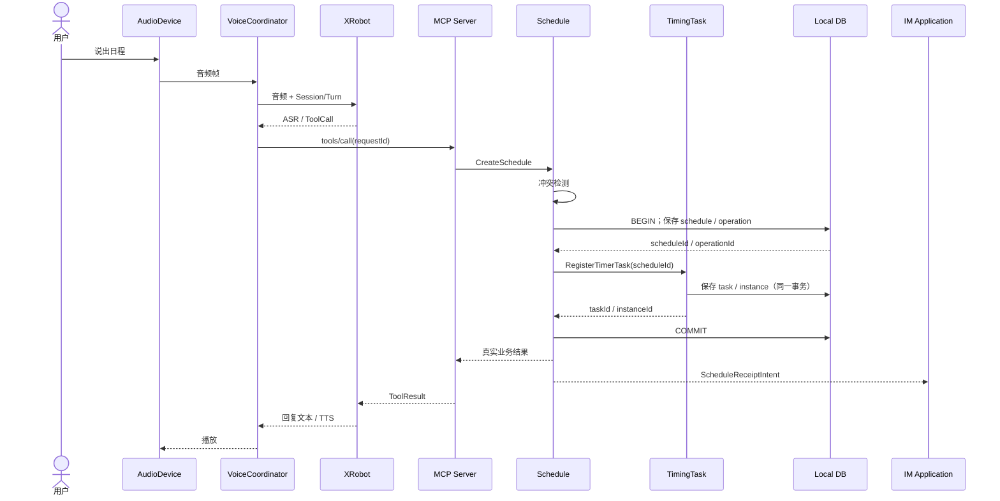
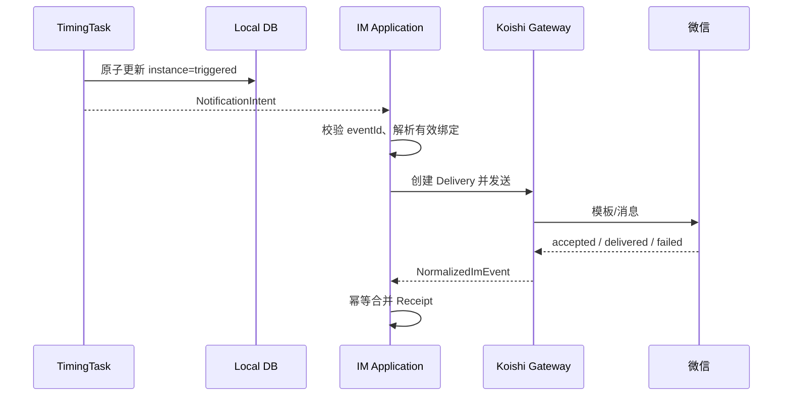
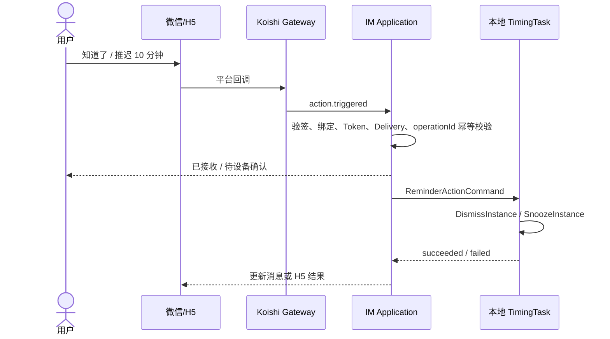
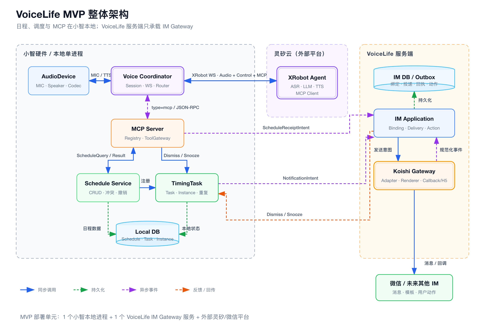
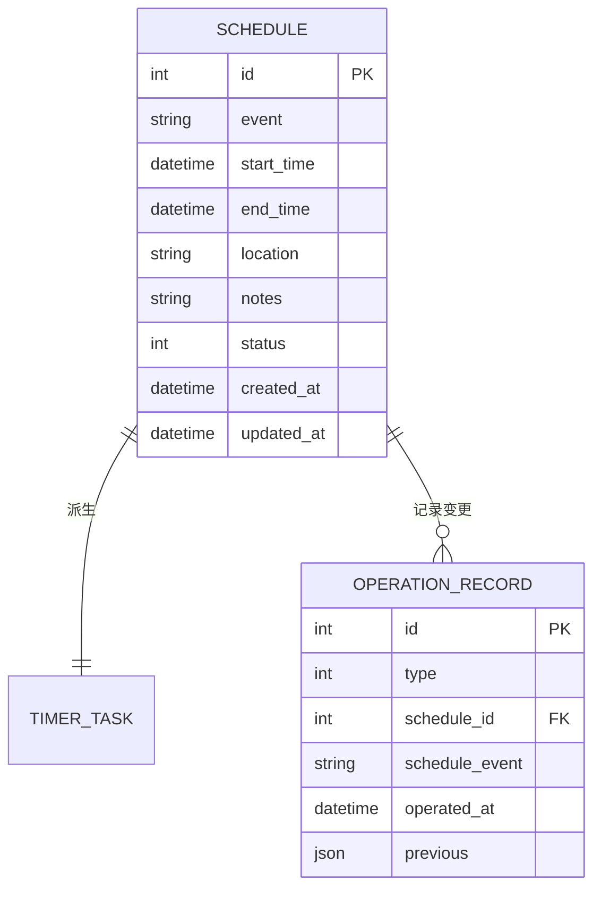
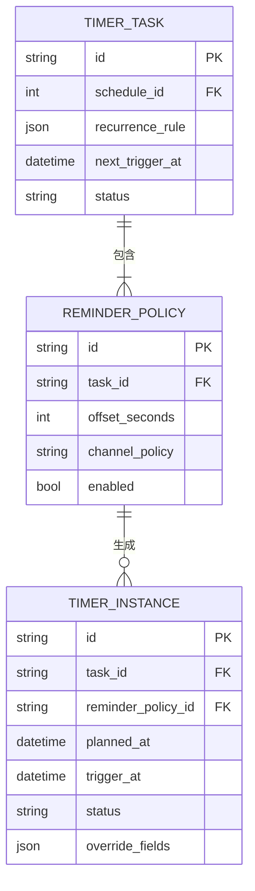

# VoiceLife（声活）MVP 整体架构设计 V0

> 文档状态：模块架构草案
> 
> 基线日期：2026-07-30
> 
> 适用范围：VoiceLife MVP（小智设备 + XRobot + 本地日程/调度 + VoiceLife IM Gateway + 微信）

## 1. 核心目标

### 1.1 一句话目标

> 构建一个"语音优先、IM 辅助"的日程提醒系统，以本地为业务事实源，通过清晰的模块划分实现语音交互、日程管理、定时调度和 IM 消息投递的主链路闭环。

### 1.2 V0 范围

VoiceLife MVP 整体架构覆盖：

- 语音交互编排（AudioDevice → VoiceSessionCoordinator → XRobot）
- MCP 工具注册与调用路由（MCP Server）
- 日程 CRUD、冲突检测与操作追溯（Schedule Service）
- 定时任务注册、实例生成与触发（TimingTask）
- IM 身份绑定、通知投递与用户动作处理（IM Application + Koishi Gateway）

不进入 V0：

- 多设备、多用户、多绑定路由策略
- 企业微信、飞书、钉钉正式接入（仅通过 Koishi Adapter 预留扩展）
- 群聊提醒
- 断网/离线运行场景
- Satori 对外协议

### 1.3 核心质量目标

| 优先级 | 质量目标 | 可验证场景 |
| --- | --- | --- |
| P0 | 数据归属清晰 | 本地日程、任务和实例是完整事实源，IM 与 XRobot 不保存可替代副本 |
| P0 | 跨边界幂等 | 工具调用、提醒投递、平台回执或用户动作重复到达时，不产生重复日程或重复业务动作 |
| P0 | 状态可追踪 | 一次语音操作能从 `sessionId` 追踪到 `toolCallId`、`scheduleId`、`taskId` 和 IM `deliveryId` |
| P1 | 外部能力可替换 | 业务模块不依赖 XRobot 原始消息、Koishi Session、微信 XML 或平台专属字段 |
| P1 | 失败可恢复 | IM 临时失败可检测并降级，设备重启后可恢复未完成调度 |

---

## 2. 核心概念定义

### 2.1 部署单元

- **`小智本地进程`**：部署在小智设备上的单进程，包含 AudioDevice、VoiceSessionCoordinator、MCP Server、Schedule、TimingTask、Local DB。MVP 的业务事实源。
- **`灵矽（XRobot）`**：直接调用的外部 ASR/LLM/TTS 与 MCP Client 平台，通过 WebSocket 与灵矽平台进行语音识别、LLM 理解和 TTS 合成。MVP 语音交互和语音播报的必需依赖，不保存 VoiceLife 业务事实。
- **`VoiceLife IM Gateway`**：独立部署的服务端，承载 IM Application、Koishi Runtime、平台适配与能力插件。可独立扩缩容，不接管本地日程和调度。

### 2.2 模块角色

- **`AudioDevice Adapter`**：麦克风采集、音频编解码、播放。不持有会话状态或业务数据。
- **`VoiceSessionCoordinator`**：管理 Session/Turn/Generation，编排录音/播放，处理 XRobot WebSocket 连接与重连。不负责日程 CRUD 或 IM 投递。
- **`MCP Server`**：工具注册、Schema 校验、`tools/list`、`tools/call`、结果封装。不拥有日程或提醒状态。
- **`Schedule Service`**：日程 CRUD、冲突检测、操作记录、撤销。回答"用户安排了什么"。
- **`TimingTask`**：重复规则、提醒策略、任务注册、实例生成、触发、单次例外、关闭与推迟。回答"系统何时、以何种规则触发哪一次"。
- **`IM Application`**：身份绑定、路由选择、通知投递、回执归并、动作校验、Outbox。不修改日程事实。
- **`Koishi Gateway`**：通用 IM Session、收发适配、标准事件归一化。不包含 VoiceLife 业务规则。
- **`Platform Capability Plugin`**：微信/企微/飞书/钉钉专属模板、卡片、验签和回调。不涉及平台无关业务规则。

### 2.3 关键标识

| 阶段 | 标识 | 用途 |
| --- | --- | --- |
| 语音会话 | `sessionId`、`turnId`、`generation` | 隔离轮次、取消和迟到音频 |
| 工具调用 | `toolCallId`、`requestId` | 工具幂等与结果回传 |
| 日程业务 | `scheduleId`、`operationRecordId` | 业务事实与撤销 |
| 调度执行 | `taskId`、`reminderPolicyId`、`instanceId`、`plannedAt` | 周期规则、提醒策略和某次触发 |
| 业务事件 | `eventId`、`correlationId` | 跨服务去重和链路追踪 |
| IM 投递 | `notificationIntentId`、`deliveryId`、`attemptId` | 投递与重试审计 |
| 用户动作 | `actionId`、`operationId` | 防止重复关闭或推迟 |

---

## 3. 核心业务流程

### 3.1 语音创建日程



### 3.2 到点提醒与 IM 投递



### 3.3 微信关闭或推迟提醒



---

# 整体架构 - 详细技术设计 V1

## 一、总体架构

VoiceLife 是一个"语音优先、IM 辅助"的日程提醒系统。MVP 的部署分为三个边界：



| 部署单元 | 职责概要 |
| --- | --- |
| **小智本地进程** | 语音交互、MCP 工具路由、日程管理、定时调度、本地数据库 |
| **XRobot 平台** | ASR/LLM/TTS、MCP Client（外部依赖，不保存业务数据） |
| **VoiceLife IM Gateway** | IM 身份绑定、消息投递、回执管理、平台适配（可独立部署） |

### 六个核心模块

| 模块 | 一句话职责 | 数据归属 |
| --- | --- | --- |
| **AudioDevice Adapter** | 麦克风采集、音频编解码、播放（小智已实现） | 短期音频缓冲 |
| **VoiceSessionCoordinator** | 管理会话/轮次，编排语音交互，连接 XRobot | 会话运行态 |
| **MCP Server** | 工具注册、参数校验、调用路由 | 工具定义表 |
| **Schedule Service** | 日程 CRUD、冲突检测、操作记录与撤销 | `schedule`、`operation_record` |
| **TimingTask** | 重复规则解析、实例生成、触发、推迟/关闭 | `timer_task`、`timer_instance` |
| **IM Application** | 身份绑定、通知投递、回执归并、用户动作校验 | IM 领域表（独立服务端） |

### 关键边界决策

1. **Schedule 与 TimingTask 分离**：Schedule 回答"用户安排了什么"，TimingTask 回答"系统何时、以何种规则触发哪一次"。
2. **一个日程对应一个定时任务**：MVP 中一条 Schedule 对应一个 TimerTask，一个 TimerTask 包含多个具名 `ReminderPolicy`；实例通过 `reminderPolicyId` 表明由哪条提醒策略生成。
3. **MCP Registry 与语音 ToolGateway 是同一逻辑模块**：本地只保留一份工具定义和路由。
4. **业务回执由领域模块产生**：例如 Schedule 事务提交成功后，由 Schedule 向 IM Application 发送 `ScheduleReceiptIntent`；MCP 只转发工具结果。
5. **IM 用户动作不直写本地库**：动作经过绑定、Token、目标实例和 `operationId` 校验后，以命令回传本地 TimingTask。

### 设计原则

1. **本地优先，IM 辅助**：Schedule、TimerTask 和 TimerInstance 的权威数据位于本地。IM 服务端只保存外部身份、绑定、通知投递和用户动作审计。
2. **领域事实与适配器分离**：XRobot、Koishi 和微信类型不进入业务核心模型。MCP 不拥有业务状态，Koishi Session 不进入领域逻辑。
3. **命令同步确认，事件异步传播**：进程内领域操作使用同步 Port；跨网络回执、通知和状态传播使用异步事件，必须携带幂等标识。

---

## 二、语音模块（Voice）

### 1. 行业调研

语音模块参考了小智官方架构（xiaozhi-esp32），核心链路为：

```text
MIC -> Audio Engine -> Opus Encoder -> Protocol -> XRobot Server
XRobot Server -> Protocol -> Opus Decoder -> Playback Queue -> Speaker
```

小智官方架构适合单设备固件，但在 XE6-15 中需解决：Application 中心化导致业务模块耦合；无开放 Session/Turn/Generation 模型；无通用主动文本播报接口。因此 XE6-15 在保留小智音频链路基础上增加稳定接口层。

### 2. 核心概念定义

| 概念 | 理解 | 作用 |
| --- | --- | --- |
| `AudioDevice` | 耳朵和嘴巴 | 采集麦克风声音并播放回复音频 |
| `SpeechProvider` | 外接大脑 | 把语音转文字、理解意图。XRobot 是 V0 实现 |
| `VoiceSessionCoordinator` | 总调度员 | 安排录音、处理、工具调用、播放、取消和结束 |
| `ToolGateway` | 派单中心 | 按工具名路由到日程、提醒等模块 |
| `VoiceEvent` | 状态通知 | 告知 UI、IM 和诊断模块当前状态 |
| `Announcement` | 主动播报 | 无用户提问时，由模块主动请求播报 |

**三个关联标识**：

- `VoiceSessionID`（会话 ID）：一次完整语音交互，可包含多轮问答
- `VoiceTurnID`（轮次 ID）：用户一句话到系统回复的过程
- `Generation`（有效代次）：处理版本号，新一轮/取消时递增，识别迟到消息

例如：

```text
Session S1
├── Turn T1：明天下午三点帮我开会
├── Turn T2：提前十五分钟提醒
└── Turn T3：算了，取消刚才的安排
```

`Generation` 只能阻止旧结果播放，不能回滚已提交的业务操作。

### 3. 核心业务流程

**流程一：用户通过语音创建日程**

```text
按键/唤醒词 → 创建 Session/Turn → 采集音频 → XRobot 转写
→ XRobot 发出 ToolCall → ToolGateway 路由到业务模块
→ 业务执行并返回 ToolResult → XRobot 生成回复 → 播放
→ VoiceEvent 发布结果
```

**流程二：提醒模块发起主动播报**

```text
Reminder 到点 → 提交 Announcement
→ 检查 Provider 是否支持播报
→ 支持：排队/打断当前播放 → 完成后发布 completed
→ 不支持：返回错误，降级到 IM
```

**流程三：用户取消**

```text
用户停止/唤醒 → 取消当前 Turn → Generation +1
→ 停止旧处理 → 清理旧代次 → 丢弃迟到消息
```

### 4. 模块接口

#### 4.1 接口总览

**语音会话管理**

| Method | Path | 说明 |
| --- | --- | --- |
| POST | `/v1/voice/sessions` | 创建语音会话 |
| GET | `/v1/voice/sessions/{sessionId}` | 查询会话状态 |
| DELETE | `/v1/voice/sessions/{sessionId}` | 关闭会话 |
| POST | `/v1/voice/sessions/{sessionId}/turns` | 开始一轮语音输入 |
| POST | `/v1/voice/sessions/{sessionId}/turns/{turnId}/stop-input` | 结束本轮录音 |
| POST | `/v1/voice/sessions/{sessionId}/turns/{turnId}/cancel` | 取消本轮处理 |

**业务工具接入**

| Method | Path | 说明 |
| --- | --- | --- |
| POST | `/v1/voice/tools` | 注册业务工具 |
| GET | `/v1/voice/tools` | 查询已注册工具 |
| POST | `/v1/voice/tool-calls/{toolCallId}/result` | 返回工具执行结果 |
| POST | `/v1/voice/tool-calls/{toolCallId}/cancel` | 请求取消工具调用 |

**主动播报**

| Method | Path | 说明 |
| --- | --- | --- |
| POST | `/v1/voice/announcements` | 提交主动播报 |
| GET | `/v1/voice/announcements/{announcementId}` | 查询播报状态 |
| POST | `/v1/voice/announcements/{announcementId}/cancel` | 取消播报 |

**事件订阅**

| Method | Path | 说明 |
| --- | --- | --- |
| GET | `/v1/voice/events` | SSE 订阅语音事件 |

#### 4.2 关键接口参数

**创建语音会话**

| 参数 | 类型 | 必填 | 说明 |
| --- | --- | --- | --- |
| `requestId` | string | 是 | 请求幂等 ID |
| `deviceId` | string | 是 | 逻辑设备 ID |
| `agentId` | string | 是 | XRobot Provider 配置 ID |
| `userId` | string | 否 | 当前用户 ID |
| `trigger` | string | 是 | `button` / `wake_word` / `ui` / `system` |

**提交主动播报**

| 参数 | 类型 | 必填 | 说明 |
| --- | --- | --- | --- |
| `requestId` | string | 是 | 幂等 ID |
| `sourceModule` | string | 是 | 请求来源，如 `reminder` |
| `text` | string | 是 | 播放文本 |
| `interruptPolicy` | string | 是 | `wait_current_turn` / `interrupt_output` / `reject_if_busy` |
| `deviceId` | string | 是 | 目标设备 ID |

### 5. 状态模型

**Session 状态**：`opening → ready → closing → closed`，任一步到 `failed`

**Turn 状态**：`created → capturing → processing → speaking → completed`，任一步到 `cancelled` / `failed`

**Announcement 状态**：`queued → preparing → playing → completed`，或 `failed / expired / cancelled / rejected`

---

## 三、MCP 模块

### 1. 行业调研

1. [OpenClaw](https://github.com/openclaw/openclaw) — 开源工具调用框架
2. [ClaudeCode](https://github.com/claude-code-best/claude-code) — Claude MCP 工具集成
3. 灵矽平台 — MCP 硬件接入协议

### 2. 核心概念定义

- **注册器（Registry）**：所有工具统一注册，校验合法性，保证名称不重复
- **工具（Tool）**：OpenAI 格式工具定义 + 业务逻辑 handler
- **Tool Definition**：约束各模块工具定义标准

### 3. 核心业务流程

**流程一：工具初始化**

1. 各模块完成工具定义（name、description、inputSchema、handler）
2. 通过注册器注册，校验命名唯一性
3. 响应 `tools/list` 将工具列表发送给灵矽平台

**流程二：工具回调**

1. 灵矽平台发 `tools/call` 请求（含工具名和参数）
2. Registry 查找工具，校验参数
3. 调用 handler 执行业务逻辑
4. 返回标准 JSON-RPC 响应

### 4. 核心数据模型

```text
ToolDefinition
  ├── name           // String，工具名，全局唯一，建议命名空间格式
  ├── description    // String，工具功能描述，发送给模型
  ├── inputSchema    // Object，JSON Schema 入参定义
  ├── schemaVersion  // String，Schema 版本
  └── ownerModule    // String，归属模块（schedule / timer / binding）
```

### 5. 模块接口

#### 5.1 接口总览

| 方法 | 说明 |
| --- | --- |
| `register_tool(name, description, input, handler)` | 注册一个工具定义 |
| `get_tool(name)` | 查询已注册的工具 |
| `list_tools()` | 获取全部已注册工具 |

**MCP 协议接口**：`initialize`、`ping`、`tools/list`、`tools/call`、`notifications/tools/list_changed`

#### 5.2 关键接口参数

**注册工具**

| 参数 | 类型 | 必填 | 说明 |
| --- | --- | --- | --- |
| `name` | String | 是 | 命名空间格式，全局唯一 |
| `description` | String | 是 | 功能描述，发送给模型 |
| `input` | Object | 否 | JSON Schema 入参定义 |
| `handler` | Function | 是 | 回调函数 |

**`tools/call` 请求/响应示例**

```json
// 请求
{ "jsonrpc": "2.0", "id": "req-001", "method": "tools/call", "params": { "name": "voicelife.schedule.create", "arguments": { "event": "明天下午三点开会" } } }
// 响应
{ "jsonrpc": "2.0", "id": "req-001", "result": { "content": [{ "type": "text", "text": "日程创建成功" }], "isError": false } }
// 未知工具
{ "jsonrpc": "2.0", "id": "req-001", "error": { "code": -32601, "message": "unknown tool" } }
```

### 6. 关键约定

- 注册时校验命名唯一性与 JSON Schema
- MVP 采用进程内直接调用 Application Port
- Handler 抛错必须转换为结构化 ToolResult，不能悬空请求

**推荐命名空间**：`voicelife.schedule.*`、`voicelife.timer.*`、`voicelife.binding.*`

---

## 四、日程模块（Schedule）

### 1. 行业调研

1. [oh-my-task](https://github.com/qq33357486/oh-my-task) — 开源任务/日程管理
2. [Agentscope-example](https://github.com/AlfredChaos/agentscope-example) — 多 Agent 工具调用模式

### 2. 核心概念定义

- **ScheduleID（日程 ID）**：定位每一个日程，包含时间、地点、事件状态、备注
- **OperationRecord（操作记录）**：记录创建、修改和删除操作，支持撤销

### 3. 核心业务流程

**流程一：日程增删改查**

1. **创建**：ASR → LLM → Schedule Create Tool → DB → LLM → TTS
2. **查询**：ASR → LLM → Schedule Query Tool → LLM → TTS
3. **修改**：ASR → LLM → Query → LLM → Update → LLM → TTS（支持二次确认）
4. **删除**：ASR → LLM → Query → LLM → Delete → LLM → TTS（支持二次确认；同步清理关联提醒）

**流程二：操作撤销**

1. **记录**：增删改完成后记录操作前的数据状态快照
2. **撤销**：查询最近操作（默认最近 15 分钟），推断用户要撤销的操作

### 4. 核心数据模型



### 5. 模块接口

#### 5.1 接口总览（MCP Tool 形式）

| 工具名 | 说明 |
| --- | --- |
| `voicelife.schedule.create` | 创建日程（含冲突检测） |
| `voicelife.schedule.query` | 查询日程（ID/关键词/时间范围） |
| `voicelife.schedule.update` | 修改日程（含冲突检测） |
| `voicelife.schedule.cancel` | 取消日程（不会自动删除关联提醒） |
| `voicelife.schedule.listOperations` | 查询最近操作（最多 10 条） |
| `voicelife.schedule.undo` | 撤销操作（最近 15 分钟内） |

#### 5.2 关键接口参数

**创建日程**

入参：

| 参数 | 类型 | 必填 | 说明 |
| --- | --- | --- | --- |
| `event` | String | 是 | 事件标题 |
| `start_time` | String | 否 | 事件开始时间 |
| `end_time` | String | 否 | 事件结束时间 |
| `location` | String | 否 | 事件地点 |
| `notes` | String | 否 | 事件备注 |
| `ignore_conflict` | Boolean | 否 | 是否忽略时间冲突，默认 False |

出参：`message`、`schedule`、`conflicts`（冲突列表）、`error`

**查询日程**

| 参数 | 类型 | 必填 | 说明 |
| --- | --- | --- | --- |
| `schedule_id` | Number | 否 | 按 ID 精确查询 |
| `keyword` | String | 否 | 事件标题模糊匹配 |
| `start_from` / `start_to` | String | 否 | 时间范围筛选 |
| `status` | String | 否 | 默认 active，可选 all / cancelled |
| `limit` | Number | 否 | 默认 10，最大 50 |
| `offset` | Number | 否 | 默认 0 |

**撤销操作**

| 参数 | 类型 | 必填 | 说明 |
| --- | --- | --- | --- |
| `operation_id` | Number | 是 | 由 listOperations 获取 |

出参：`undone`、`operation`、`schedule`、`error`

### 6. 关键约定

- 创建事务顺序：写入 Schedule + OperationRecord → 调用 TimingTask 注册 → 提交 → IM 回执
- 取消 Schedule 必须同步终止关联 TimerTask 和未终态实例
- 每次修改同时写入 OperationRecord
- 撤销限制最近 15 分钟内操作

---

## 五、定时任务模块（TimingTask）

### 1. 行业调研

参考 iCalendar（RFC 5545）、Google Calendar、Microsoft Outlook：

| 本模块业务对象 | Google Calendar | Outlook | RFC 5545 |
| --- | --- | --- | --- |
| Schedule（业务） | Event | Event | VEVENT |
| TimerTask（调度） | Master Event | Series Master | RRULE |
| Instance（执行） | Instance | Occurrence | RECURRENCE-ID |

三层拆分：业务模型（What）、调度模型（How）、执行模型（When）。

### 2. 核心概念定义

- **`schedule_id`**：对上游日程的引用，解决 What 的问题
- **`task_id`**：模块核心实体，承载调度策略和参数。解决"如何安排触发"的问题
- **`instance_id`**：单次执行实体，代表具体触发时刻。解决"这一次触发是什么"的问题

三者单向影响，不可反向：`schedule → task → instance`

`change_scope` 语义：

| 范围 | 说明 |
| --- | --- |
| `single` | 仅作用于某一个 `timer_instance` |
| `future` | 从 `effective_from` 起作用于后续未终态实例及调度规则 |
| `all` | 作用于整个 `timer_task` 系列，保留历史终态实例 |

### 3. 核心业务流程

**流程一：上游日程接入与任务注册**

1. 上游传入日程内容、开始时间、循环规则
2. 以 `schedule_id` 创建/更新 `timer_task`，保存 `next_trigger_at`、`recurrence_rule` 等

**流程二：实例生成与触发**

1. 到达 `next_trigger_at` 时生成 `timer_instance`
2. 执行完成后推进下一次触发时间
3. 实例生成需保证幂等：同一 `task_id` 下相同 `planned_at` 不重复生成

**流程三：单次改动与例外处理**

1. "单次"修改 → 只影响一个 `timer_instance`，不改整条 `timer_task`
2. "本次及以后" → 以 `effective_from` 为边界重算后续规则和实例
3. 取消日程 → 停止实例生成，标记任务为 `terminated`

**流程四：时间范围查询**

1. 基于 `timer_task` + `recurrence_rule` 展开 occurrence
2. 合并已有 `timer_instance` 叠加例外状态
3. 尚未物化的 occurrence 只要规则有效仍应返回

### 4. 核心数据模型



#### 4.1 `timer_task`

| 字段 | 类型 | 约束 | 说明 |
| --- | --- | --- | --- |
| `id` | string | PK | 定时任务唯一标识 |
| `schedule_id` | string | FK, Unique | 关联日程 ID |
| `status` | string | Not Null | `active` / `paused` / `terminated` |
| `next_trigger_at` | datetime | Nullable | 下次预计触发时间 |
| `created_at` / `updated_at` | datetime | Not Null | 创建/更新时间 |

#### 4.2 `recurrence_rule`

| 字段 | 类型 | 约束 | 说明 |
| --- | --- | --- | --- |
| `frequency` | string | Not Null | `day` / `week` / `month` / `year` |
| `interval` | integer | >= 1 | 周期间隔 |
| `timezone` | string | Not Null | 时区，统一 `+08:00` |
| `end_type` | string | Not Null | `none` / `until` / `count` |
| `end_at` | datetime | Nullable | `until` 的结束时间 |
| `count` | integer | Nullable | 执行次数 |

#### 4.3 `timer_instance`

| 字段 | 类型 | 约束 | 说明 |
| --- | --- | --- | --- |
| `id` | string | PK | 实例唯一标识 |
| `task_id` | string | FK, Not Null | 所属定时任务 |
| `planned_at` | datetime | Not Null | 原始计划触发时间 |
| `trigger_at` | datetime | Not Null | 实际触发时间 |
| `status` | string | Not Null | 状态枚举 |
| `delay_count` | integer | >= 0 | 已推迟次数 |
| `override_fields` | json | Nullable | 覆盖字段 |

### 5. 模块接口

#### 5.1 接口总览

| Method | Path | 说明 |
| --- | --- | --- |
| POST | `/v1/timer-tasks` | 注册定时任务 |
| PATCH | `/v1/timer-tasks/{taskId}` | 更新定时任务 |
| DELETE | `/v1/timer-tasks/{taskId}` | 取消定时任务 |
| POST | `/v1/timer-tasks/{taskId}/instances` | 生成实例 |
| GET | `/v1/calendar-view` | 按时间范围查询用户可见安排 |
| GET | `/v1/timer-instances` | 查询实例列表 |
| POST | `/v1/timer-instances/{instanceId}/snooze` | 推迟实例 |
| POST | `/v1/timer-instances/{instanceId}/dismiss` | 关闭实例 |

#### 5.2 关键接口参数

**RegisterTimerTask**

| 参数 | 类型 | 必填 | 说明 |
| --- | --- | --- | --- |
| `schedule_id` | string | 是 | 关联日程 ID |
| `start_at` | datetime | 是 | 首次触发时间 |
| `recurrence_rule` | object | 否 | 周期规则；一次性日程可为空 |
| `reminder_config` | object | 否 | 提醒配置 |

**UpdateTimerTask**

| 参数 | 类型 | 必填 | 说明 |
| --- | --- | --- | --- |
| `change_scope` | string | 是 | `single` / `future` / `all` |
| `instance_id` | string | 否 | `single` 时目标实例 ID |
| `effective_from` | datetime | 否 | `future` 时生效起始时间 |
| `start_at` | datetime | 否 | 更新后的开始时间 |
| `recurrence_rule` | object | 否 | 更新后的周期规则 |

**GenerateInstances**

| 参数 | 类型 | 必填 | 说明 |
| --- | --- | --- | --- |
| `window_start` | datetime | 是 | 生成窗口开始 |
| `window_end` | datetime | 是 | 生成窗口结束 |
| `limit` | integer | 否 | 最大数量 |

### 6. 状态模型

**`timer_task.status`**：`active`（运行中）→ `paused`（暂停）→ `terminated`（终止）

**`timer_instance.status`**：

```text
非终态：pending / snoozed / modified / triggered
终态：dismissed / skipped

pending → snoozed / modified / triggered / dismissed / skipped
snoozed → snoozed / modified / triggered / dismissed / skipped
triggered → dismissed / snoozed
```

### 7. 下游事件契约

| 字段 | 类型 | 说明 |
| --- | --- | --- |
| `event_type` | string | `instance_triggered` / `instance_snoozed` / `instance_dismissed` / `task_cancelled` 等 |
| `event_id` | string | 事件唯一标识，下游幂等 |
| `task_id` / `instance_id` | string | 关联 ID |
| `schedule_id` | string | 关联日程 ID |
| `trigger_at` | datetime | 实际触发时间 |
| `payload` | object | 播报或展示所需内容 |

### 8. 关键约定

- `timer_task.schedule_id` 唯一，注册幂等 upsert
- 实例以 `(taskId, reminderPolicyId, plannedAt)` 唯一
- 无限重复规则必须用 `windowStart/windowEnd/limit` 限制窗口
- `dismissed`、`skipped` 为实例终态，不可回退
- 撤销日程必须同时触发 TimingTask 补偿更新
- `ListCalendarView` 基于规则展开 + 合并实例例外
- `ListInstances` 仅返回已物化实例，适用于执行态和审计

---

## 六、IM 模块

### 1. 行业调研

调研微信公众号、企业微信、飞书、钉钉能力差异：

| 能力 | 微信公众号 | 企业微信(机器人) | 飞书 | 钉钉 |
| --- | --- | --- | --- | --- |
| 入站方式 | HTTPS Webhook | WebSocket | Webhook/长连接 | HTTP/Stream |
| 主动提醒 | 依赖获批模板 | 支持主动推送 | 支持 | 支持 |
| 原生按钮回调 | 否，使用 H5 | 是 | 是 | 是 |
| 通用已读回执 | 无 | 不应假设 | 部分支持 | 不应假设 |

**架构决策**：

| 方案 | 结论 |
| --- | --- |
| 分别维护原生 Adapter | **不推荐**：重复维护连接和消息模型 |
| 只用 Koishi Adapter | 不足以满足业务：模板、卡片仍可能缺失 |
| **Koishi Gateway + Adapter + Capability Plugin** | **推荐** |
| 业务核心通过 Satori 接入 | 仅作可选外部出口 |

### 2. 核心概念定义

| 概念 | 说明 |
| --- | --- |
| `ImPlatform` | `wechat_official` / `wecom_aibot` / `feishu` / `dingtalk` |
| `ChannelAccount` | 可独立鉴权的平台应用配置 |
| `ExternalIdentity` | 用户在通道中的平台身份 |
| `ImBinding` | 内部用户/设备与外部身份的绑定关系 |
| `NotificationIntent` | 业务向 IM 提交的语义化通知 |
| `Delivery` | 一次通知经一个绑定的投递记录 |
| `DeliveryAttempt` | 一次真实平台 API 调用（重试递增） |
| `NormalizedImEvent` | 规范化入站事件 |

### 3. 核心业务流程

**流程一：业务提醒投递**

1. 消费 `NotificationIntent`，创建平台无关通知
2. 查找有效 `ImBinding` 和 `ChannelAccount`
3. 每个目标绑定生成一个 `Delivery`，Renderer 转为平台内容
4. 平台返回回执，临时失败重试，永久失败入死信

**流程二：用户动作处理**

1. Adapter 验签接收 Webhook/WebSocket 回调
2. 转为 `NormalizedImEvent`，`externalEventId` 去重
3. 校验绑定和 `operationId` 后执行动作

**流程三：平台回执更新**

1. 平台发送结果转为 `delivery.updated` 事件
2. 通过 `externalMessageId` 找到对应 Delivery
3. 幂等更新 Receipt，不允许状态倒退

### 4. 总体架构

```text
VoiceLife Core → IM Application（Binding / Delivery / Action Service）
  → VoiceLife Koishi Plugin（Session Mapper / Bot Router / Capability Registry）
    → Koishi Runtime（WeChat / WeCom / Lark / DingTalk Adapter + Capability Plugin）
```

### 5. 核心数据模型

```text
ChannelAccount（通道账号配置）
  ├── id              // uuid, PK
  ├── platform        // wechat_official / wecom / feishu / dingtalk
  ├── credential_ref  // 凭据引用（不存明文 Secret）
  └── status          // active / disabled / error

ExternalIdentity（平台用户身份）
  ├── id                         // uuid, PK
  ├── channel_account_id         // FK
  ├── external_user_id_ciphertext // 加密保存
  ├── external_user_id_hash      // 查询和去重
  └── status                     // active / unreachable / revoked

ImBinding（内部用户与平台身份的绑定）
  ├── id                  // uuid, PK
  ├── user_id             // 内部用户ID
  ├── device_id           // 设备ID, Nullable
  ├── external_identity_id // FK
  ├── priority            // 绑定优先级
  └── status              // active / unbound / revoked

Delivery（一次业务投递记录）
  ├── id                  // uuid, PK
  ├── business_event_id   // 业务事件ID
  ├── correlation_id      // 关联ID
  ├── binding_id          // FK
  ├── status              // pending → sending → accepted → delivered → acted
  ├── external_message_id // 平台消息ID
  └── last_error_code

DeliveryAttempt（每次 API 调用）
  ├── id            // uuid, PK
  ├── delivery_id   // FK
  ├── attempt_no    // 从1递增
  ├── request_id    // Unique
  └── status        // sending / accepted / retryable_failed / permanent_failed

NormalizedImEvent（规范化入站事件）
  ├── type           // message.received / action.triggered / delivery.updated / binding.requested
  ├── platform       // wechat_official
  ├── channel_account_id
  ├── external_event_id // 平台事件ID，用于去重
  └── payload        // 平台无关结构化数据
```

### 6. 模块接口

#### 6.1 接口总览

**内部业务 API**

| Method | Path | 说明 |
| --- | --- | --- |
| POST | `/internal/v1/im/pairing-sessions` | 创建配对会话 |
| GET | `/internal/v1/im/pairing-sessions/{id}` | 查询配对状态 |
| GET | `/internal/v1/im/bindings` | 查询绑定 |
| DELETE | `/internal/v1/im/bindings/{id}` | 解绑 |
| POST | `/internal/v1/im/notifications` | 提交通知意图 |
| GET | `/internal/v1/im/deliveries/{id}` | 查询投递状态 |
| POST | `/internal/v1/im/deliveries/{id}/retry` | 人工重试死信 |
| POST | `/internal/v1/im/events` | 接收 NormalizedImEvent |

**Webhook / H5**

| Method | Path | 说明 |
| --- | --- | --- |
| GET/POST | `/webhooks/im/wechat-official/{account_id}` | 微信事件 |
| GET | `/im/actions/{token}` | H5 操作页 |
| POST | `/im/actions/{token}` | 执行 H5 动作 |

**跨模块事件**

| 方向 | 接口 | 说明 |
| --- | --- | --- |
| 本地→IM | `ScheduleReceiptIntent` | 提交操作回执 |
| 本地→IM | `NotificationIntent` | 提交通知意图 |
| IM→本地 | `ReminderActionCommand` | 回传用户动作 |

#### 6.2 关键接口参数

**提交通知意图**

```http
POST /internal/v1/im/notifications
Idempotency-Key: reminder-occurrence-8899
```

```json
{
  "business_event_id": "evt-reminder-8899",
  "correlation_id": "corr-reminder-8899",
  "kind": "reminder_due",
  "recipient": { "user_id": "user-01", "device_id": "xiaozhi-demo-01" },
  "content": { "title": "喝水", "body": "该喝水了" },
  "actions": [
    { "type": "acknowledge", "label": "知道了" },
    { "type": "snooze", "label": "推迟 10 分钟", "params": { "minutes": 10 } }
  ]
}
```

响应：`{ "business_event_id": "...", "status": "accepted", "deliveries": [{ "delivery_id": "...", "binding_id": "...", "status": "pending" }] }`

### 7. 能力降级策略

```text
原生互动卡片 → 模板/富文本 + H5 → 纯文本 + H5 → 纯文本提示"回复 知道了/推迟10分钟"
```

### 8. 投递状态机

```text
pending → sending → accepted → delivered → read → acted
                              ↘ retryable_failed → pending
                                  ↘ permanent_failed / dead_letter
```

### 9. 幂等策略

| 场景 | 幂等键 |
| --- | --- |
| 消费业务事件 | `business_event_id` |
| 平台入站事件 | `channel_account_id + external_event_id` |
| 用户业务动作 | `operation_id` |
| 发送 API 请求 | `delivery_id + attempt_no` |

### 10. 关键约定

- 本地业务事务不依赖 IM 是否成功
- IM 用户动作不直写本地库
- 回执状态 `accepted` ≠ `delivered` ≠ `acted`，不可合并
- 凭据加密保存，不存明文 Secret
- H5 Token 需签名，含 `action_id`、`delivery_id`、`expires_at`，不放身份明文

---

## 七、跨模块接口契约

| 边界 | 接口方式 | 说明 |
| --- | --- | --- |
| Voice ↔ XRobot | WebSocket | 上行音频、下行 TTS、MCP 控制消息 |
| XRobot ↔ MCP Server | JSON-RPC | `initialize` / `ping` / `tools/list` / `tools/call` |
| MCP Server ↔ Schedule | MCP Tool | `voicelife.schedule.*` 命名空间 |
| Schedule ↔ TimingTask | 同步 Port | `RegisterTimerTask` / `UpdateTimerTask` / `CancelTimerTask` / `SnoozeInstance` / `DismissInstance` / `ListCalendarView` |
| 本地 ↔ IM Gateway | Intent / Command | `ScheduleReceiptIntent` / `NotificationIntent` / `ReminderActionCommand` |
| IM Application ↔ Koishi | Port | 出站：发送意图；入站：`NormalizedImEvent` |

---

## 八、数据库表结构设计

> 时间统一保存 UTC，API 层按 ISO 8601 输出。

### 1. 本地核心表

#### 1.1 `schedules`

| 字段 | 类型 | 约束 | 说明 |
| --- | --- | --- | --- |
| `id` | integer | PK, AutoIncrement | 自增主键 |
| `event` | varchar(100) | Not Null | 事件标题 |
| `start_time` | datetime | Nullable | 开始时间 |
| `end_time` | datetime | Nullable | 结束时间 |
| `location` | varchar(100) | Nullable | 地点 |
| `notes` | varchar(200) | Nullable | 备注 |
| `status` | tinyint | Not Null, Default 1 | 1:有效 / 2:已取消 |
| `created_at` | datetime | Not Null | 创建时间 |
| `updated_at` | datetime | Not Null | 更新时间 |

#### 1.2 `operation_records`

| 字段 | 类型 | 约束 | 说明 |
| --- | --- | --- | --- |
| `id` | integer | PK, AutoIncrement | 自增主键 |
| `type` | tinyint | Not Null | 1:create / 2:update / 3:delete |
| `schedule_id` | integer | FK, Not Null | 关联日程 |
| `schedule_event` | varchar(100) | Not Null | 操作时的事件标题 |
| `operated_at` | datetime | Not Null | 操作时间 |
| `previous` | json | Nullable | 操作前完整快照（create 为 NULL） |

#### 1.3 `timer_tasks`

| 字段 | 类型 | 约束 | 说明 |
| --- | --- | --- | --- |
| `id` | varchar(64) | PK | 任务ID |
| `schedule_id` | varchar(64) | FK, Unique | 关联日程 |
| `recurrence_rule` | json | Nullable | 重复规则 |
| `next_trigger_at` | datetime | Nullable | 下次触发时间 |
| `status` | varchar(16) | Not Null | active / paused / terminated |
| `created_at` | datetime | Not Null | 创建时间 |
| `updated_at` | datetime | Not Null | 更新时间 |

#### 1.4 `reminder_policies`

| 字段 | 类型 | 约束 | 说明 |
| --- | --- | --- | --- |
| `id` | varchar(64) | PK | 策略ID |
| `task_id` | varchar(64) | FK, Not Null | 关联定时任务 |
| `offset_seconds` | integer | Not Null | 提前偏移秒数 |
| `channel_policy` | varchar(16) | Not Null | voice / im / both |
| `enabled` | boolean | Not Null | 是否启用 |

复合唯一：`(task_id, id)`。

#### 1.5 `timer_instances`

| 字段 | 类型 | 约束 | 说明 |
| --- | --- | --- | --- |
| `id` | varchar(64) | PK | 实例ID |
| `task_id` | varchar(64) | FK, Not Null | 关联定时任务 |
| `reminder_policy_id` | varchar(64) | FK, Not Null | 关联提醒策略 |
| `planned_at` | datetime | Not Null | 计划触发时间 |
| `trigger_at` | datetime | Nullable | 实际触发时间 |
| `status` | varchar(16) | Not Null | pending / triggered / snoozed / dismissed / skipped / modified |
| `delay_count` | integer | Not Null, Default 0 | 推迟次数 |
| `override_fields` | json | Nullable | 单次例外覆盖 |
| `created_at` | datetime | Not Null | 创建时间 |
| `updated_at` | datetime | Not Null | 更新时间 |

复合唯一：`(task_id, reminder_policy_id, planned_at)`。

### 2. IM 服务端核心表

#### 2.1 `im_channel_accounts`

| 字段 | 类型 | 约束 | 说明 |
| --- | --- | --- | --- |
| `id` | uuid | PK | 主键 |
| `platform` | varchar(32) | Not Null | 平台类型 |
| `name` | varchar(128) | | 展示名称 |
| `tenant_external_id` | varchar(128) | | 公众号 AppID 等 |
| `credential_ref` | varchar(256) | | 凭据引用 |
| `connection_mode` | varchar(16) | | webhook / websocket |
| `status` | varchar(16) | | active / disabled / error |
| `created_at` | timestamptz | Not Null | 创建时间 |

#### 2.2 `im_external_identities`

| 字段 | 类型 | 约束 | 说明 |
| --- | --- | --- | --- |
| `id` | uuid | PK | 主键 |
| `channel_account_id` | uuid | FK, Not Null | 关联通道 |
| `external_user_id_ciphertext` | text | Not Null | 加密保存 |
| `external_user_id_hash` | varchar(128) | Not Null | 查询和去重 |
| `status` | varchar(16) | | active / unreachable / revoked |

复合唯一：`(channel_account_id, external_user_id_hash)`。

#### 2.3 `im_bindings`

| 字段 | 类型 | 约束 | 说明 |
| --- | --- | --- | --- |
| `id` | uuid | PK | 主键 |
| `user_id` | varchar(128) | Not Null | 内部用户ID |
| `device_id` | varchar(128) | Nullable | 设备ID |
| `external_identity_id` | uuid | FK, Not Null | 外部身份 |
| `priority` | integer | Default 100 | 绑定优先级 |
| `status` | varchar(16) | | active / unbound / revoked |
| `bound_at` | timestamptz | Not Null | 绑定时间 |

索引：`(user_id, status, priority)`。

#### 2.4 `im_deliveries`

| 字段 | 类型 | 约束 | 说明 |
| --- | --- | --- | --- |
| `id` | uuid | PK | 主键 |
| `business_event_id` | varchar(128) | Not Null | 业务事件ID |
| `correlation_id` | varchar(128) | Not Null | 关联ID |
| `binding_id` | uuid | FK, Not Null | 关联绑定 |
| `kind` | varchar(64) | | reminder_due 等 |
| `status` | varchar(32) | | pending / sending / accepted / delivered / failed |
| `external_message_id` | varchar(256) | Nullable | 平台消息ID |
| `expires_at` | timestamptz | Nullable | 过期时间 |

复合唯一：`(business_event_id, binding_id, kind)`。

#### 2.5 `im_delivery_attempts`

| 字段 | 类型 | 约束 | 说明 |
| --- | --- | --- | --- |
| `id` | uuid | PK | 主键 |
| `delivery_id` | uuid | FK, Not Null | 关联投递 |
| `attempt_no` | integer | Not Null | 从1递增 |
| `request_id` | varchar(128) | Unique | 请求标识 |
| `status` | varchar(24) | | sending / accepted / retryable_failed / permanent_failed |
| `started_at` | timestamptz | Not Null | 开始时间 |

复合唯一：`(delivery_id, attempt_no)`。

#### 2.6 `im_inbound_events`

| 字段 | 类型 | 约束 | 说明 |
| --- | --- | --- | --- |
| `id` | uuid | PK | 主键 |
| `channel_account_id` | uuid | FK, Not Null | 关联通道 |
| `external_event_id` | varchar(256) | Not Null | 平台事件ID |
| `event_type` | varchar(64) | | 事件类型 |
| `payload` | jsonb | | 规范化载荷 |
| `status` | varchar(16) | | received / processing / processed / failed |
| `occurred_at` / `received_at` | timestamptz | | 时间 |

复合唯一：`(channel_account_id, external_event_id)`。

### 3. 实体关系

```text
本地数据库：
schedules 1 ── 1 timer_tasks
timer_tasks 1 ── N reminder_policies
reminder_policies 1 ── N timer_instances
schedules 1 ── N operation_records

IM 服务端：
im_channel_accounts 1 ── N im_external_identities
im_external_identities 1 ── N im_bindings
im_bindings 1 ── N im_deliveries
im_deliveries 1 ── N im_delivery_attempts
im_channel_accounts 1 ── N im_inbound_events
```

---

## 九、总结

VoiceLife MVP 以**本地日程 + 定时任务**为业务事实源，以**语音**为主要交互方式、**IM**为辅助通道，通过六个核心模块的分工协作实现完整主链路:

- **语音模块**负责交互编排，不执行业务
- **MCP 模块**负责工具路由，不持有状态
- **日程 + 定时任务**负责业务事实与调度，是系统核心（三层模型：Schedule → TimerTask → Instance）
- **IM 模块**负责消息通道，不解耦业务（Koishi Gateway + Capability Plugin 隔离平台差异）

数据流向：`用户语音 → 意图 → 日程 → 定时 → 触发 → 提醒投递 → 用户动作 → 闭环`
