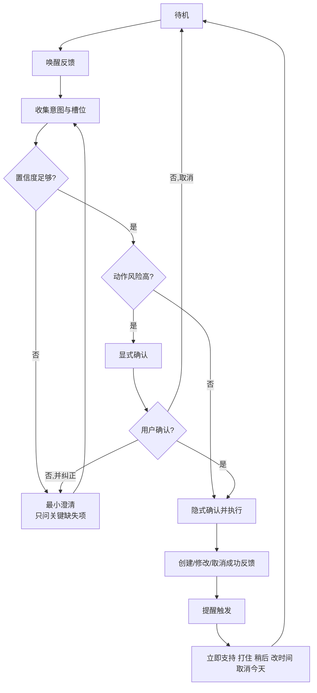

# 纯语音无GUI日程提醒助手交互研究报告

## 执行摘要

本报告按“**家用智能音箱为主，兼顾可穿戴与移动场景**”这一未指定项假设展开，目标用户以普通成年用户为主，同时纳入老年人、低视力用户、共享家庭设备用户以及高噪声环境中的使用者。研究重点不是硬件或模型选型，而是**纯语音、无GUI条件下，日程/提醒助手应该如何进行交互**。

市场上的成熟方案虽然来自不同生态，但在交互上高度收敛：默认以**唤醒词或物理键进入会话**，以**短提示、低信息密度、尽量少轮次**完成任务；对高代价动作采用**显式确认**，对低风险信息采用**隐式确认**；允许用户在一句话里完成纠错；在共享设备上通过**声纹/Voice Match/访客模式/物理静音**来控制隐私；在提醒触发时根据情境与紧急度决定是否“打断式”播报。Google 的对话设计明确建议“参数默认隐式确认、破坏性动作显式确认、支持一步纠错”；Amazon 明确要求技能设置提醒时必须获得每次明确授权；Apple、Google、小度、小爱、华为都提供了不同程度的多用户识别、隐私控制或语音唤醒管理能力。

如果你要做一款只有语音、没有GUI的日程提醒助手，最稳妥的交互策略不是“把聊天做长”，而是把系统做成一个**低记忆负担、强可恢复、强可控、能随时打断与撤销**的工具：创建提醒时只追问缺失槽位；默认复述关键参数而不逼用户“再确认一次”；只有在人名、时间、高风险删除、共享设备读取个人内容时才显式确认；提醒触发时允许“稍后提醒/取消今天/改到今晚/静音三十分钟”等即时恢复指令。近年的语音交互研究也表明，信息密度越低、响应越快、简单任务越偏好单轮完成；但在高风险或个人数据类问题上，用户又偏好更完整、更明确的表述。因此，**简短并不等于过度省略，关键在于按风险分层**。

## 研究边界与用户场景

本报告采用以下假设：目标平台未指定，因此以**家用智能音箱**为主，同时参考耳机、手表、手机助手的交互经验；用户群体未指定，因此以普通成年用户为主，但单列特殊用户与高风险场景；“无GUI”理解为**核心任务不能依赖屏幕完成**，但允许存在配套 App、物理按键、指示灯、可穿戴震动等辅助手段。Apple、Google、华为和小度的官方资料都表明，现实产品往往运行在**共享空间、多设备并存、个人结果受限、环境噪声变化**的条件下，因此你的交互设计必须从一开始就考虑共享家庭、误唤醒、漏唤醒和隐私切换。
| 用户画像/场景 | 典型任务 | 主要难点 | 交互含义 |
|---|---|---|---|
| 做饭、抱娃、打扫的家庭成年人 | 快速设提醒、改提醒、稍后提醒 | 手忙、环境噪声、不能盯屏 | 需要短句、少轮次、能一句纠错  |
| 共享家庭设备用户 | 查询个人日程、创建私密提醒 | 旁人可听见、多人共用设备 | 必须在读取私人内容前做身份/隐私闸门  |
| 老年/低视力用户 | 服药、缴费、复诊提醒 | 听觉负担、记忆负担、确认压力 | 需要慢速、明确、可重复、可物理静音  |
| 高噪声场景 | 设定简单倒计时或提醒 | 漏唤醒、错听时间/事项 | 需要灵敏度调节、短提示、候选式澄清  |
| 隐私敏感场景 | 医疗、账单、出行、家庭事务提醒 | 内容不宜外放 | 需要“私密模式/访客模式/仅播报有提醒”  |
| 可穿戴/移动补充场景 | 外出时接收提醒、快速确认 | 无法长对话、网络波动 | 需要极简命令、离线降级、震动补充  |

## 市面现有方案比较

下表只比较**与交互策略直接相关**的公开信息；若厂商未公开某一细节，表中明确标注“未细述”，避免推测替代事实。  

| 产品 | 厂商 | 交互模式 | 唤醒方式 | 确认/歧义处理 | 错误恢复 | 隐私提示/控制 | 可访问性特性 | 优点与局限 |
|---|---|---|---|---|---|---|---|---|---|
| Alexa / Echo | Amazon | 语音设提醒，技能也可代设提醒 | 唤醒词；也支持物理/按键触发场景 | **每次创建提醒都需明确授权**；官方建议明确说明时间与重复规则 | Amazon 设计指南要求用简单提示、解释错误并逐步升级帮助 | 可关闭唤醒；提醒能力要求权限；强调防止意外“打断” | 官方公开资料更偏设计规范，辅助功能公开较分散 | 优点是提醒权限与风险控制做得最严格；局限是对第三方技能约束较重 |
| Google Assistant / Nest | Google | 可用语音创建、修改、完成、删除任务；习惯于短命令 | “Hey Google”；可调灵敏度 | 官方强调**隐式确认常用、显式确认用于高代价动作**；支持一步纠错 | 只应有一个设备回应；可通过敏感度、麦克风状态排障 | Voice Match、Personal Results、Guest Mode | 智能显示屏支持起始音、字幕、屏幕阅读器 | 优点是共享空间隐私控制细；局限是提醒/任务体系近年有调整，公开文档偏生态分散 |
| Siri / HomePod | Apple | 语音设提醒，HomePod 支持个人请求 | “Siri/嘿 Siri”；也可按压顶部 | 官方公开帮助中心未细述口头确认逻辑，但支持多用户识别与个人请求 | 多设备通过蓝牙协同决定谁回应；可关闭“嘿 Siri” | 识别我的声音、个人请求、删除历史记录、可语音关闭监听 | HomePod 支持 VoiceOver；Apple 提供盲文资源 | 优点是多设备仲裁和个人请求边界清楚；局限是共享场景下仍须谨慎播报私人内容 |
| 小爱同学 | 小米 | 一句话可做提醒、闹钟、日程；新版本强调主动建议与“记一下” | 语音唤醒 | 公开站点未细述确认链路；隐私政策明确涉及时间、时区、日历同步等 | 支持关闭语音唤醒；部分联系人信息本地处理 | 记录唤醒词声音需用户主动开启；可撤回授权 | 以手机/音箱/电视联动为主，公开无障碍信息相对少 | 优点是“记忆+提醒+系统联动”强；局限是纯音箱场景的公开交互细节不足 |
| 小度 | 百度 | 日程管理、闹钟、备忘、智能提醒；全屋场景强调免唤醒与设备控制 | 默认唤醒词；公开资料显示也支持全域免唤醒 | 公开资料未细述确认策略 | 提供物理麦克风关闭、状态提示、本地唤醒；可管理第三方应用权限 | 仅在听到召唤后收集语音；唤醒本地完成；云端不存原始交互音频 | 更强调家庭场景与儿童/酒店等特殊隐私模式 | 优点是硬件隐私提示与本地唤醒很清楚；局限是复杂日程编辑的公开范式较少 |
| 小艺 | 华为 | 系统级语音助手，强调连续服务与 LUI | “小艺小艺”、电源键、蓝牙设备等多种方式 | 公开资料未细述提醒确认，但强调连续服务闭环 | 官方明确提示识别受语速、口音、环境影响；多方言支持逐步扩展 | HPIC 隐私计算平台；部分场景需登录/联网 | 支持多方言；更适合跨设备连续任务 | 优点是连续服务、跨设备上下文强；局限是共享家庭音箱场景的提醒规则公开较少 |

综合来看，市面方案对同一难题的主流解法非常一致：**唤醒要可控、确认要按风险分层、纠错要允许一句完成、共享设备读取私密信息前必须加闸、提醒打断必须给用户立即恢复出口**。这不是技术路线问题，而是语音交互在无屏环境中的共同约束。

## 关键交互挑战与设计原则

纯语音助手最大的困难，不是“不会说”，而是**用户听过即逝、不能回看、又常常在忙**。新的语音交互研究表明，音频信息识别与记忆天然弱于视觉信息；当信息密度高、等待时间长、对话轮次多时，满意度会显著下降，而简单任务中用户通常更偏好低信息密度、较短响应与单轮完成。与此同时，高风险或个人数据类问答又需要更完整、更明确的表述。你的设计因此应遵循“**简单任务极简，高风险任务明确**”的双轨原则。
可以将核心流程抽象为下面这条交互链路：

围绕这条链路，建议采用以下设计原则。Google 的官方对话设计将确认分为隐式确认、显式确认和无确认，并明确表示：参数通常用隐式确认，高代价动作才显式确认；而且必须支持用户用一句“不是，改成七点”完成纠错。Amazon 的错误设计指南则强调：用简单语言、说明错在哪里、逐步升级提示，不要把责任推给用户，也不要一出错就让会话走到死路。

| 挑战 | 建议原则 |
|---|---|
| 唤醒/睡眠管理 | 提供清晰的听到反馈；允许物理静音；支持灵敏度调节；多设备环境只让一个设备回应。|
| 意图识别不确定性 | 不要整句重问，只追问缺的槽位；优先候选式澄清，如“今晚六点还是明早六点”。|
| 多轮对话管理 | 简单任务单轮完成，复杂任务分步确认；不要让用户从头开始。|
| 确认策略 | 默认隐式确认；删除、覆盖、共享设备读取私密内容等高风险动作显式确认。|
| 记忆负担 | 提示词尽量低信息密度；成功反馈只说“做了什么、何时触发、怎么撤销/更改”。|
| 并发提醒与冲突 | 把冲突显式说出来，并给出最短可执行选项：“保留两个、合并、替换哪一个”。这是设计建议，但符合市场上的高风险确认逻辑。|
| 用户打断与优先级 | 紧急提醒可以更早、更直接；非紧急提醒应更克制，并允许立即“稍后提醒”。研究表明，人类会按任务难度与紧急度调整打断时机与措辞。|
| 隐私与可控性 | 共享设备不要直接播报个人日程；先走声纹/个人结果/访客模式判断；最小化采集。|

## 交互模式与多轮对话示例

### 交互模式

| 模式 | 适用场景 | 优点 | 风险/缺点 | 中文示例 | 失败恢复 |
|---|---|---|---|---|---|
| 显式确认 | 删除、覆盖、私密播报、多人共享设备 | 最稳妥 | 轮次增加 | “要删除明早八点的吃药提醒吗？” | 用户可说“不是，改成今晚八点” |
| 隐式确认 | 普通单次提醒、低风险改时间 | 快、自然 | 若复述不清楚会漏错 | “好，已为你设置明天中午十二点提醒你交水费。” | 紧跟一句支持打断：“不对，改成一点” |
| 分步确认 | 槽位缺失多，如事项+时间+重复 | 降低一次性认知负担 | 回合稍多 | “提醒什么事？”→“什么时候提醒？” | 若两次失败，改给候选项 |
| 回溯确认 | 用户中途改槽位 | 不必重来 | 需保存上下文 | “把时间改成周五晚上。” | 仅更新被改槽位并复述结果 |
| 模糊确认 | “晚上”“下周”“过会儿” | 贴近日常说法 | 模糊边界需澄清 | “你说的今晚，是六点到九点之间吗？” | 给两个候选，不要开放大追问 |
| 无确认 | 高置信度全局命令，如“取消”“停止”“安静” | 最快 | 不适合有代价动作 | “好的，已暂停播报。” | 如误触发，立即支持“恢复刚才提醒” |

这些模式与 Google 的确认分层、一步纠错原则高度一致，也符合 Amazon 对“高风险动作才确认”的建议

### 多轮对话示例库

以下示例为基于上述原则整理的**建议脚本**，用于定义你的产品体验基线。

| 场景 | 示例对话 | 意图/槽位 | 确认策略与失败恢复 |
|---|---|---|---|
| 创建单次提醒 | 用户：提醒我明早八点交房租。 助手：好，明早八点提醒你交房租。 | 创建；事项=交房租，时间=明早8点 | 隐式确认；若低置信度，先问“是交房租还是交水费？” |
| 创建缺槽位 | 用户：帮我设个提醒。 助手：提醒什么事？ 用户：给妈妈打电话。 助手：什么时候？ | 创建；事项缺失后补齐 | 分步确认；连续两次没听清就给例子“比如今晚八点” |
| 模糊时间 | 用户：今晚提醒我收衣服。 助手：今晚你希望几点？我可以设为七点、八点或九点。 | 创建；时间=今晚（模糊） | 模糊确认；不给开放式长追问 |
| 重复提醒 | 用户：每周一到周五早上七点提醒我吃药。 助手：好，工作日早上七点提醒你吃药。 | 创建；重复=工作日 | 隐式确认；若重复规则冲突，显式确认“按工作日还是每天？” |
| 修改提醒 | 用户：把交房租提醒改到明晚九点。 助手：好，已把交房租提醒改到明晚九点。 | 修改；目标=交房租提醒，新时间=明晚9点 | 回溯确认；若同名多条，先问“是本周那条还是下周那条？” |
| 取消提醒 | 用户：取消明天的开会提醒。 助手：要取消明天上午十点的开会提醒吗？ 用户：对。 | 取消；目标=明天开会提醒 | 显式确认；高代价动作必须确认 |
| 冲突处理 | 用户：明晚八点提醒我健身。 助手：你明晚八点已经有“视频会议”提醒，要保留两个，还是把健身改到八点半？ | 创建；时间冲突 | 显式冲突提示；给最短候选答案 |
| 共享设备隐私 | 用户：明天我有什么安排？ 助手：这是共享设备。若要读取你的个人日程，请先通过声纹识别，或说“访客模式”。 | 查询日程 | 先隐私闸门；不直接播报个人结果 citeturn25view2turn11view7 |
| 噪声中断 | 用户：提醒我六点关火。 助手：我听到“七点关火”，如果不对，请直接说“不是，六点”。 | 创建；时间低置信 | 隐式确认+一步纠错；适合厨房噪声 |
| 用户打断 | 助手：现在提醒你—— 用户：稍后十分钟。 助手：好，十分钟后再提醒。 | 提醒响应；延期=10分钟 | 无确认或极短确认；提醒时要支持抢话 |
| 错误识别 | 用户：提醒我给李敏发消息。 助手：是给“李敏”还是“李明”？ | 创建；对象歧义 | 候选式澄清；别让用户从头再说 |
| 离线/无网络 | 用户：提醒我半小时后关空调。 助手：我现在网络不可用，但可为你设置本地半小时提醒。涉及云同步的重复提醒，联网后我再问你一次。 | 创建；本地倒计时 | 降级模式；明确说哪些能做、哪些暂时不能做 |
| 识别不到人名 | 用户：提醒我联系陈医生。 助手：我没听清名字。你可以重说一次，或说“只记录事项，不加联系人”。 | 创建；联系人槽位失败 | 提供退路，避免任务失败 |
| 提醒后二次操作 | 助手：现在提醒你交电费。 用户：改到今晚八点。 助手：好，改到今晚八点。 | 提醒中修改 | 允许在提醒上下文里直接改槽位 |

## 语音提示、可访问性与隐私

纯语音系统的提示词应该按**长度、紧急度、私密性**分层。对于普通成功反馈，建议使用“动作 + 时间 + 一句可恢复出口”的短句，例如“好，明天八点提醒你开会；如果要改时间，直接说‘改到九点’。” 对复杂说明或重复失败，才逐级加长。研究显示，低信息密度、较短等待时间与较少轮次通常带来更好的体验；但在个人数据或高风险内容上，完整句式更受欢迎，因此“短提示”和“完整提示”都要保留，只是不要混用。

在语气设计上，唤醒反馈应简短而稳定，例如“在”“我在听”；首次听错时不必过度道歉，第二次失败再给更具体的引导；提醒播报则应按紧急度区分，普通提醒偏平静、紧急提醒可更直接。关于打断，研究发现人类会根据紧急度改变措辞和时机，因此你的提醒播报也不应一律同强度：服药、关火、出门类提醒要更短、更前置；“记得整理照片”这类事项则可更柔和，甚至优先用轻提示或等待用户空闲。

可访问性方面，真正的“无GUI”并不意味着拒绝所有替代通道。对听力障碍用户，核心建议是提供**可穿戴震动、指示灯、手机通知、配套字幕或转写**；Google 智能显示支持起始音、字幕与屏幕阅读器，Apple 则为 HomePod 提供 VoiceOver 与盲文资源，这说明成熟生态普遍承认：纯语音交互如果没有替代反馈，会天然排斥一部分用户。对语言障碍用户，应增加物理键唤醒、短命令语法、可配置唤醒词或配套文本入口。

隐私提示要出现在**三个时机**：开始收集个性化数据之前、共享设备要读取个人结果之前、设备开始主动打断之前。措辞要短，不要写成长协议式播报。示例文案可以是：“这是共享设备，读取你的个人日程前需要识别你的声音”；“访客模式已开启，本次对话不会保存到设备主人的个人记录”；“麦克风已关闭，要重新开启请按顶部按键或说‘开始听’。” 这些策略与 Google 的 Guest Mode、Voice Match，Apple 的 HomePod 隐私控制，小爱和小度的唤醒/麦克风控制逻辑一致，也符合“小只收集为该功能所必需的信息”的最小化原则。

## 评估与实施路线图

你的第一版不应追求“能聊很多”，而应先验证**高频闭环**：创建、修改、取消、重复提醒、提醒到时的立即响应、共享设备隐私闸门、噪声下的一步纠错。评价指标建议至少包含：任务成功率、任务完成时间、平均轮次、ASR 误识别率、一步纠错恢复率、误唤醒率、漏唤醒率、提醒响应率、用户满意度，以及“在共享空间使用是否安心”的隐私舒适度。关于测试方法，NN/g 建议形成性可用性测试先用小样本迭代，多轮小测试往往比一次大测试更有效；A/B 测试则应先定义基线指标、最小可检测差异与统计阈值，再决定样本量与测试周期。

| 阶段 | 交互功能清单 | 里程碑 | 主要风险 | 缓解措施 |
|---|---|---|---|---|
| 核心闭环 | 创建/修改/取消单次提醒；基础唤醒反馈；本地稍后提醒 | 能稳定完成 80% 高频任务 | 用户说法过散、时间槽位错听 | 先只支持核心表达；候选式澄清 |
| 风险控制 | 重复提醒；删除/覆盖显式确认；共享设备隐私闸门；物理静音 | 高风险动作零“静默误执行” | 确认过多导致烦躁 | 只对高风险动作确认，普通动作走隐式确认 |
| 恢复能力 | 一步纠错；回溯改槽位；冲突处理；离线降级 | 主要错误都能自恢复 | 用户被迫重来 | 保留上下文，不清空已填槽位 |
| 场景扩展 | 噪声适配；个性化语速/音量；提醒紧急度分层；可穿戴联动 | 家庭真实环境可用 | 打断过强或过弱 | 按任务类型做优先级策略，提供“安静模式” |
| 优化验证 | 显式确认 vs 隐式确认、短提示 vs 完整提示的 A/B | 数据驱动收敛 | 只看成功率忽略主观负担 | 同时看成功率、时间、满意度、恢复率 |

测试场景建议覆盖安静房间、厨房油烟机/水声、电视背景音、夜间低音量、多人同时说话、共享家庭成员条件，以及断网重连。形成性阶段可先按主要人群分组做小样本迭代；如果进入 A/B，优先比较“**默认隐式确认**”与“**默认显式确认**”对成功率、时长和烦躁感的影响，而不是先做花哨人格语气实验。

## 主要参考来源

本报告优先采用了官方与原始资料，包括 Google Assistant Conversation Design、Google Assistant/Google Home 帮助中心、Apple 官方支持与 HomePod 使用手册、Amazon Alexa Developer 文档、华为小艺官网、百度小度隐私页面、小米小爱隐私政策；同时补充了近年的学术研究，用于支撑“低信息密度、少轮次、一步纠错、按紧急度设计打断”等结论。核心来源包括 Google 的确认与纠错设计、Amazon 的提醒授权与错误设计、Apple 的多设备与隐私控制、以及关于语音响应长度、响应密度、对话修复和主动打断的 ACM / Springer / arXiv 论文。citeturn19view1turn11view2turn11view8turn20view0turn11view3turn23view0turn24search1turn21view2turn20view8turn20view9turn22view0

结论上，你要做的不是一个“会聊天的音箱”，而是一个**用很少的话，把提醒安全、可逆、可控地做对**的语音工具。若只保留一句设计总纲，那就是：**默认短、默认可打断、默认可纠错、默认不泄露，只有高风险时才让用户多说一句。** 这正是当前市场成熟方案与近年语音交互研究共同指向的方向。
