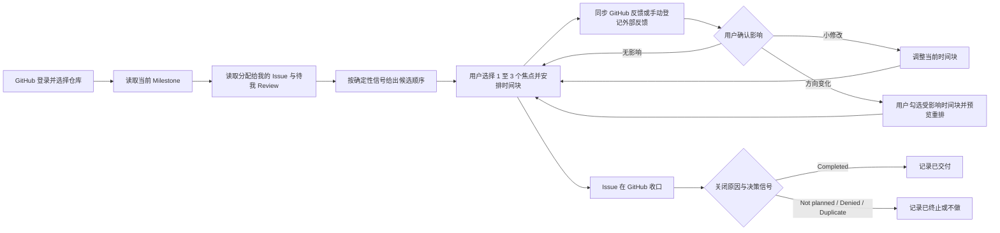

# 基于 GitHub 协作模式的项目周期个人时间任务管理助手：MVP 草案

结论：本轮 MVP 选择服务 XEngineer 学员的个人日计划，把“当前 Milestone 中与我有关的 GitHub 工作”整理成 1 至 3 个今日焦点及其时间块，并在反馈暴露偏差时帮助用户重新安排个人投入。团队看板、会议和自动写回能力保留为后续候选。

请求决策：请团队在 2026-07-13 讨论时确认三个问题：核心时刻是否是“个人今日计划 + 反馈后重排”、首版是否保持只读、任务结果是否按 Issue 收口原因区分“已完成”和“已终止”。

## 1. 决策摘要

| 项目 | 本稿结论 |
| --- | --- |
| 产品定位 | 基于 GitHub 项目事实的个人时间任务管理助手 |
| 本阶段目标用户 | 正在参加 XEngineer 营、已被分配 GitHub Issue、需要自己安排每天投入的普通组员 |
| 核心问题 | GitHub 记录了 Milestone、Issue、PR 和 Review，但没有直接回答“我今天先做什么、安排多少时间、反馈来了以后怎么改计划” |
| MVP 核心工作 | 读取分配给我的 Issue 和关联交付状态，形成今日时间块；出现 Review 或检查变化时，由用户确认影响并重排 |
| 最小闭环 | `我的 GitHub 工作 -> 1 至 3 个今日焦点 -> 时间块 -> 反馈证据 -> 影响确认 -> 重排 -> Issue 收口` |
| 价值判断 | 忙过、提交过都不等于推进了 Milestone；个人计划必须以可追溯的项目结果为准 |
| 首版原则 | 单仓库、个人视角、只读同步、用户确认、可解释规则 |
| 明确不做 | 通用待办、完整团队项目管理、会议系统、自动修改 GitHub、自动判断文档内容是否正确 |

### 1.1 7 月 13 日需要确认的三个问题

1. **核心时刻：** 首版是否只验证“我的 GitHub 工作进入今日计划，以及反馈后重排”？
2. **只读边界：** 首版不自动修改 GitHub，只验证个人计划价值；写回能力进入后续版本。
3. **结果定义：** PR 打开或合并都不自动等于完成；Issue 收口后还要区分 Completed 与 Not planned、Denied、Duplicate 等结果。

## 2. 为什么现在做

团队前三天的真实经历指向同一个重点：当前更需要解决个人投入与项目目标脱节，而不是继续扩充功能范围。

| 日期 | 真实发生的事 | 暴露的问题 | 证据 |
| --- | --- | --- | --- |
| 7 月 7 日 | 四名组员按平台调研时间管理产品并提交文档 PR | 大家完成了“查资料”，但还没有形成目标用户和产品判断 | [PR #1](https://github.com/1024XEngineer/XE6-15/pull/1) 至 [PR #4](https://github.com/1024XEngineer/XE6-15/pull/4) |
| 7 月 8 日 | 导师指出四份产出仍是功能清单，团队重新回答“用户是谁、问题是什么” | 已开 PR 被误当成完成，直到第二天才发现没有推进 MS1 | [Issue #11 的会议记录](https://github.com/1024XEngineer/XE6-15/issues/11)；后续第一人称复盘见 [PR #16](https://github.com/1024XEngineer/XE6-15/pull/16) |
| 7 月 8 日下午 | 团队暂定 ADHD 人群并准备写 Proposal | 方向未经足够真实证据验证，后续计划建立在脆弱假设上 | [PR #3 的目标群体与调研记录](https://github.com/1024XEngineer/XE6-15/pull/3) |
| 7 月 9 日 | 团队确认对陌生人群缺少真实洞察，改为 XEngineer 学员 | 上游产品判断变化后，原来的调研和 Proposal 计划立即失效 | [PR #5 的用户故事](https://github.com/1024XEngineer/XE6-15/pull/5)与[具体 Review](https://github.com/1024XEngineer/XE6-15/pull/5#discussion_r3550822002)；[PR #19 的用户画像修正](https://github.com/1024XEngineer/XE6-15/pull/19) |
| 7 月 10 日 | 团队进一步收敛到 GitHub 协作下的个人任务规划 | 真正值得验证的是“项目事实如何改变个人今天的安排” | [Issue #18](https://github.com/1024XEngineer/XE6-15/issues/18)；[PR #16](https://github.com/1024XEngineer/XE6-15/pull/16) |

Issue #11 用于记录 7 月 8 日的会议与方向问题；PR #16 当前以 `Refs #15` 关联用户故事任务。两者在这里分别承担“会议事实”和“个人复盘”证据，不表示 PR #16 仍关联 Issue #11。

证据强度需要分清：日报中的日期、分工、PR 链接和导师结论是直接记录；PR #16 对“提交后才发现没有推进目标”的解释是待组内确认的第一人称复盘；`Milestone -> Issue -> PR -> Review -> 个人重排` 是从这些记录抽象出的产品方案。部分旧材料中的示例姓名、时长和完成率没有对应原始记录，只作为待验证示例，不作为用户研究结论。

## 3. 目标用户与核心工作

### 3.1 目标用户

首批用户同时满足以下条件：

- 正在参加 XEngineer 营的 8 周项目。
- 通过 GitHub 的 Milestone、Issue、PR 和 Review 协作。
- 当前 Milestone 至少有一个 Issue 分配给自己。
- 需要自己决定今天投入什么、投入多久、何时处理 Review。
- 对完整工程流程还不熟，容易把“做了动作”误判成“完成交付”。

本阶段不是为导师、仓库管理员或项目经理设计。导师和 Reviewer 提供反馈，但首页和计划都服务个人组员。

### 3.2 核心工作

> 当我在一个有明确 Milestone 的 GitHub 项目里推进工作时，我想迅速看清哪些事项真正轮到我、今天能推进到什么结果；一旦 Review 改变方向，我能马上停止低价值工作并重新安排时间，以免到下一次会议才发现自己忙错了。

### 3.3 待验证的现状假设

下表是根据现有材料提出的产品假设，不等同于已经完成的用户访谈结论。首轮原型需要逐项确认哪些摩擦真实存在、发生频率多高。

| 可能的现有做法 | 可能缺少的连接 |
| --- | --- |
| 直接看 GitHub Issue / PR 列表 | 能看到对象和状态，但需要用户自己跨页面拼出今天的行动顺序与时间投入 |
| 在聊天里接收 Review 或会议结论 | 反馈与原 Issue、PR 和个人计划分离，容易遗漏，也难以解释为什么改计划 |
| 普通待办或日历 | 有时间但没有 Milestone、验收和交付上下文，容易把“提交文件”勾成完成 |
| 用 Project 列停留时间估算工时 | 列停留时间只是状态持续时间，不是用户真实投入时间；等待 Review 也可能停留数天 |
| 每天手写日报 | 能汇报，但通常发生在一天结束后，无法在方向变化时及时纠正当天计划 |

## 4. 产品关键决策

### 决策 1：GitHub 是项目事实来源，应用只补个人计划

应用读取 GitHub 对象和链接，不复制 Issue、PR、Review 或 Milestone 数据库。首版只在应用内保存个人预计投入、时间块、实际投入和用户对反馈影响的判断。

这样做的原因是：项目事实继续由团队共同维护，个人时间计划可以随时重建，不会出现 GitHub 和应用两套状态互相冲突。

### 决策 2：首版只读，不自动修改 GitHub

应用不自动创建、编辑、评论、关闭 Issue，也不自动合并 PR。用户看到建议后，回到 GitHub 完成正式动作。

只读会少一些“自动化感”，但能先验证真正的价值：用户是否愿意根据 GitHub 事实改变今天的安排。写回、权限和冲突处理留到验证成立之后。

### 决策 3：PR 是交付证据，Issue 关闭原因决定结果类型

个人任务是否完成以 Issue 是否按团队规则收口为准。PR 处于 Draft、Open、Review 中或已合并但 Issue 仍打开时，应用都不能直接显示“完成”。Issue 关闭也不一定表示成功交付：它还可能因为不计划、重复、Proposal 被拒或暂不排期而关闭。

应用必须把以下状态分开：

| 个人工作状态 | GitHub 证据 | 时间计划动作 |
| --- | --- | --- |
| 待澄清 | Issue 未确认预期产出，或缺负责人 / Milestone 等必要上下文 | 只安排澄清时间，不安排大块执行 |
| 可计划 | Open Issue 分配给当前用户，用户确认下一步产出和预计投入 | 可加入今日计划 |
| 已提交 / 待评审 | 关联 PR 已打开，Issue 仍为 Open | 预留 Review 等待、说明或修改时间，不显示完成 |
| 待我评审 | 当前用户被请求 Review | 作为独立时间块，不混入自己的实现任务 |
| 需修改 | Review 为 Request changes、检查失败，或用户确认评论改变了方向 | 暂停受影响的后续时间块，进入重排 |
| 待收口 | PR 已合并，但 Issue 仍为 Open | 提醒核对验收、文档或其他剩余项 |
| 已完成 | Issue 以 Completed 收口，且没有 `Proposal-Denied`、`Proposal-NoPlan` 等终止信号 | 移出执行队列，进入已交付结果记录 |
| 已终止 / 不做 | Issue 以 Not planned 收口，或带有拒绝、暂不排期、重复等决策信号 | 移出执行队列，保留原因，不计为已交付 |

### 决策 4：预计与实际投入由个人记录

GitHub 没有一个所有仓库都采用的标准工时字段。GitHub 目前支持组织级 Issue number / date / single-select 等结构化字段，Project 也可以配置自定义字段，但当前仓库是否采用、字段语义是否一致仍需团队配置。MVP 不用 Label 伪装工时，也不把 Project 列停留时间当实际投入。

- 预计投入：用户把 Issue 加入今日计划时填写，保存在个人计划中。
- 实际投入：时间块结束时由用户确认，可修改。
- 等待 Review：记录为等待状态，不计入个人实际投入。
- 后续如团队稳定使用组织 Issue fields 或 Project 自定义字段，再评估同步，不作为首版依赖。

### 决策 5：系统只识别确定性信号，方向判断由用户确认

应用可以确定读取 Issue、PR、Review、Checks、Assignee、Milestone 和时间戳，但不能可靠判断一段评论是否意味着“小修”还是“方向推倒重来”。

反馈有两个入口：

- GitHub 入口：新的 Review、Comment 或 Check 变化。
- 外部入口：导师会议、站会或群聊形成了方向变化。用户手动登记摘要并关联 Issue / PR；正式决策仍由用户回填 GitHub，应用不替代项目记录。

收到反馈时，应用让用户选择：

1. 不影响计划。
2. 小修改，调整当前时间块。
3. 方向变化，勾选受影响的今日焦点或时间块，再重新排今天。

所有重排先预览，用户确认后才进入个人计划。应用保存反馈事件标识、首次看到时间和处理状态，已经确认过的反馈不重复提示。

### 决策 6：只对当前 Milestone 给出可解释的候选顺序

“我的工作”主队列只收纳与所选 Milestone 有明确关系的事项：

- 直接挂在该 Milestone、且分配给当前用户的 Open Issue。
- 关联上述 Issue 的 PR；如果仓库采用 Issue + PR Milestone 策略，也接受直接挂载的 PR。
- 关联上述 Issue 的待我 Review PR。
- 其他 Milestone、其他仓库或无法建立关联的事项单列，不进入今日主线推荐。

候选顺序只使用可以解释的 GitHub 信号：

1. **需要立即处理：** 当前 Milestone 内，自己的 PR 被 Request changes，或必要检查失败。
2. **正在等待我：** 当前 Milestone 内，有明确 Review request 的 PR。
3. **可以继续推进：** 分配给我的 Issue 已确认个人产出，且有显式 Priority、截止信息或团队排序。
4. **需要先澄清：** 多人共同 Assignee 但没有个人产出，或 Issue 缺少必要上下文。
5. **没有足够依据：** GitHub 未提供优先级时，应用明确显示“需用户决定”，不根据更新时间等弱信号伪造顺序。

系统给出候选顺序和理由，最终由用户选择当天 1 至 3 个焦点事项。一个焦点事项可以安排一个或多个具有开始、结束时间的时间块。

## 5. MVP 核心路径

这条路径只回答个人每天最常见的三个问题：

1. 现在轮到我推进什么？
2. 这件事真的完成了吗？
3. 反馈来了以后，我今天要停什么、改什么？

## 6. MVP 范围

### 6.1 MVP P0：MS2 跑通真实核心路径，MS3 完成功能闭合

| 能力 | 首版行为 | 验证价值 |
| --- | --- | --- |
| 连接单个仓库 | 使用 GitHub 身份登录，选择一个仓库和当前 Milestone | 能获得“我的工作”的真实上下文 |
| 我的工作队列 | 显示当前 Milestone 中分配给我的 Open Issue，以及关联这些 Issue 的我的 PR、待我 Review PR | 不把其他阶段的工作混入今日主线 |
| 候选顺序 | 按 Request changes / 失败检查、待我 Review、显式优先级、待澄清分组并说明理由 | 帮助用户判断先看什么，又不伪造 GitHub 没有的优先级 |
| 项目证据卡 | 在一个页面展示 Issue、关联 PR、Review 结论、Checks、更新时间和原始链接 | 区分“做过动作”与“完成交付” |
| 今日计划 | 用户输入今天可用时间，选择 1 至 3 个焦点事项，并安排带开始 / 结束时间的时间块 | 把项目状态转成个人可执行安排 |
| 反馈影响确认 | 检测 GitHub 新事件，也允许用户登记会议等外部反馈；用户选择影响级别 | 真实方向变化即使发生在会议中也能进入个人计划 |
| 重排预览 | 用户勾选受影响时间块，再查看保留、暂停、顺延和新增修改块 | 不依赖系统猜测任务依赖关系 |
| 投入确认 | 时间块结束时记录实际投入和结果，保留 GitHub 来源链接 | 为下一次估时提供个人事实 |

### 6.2 P1：验证 P0 后再做

- 根据当天 GitHub 活动和时间块形成带链接的日报草稿，由用户检查后发送。
- 显示 Milestone 剩余天数、Open Issue、Open PR 和阻塞项的简单风险摘要。
- 检查 Issue 是否缺少明确的目标、范围或验收清单，但只提示，不自动改写。
- 提供 Issue 拆解建议；独立负责、需要单独状态的工作优先建议 Sub-issue，简单步骤才用 Markdown Checkbox。
- 在 Milestone 收口页显示目标 Commit、Tag、Release 和 Known Issues 是否齐全。

## 7. 三条核心场景：事实与待验证假设

三条场景都来自真实 GitHub 对象或真实方向变化，但证据强度不同。故事 2 有最完整的事件链；故事 1 和故事 3 是从真实事件延伸出的产品假设，需要在首轮测试中确认。

### 故事 1：共同指派后，先确认我今天具体负责什么

**直接事实：** 2026-07-10，MVP 文档任务 [Issue #18](https://github.com/1024XEngineer/XE6-15/issues/18) 同时分配给四名组员，正文只写了共同交付要求，没有记录每个人的具体产出。

**产品推断：** Assignee 只能证明四个人共同负责，不能直接回答“赵兴鹏今天具体做什么”。应用需要把共同指派显示为“待确认个人责任”，由用户补充自己的预期产出和投入后才能进入今日计划。

**待验证问题：** 四名组员是否确实需要一个个人确认步骤；这个步骤能否减少重复工作或责任空白。

**作为**一名第一次完整参与 XEngineer GitHub 项目的普通组员，

**我想要**在一个页面看到当前 Milestone 中分配给我的 Issue、关联交付和待我 Review 的事项，并先确认共同任务中我自己的具体产出，再选择今天的 1 至 3 项工作，

**以便于**我不会因为“大家都被指派”就默认别人会做，也不会与组员重复投入。

**验收场景：从 Issue #18 安排今天的文档工作**

- **Given：** 用户已连接 `1024XEngineer/XE6-15`，Issue #18 为 Open、属于 MS1 且分配给当前用户。
- **Given：** 用户填写今天可用 120 分钟，并确认本次预期产出是“一份可供 7 月 13 日讨论的 MVP 草案”。
- **When：** 用户确认自己在 Issue #18 下的个人产出，并把它加入今日计划。
- **Then：** 应用把它加入今日焦点，并形成一个或多个具体时间块；每个时间块显示预计结果、开始 / 结束时间、Issue 链接和进入计划的理由，当天焦点总数不超过 3 个。

**预期变化：** 共同任务不会直接变成四份相同待办。每个人先说明自己交什么，再安排时间；这项变化是否真正减少重复，需要通过测试确认。

### 故事 2：PR 已经提交，任务仍不能显示完成

**直接事实：** 7 月 7 日 [PR #1](https://github.com/1024XEngineer/XE6-15/pull/1) 已提交调研材料，但 7 月 8 日团队仍回答不了目标用户和真实问题；[PR #16](https://github.com/1024XEngineer/XE6-15/pull/16) 对这次返工进行了第一人称复盘。

**产品推断：** 个人计划需要把“已经提交”和“按 Issue 目标完成”分开显示。

**待验证问题：** 分层状态和原始链接是否足以让组员更早发现仍缺的产出。

**作为**负责调研并已经提交 PR 的 XEngineer 组员，

**我想要**看到“已提交、待评审、需修改、待收口、完成”的区别，

**以便于**我不会因为 PR 已打开就停止投入，而能继续处理真正阻碍 Issue 收口的工作。

**验收场景：PR 打开但 Issue 仍未完成**

- **Given：** 一个分配给当前用户的 Issue 仍为 Open，且已有 Draft 或 Open PR。
- **Given：** PR 尚未通过所需 Review，或合并后 Issue 仍有剩余验收项。
- **When：** 用户查看该事项的项目证据卡。
- **Then：** 应用显示“已提交 / 待评审”或“待收口”，不得显示“完成”，并给出可追溯的 Issue、PR、Review 链接。

**预期变化：** PR 已提交后，卡片仍显示 Issue 没有收口，并让用户继续核对 Review 与剩余产出，而不是把提交动作直接记成完成。

### 故事 3：方向性反馈到达后，重新判断今天的计划

**直接事实：** 7 月 8 日团队从功能清单转向目标用户，7 月 9 日又从 ADHD 转向 XEngineer 学员；[PR #5 的具体 Review](https://github.com/1024XEngineer/XE6-15/pull/5#discussion_r3550822002) 也直接改变了用户故事的写法。

**产品推断：** 方向变化会改变工作内容，但现有记录没有量化用户多久完成重排，也没有证明用户一定需要系统代为组织取舍。

**待验证问题：** 用户是否愿意判断反馈影响，并通过重排预览调整当天计划。

**作为**正在执行当天计划、但刚收到方向性反馈的 XEngineer 组员，

**我想要**先确认反馈影响，再选择哪些工作应暂停、哪些修改必须插入、哪些任务可以顺延，

**以便于**我能看见哪些安排依赖旧方向，并决定是否暂停或顺延，而不是等下一次会议再统一处理。

**验收场景：用户确认 Review 改变方向**

- **Given：** 应用发现关联 PR 出现新的 Review、失败检查或评论，或者用户手动登记了一条来自会议的方向反馈并关联 Issue / PR。
- **Given：** 用户把该反馈标记为“方向变化”。
- **When：** 用户打开重排预览。
- **Then：** 用户勾选受影响的未开始时间块，应用加入一项明确的修正工作并显示顺延后的计划；只有用户确认后才更新个人计划。

**预期变化：** 用户能直接看见今天停什么、先补什么，以及这次改动会占用哪段时间；是否愿意采用这套重排方式由实验确认。

## 8. GitHub 对象边界与产品用法

MVP 必须使用 GitHub 的真实语义，不能把对象名称借来做另一套状态系统。

| GitHub 对象 | 官方语义 | MVP 怎么用 | 本轮边界 |
| --- | --- | --- | --- |
| Milestone | 按仓库聚合 Issue 和 PR，显示说明、截止日期、完成比例及开闭数量 | 作为个人计划的阶段上限，读取截止时间和关联事项 | 不当任务状态，不当工时系统；Issue 和 PR 同时挂载时分开显示数量，避免误读进度 |
| Issue | 计划、讨论和跟踪工作的基本对象，可关联 PR 和子事项 | 作为个人工作来源，保留原始链接、负责人、状态和 Milestone | 不在应用里复制一份可独立编辑的 Issue |
| Sub-issue | 有独立负责人、状态和讨论的子工作 | P1 用于真正需要独立跟踪的拆分 | 不把简单步骤全部拆成 Issue |
| Markdown Checkbox | Issue 正文里的简单清单 | 展示步骤进度 | 勾完不原生自动关闭父 Issue，MVP 不增加此类写回自动化 |
| Pull Request | 提交差异、讨论、检查与 Review 的载体，可与 Issue 建立关联 | 作为交付证据，显示 Draft / Open / Merged / Closed | 不把创建 PR 当成完成 |
| Review | Comment、Approve、Request changes 三类正式结果 | 作为反馈和重排触发信号 | Review request 本身不等于批准，也不一定能阻止合并 |
| Status Checks | 针对 Commit 的外部检查结果 | 显示成功、失败、等待，解释为什么 PR 还不能收口 | 不把检查状态当成个人工时或 Issue 状态 |
| Project | 表格、看板、路线图和自定义字段的执行视图 | 团队已配置时作为 P1 补充字段来源 | P0 不依赖 Project，也不推断列停留时间为实际投入 |
| Tag | 标记仓库历史中的一个确定位置 | P1 在 Milestone 收口时显示交付 Commit 对应的 Tag | 不用于普通任务，不等同 Label |
| Release | 基于 Tag 的可交付软件迭代，可带说明和制品 | P1 展示版本、说明、Known Issues 与 Milestone 追溯 | 不把未完成事项塞入 Release，也不在 P0 自动发布 |

### 8.1 PR 与 Issue 的关联

GitHub 支持手动关联，或在面向默认分支的 PR 描述中使用 `Close`、`Fix`、`Resolve` 及其变体。使用关闭关键词的 PR 合入默认分支后，关联 Issue 会自动关闭。

本项目继续采用更严格的流程语义：

- 中间交付、设计评审和不应关闭 Issue 的 PR 使用普通引用，例如 `Refs #18`。
- 只有满足全部验收标准的最终可合并 PR 才使用 `Fixes #18`。
- 产品设计草案 PR 不合并；定稿回填 Issue 后关闭 Draft PR。

### 8.2 Tag 与 Release

GitHub 官方定义中，Tag 标记仓库历史中的一个确定位置；Release 建立在 Tag 之上，表达一个可供使用的版本，并可附 Release Notes 与制品。

截至 2026-07-10，`1024XEngineer/XE6-15` 还没有 Tag 或 Release。GitHub 本身不要求“每个 Milestone 都发布 Release”；这是本项目 XEngineer 过程规范采用的阶段收口方式。当前 MS1 要求交付“可打 Tag 的首个可串联版本”，项目进入收口时按以下顺序处理：

1. 创建或确认一个阶段收口 Issue / 清单，核对 MS1 计划交付的 Issue、PR、Review 和检查证据。
2. 把未完成事项移出本阶段并说明原因。
3. 选择已验证的交付 Commit，再创建 Tag。
4. 基于该 Tag 发布 GitHub Release，写明已交付、Known Issues 和主要 Issue / PR。
5. 把 Release 链接回填 Milestone；收口清单满足后，再关闭收口 Issue 和 Milestone。

Tag 名称和版本策略属于仓库发布决策，不由本 MVP 自动决定。P0 只保证个人每天的工作能够追溯到将来需要收口的 Milestone。

## 9. 基本概念与信息结构

| 概念 | 最小信息 | 来源 / 存储 | 说明 |
| --- | --- | --- | --- |
| GitHub 身份 | login | GitHub | 用于查询“分配给我”和“待我 Review” |
| 仓库 | owner、name、default branch | GitHub | P0 只选择一个仓库 |
| 阶段 | Milestone 编号、标题、截止时间 | GitHub | 当前个人计划的上限 |
| 工作事项 | Issue 编号、标题、状态、stateReason、决策标签、Assignee、Milestone、更新时间 | GitHub | 个人计划的基本来源；区分 Completed 与 Not planned / Denied 等结果 |
| 交付证据 | PR 编号、状态、isDraft、mergedAt、Review、Checks、更新时间 | GitHub | 区分 Open、Merged 与 Closed-unmerged，判断处于提交、评审、修改还是收口阶段 |
| 今日焦点 | 日期、Issue / PR / Review 引用、个人预期产出、顺序 | 应用本地 | 每天选择 1 至 3 个，不写回 GitHub |
| 时间块 | focus_item_id、来源链接、预期结果、start_at、end_at、预计分钟、实际分钟、状态 | 应用本地 | 一个焦点可跨多个时间块；每个块只服务一个明确对象 |
| 反馈影响 | source_type、source_event_id、原始链接 / 摘要、first_seen_at、handled_at、影响级别、affected_block_ids | 应用本地 | 支持 GitHub 与会议反馈；保存去重游标和用户选择的受影响块 |
| 发布快照 | Tag、Release、Known Issues 链接 | GitHub，P1 | 用于 Milestone 收口展示 |

几个边界必须保留：

- Issue 是项目工作单元，时间块是个人投入单元；两者不是同一个对象。
- 一个 Issue 可以跨多个时间块，一个时间块只服务一个明确的 Issue、PR 或 Review。
- GitHub 状态可以同步，个人预计和实际投入不能从状态停留时间推断。
- 所有建议必须显示依据和原始链接，用户能解释为什么需要改计划。

## 10. 原型范围

P0 控制在 5 个关键画面：

| 画面 | 用户要完成的动作 | 必须展示的证据 |
| --- | --- | --- |
| 1. 连接仓库 | 登录并选择 `1024XEngineer/XE6-15` 与 MS1 | 当前用户、仓库、Milestone 截止时间、最后同步时间 |
| 2. 我的工作 | 从分配给我的 Issue、我的 PR、待我 Review 中选择今日事项 | Assignee、Issue 状态、PR / Review 状态、原始链接、进入队列理由 |
| 3. 项目证据卡 | 判断事项处于待澄清、待评审、需修改、待收口还是完成 | Issue、PR、Review、Checks 的分层时间线 |
| 4. 今日计划 | 填写可用时间，确认 1 至 3 个焦点并安排具体时间块 | 每块预期结果、开始 / 结束时间、来源、未被选择事项 |
| 5. 重排预览 | 确认反馈影响，勾选受影响块并比较调整前后计划 | 保留、暂停、顺延、新增修改块及其原因 |

原型必须跑通三条演示：

1. 用 Issue #18 形成今天的 MVP 文档时间块。
2. 回放 PR #1 已提交但产品判断未完成的状态，正确显示“待评审 / 需修改”。
3. 回放目标用户从 ADHD 转向 XEngineer 的方向变化，暂停旧计划并让用户确认重排。

## 11. MVP 验收标准

### 11.1 MS1 可点击原型验收

- [ ] 5 个关键画面可以点击串联，不要求在本阶段完成真实 GitHub 鉴权和数据持久化。
- [ ] 原型使用 XE6-15 的真实对象快照，敏感信息不进入演示数据。
- [ ] Issue #18 共同指派场景先要求确认个人产出，再进入今日焦点。
- [ ] PR #1 场景能区分“已提交”和“已完成”。
- [ ] 方向变化场景同时支持 GitHub 反馈和手动登记会议反馈。
- [ ] 4 名当前组员完成三条演示并留下用时、误解和取舍记录。

### 11.3 用户验证

- [ ] 4 名当前组员都能用真实仓库数据找到自己的工作事项。
- [ ] 至少 3 人能在 5 分钟内确认当天 1 至 3 个焦点并安排时间块，且无需解释界面。
- [ ] 4 人都能正确解释“PR 已打开”“Issue 已完成”和“Issue 已终止”的区别。
- [ ] 至少 3 人能在方向变化场景中于 10 分钟内完成一次重排，并说清停了什么、为什么。
- [ ] 每名用户都能从任一建议回到对应 Issue、PR 或 Review，不依赖聊天补上下文。

## 14. 决策通过后的动作

第 1.1 节三项决策形成一致后，按以下顺序推进：

1. 将定稿内容回填 Issue #18，并记录本阶段选择与后续候选。
2. 从本稿的信息结构产出架构设计 Issue，确认 GitHub API、同步方式、权限、缓存与失败处理。
3. 先画 5 个关键画面，再用真实仓库快照跑 4 人测试。
4. 通过首轮验证后，再拆 P0 的 MiniSpec 和实现 Issue。

### GitHub 官方资料

- [About milestones](https://docs.github.com/en/issues/using-labels-and-milestones-to-track-work/about-milestones)
- [About issues](https://docs.github.com/en/issues/tracking-your-work-with-issues/learning-about-issues/about-issues)
- [Closing an issue](https://docs.github.com/en/issues/tracking-your-work-with-issues/administering-issues/closing-an-issue)
- [Adding and managing issue fields](https://docs.github.com/en/issues/tracking-your-work-with-issues/using-issues/adding-and-managing-issue-fields)
- [Adding sub-issues](https://docs.github.com/en/issues/tracking-your-work-with-issues/using-issues/adding-sub-issues)
- [About task lists](https://docs.github.com/en/get-started/writing-on-github/working-with-advanced-formatting/about-tasklists)
- [Linking a pull request to an issue](https://docs.github.com/en/issues/tracking-your-work-with-issues/using-issues/linking-a-pull-request-to-an-issue)
- [About pull request reviews](https://docs.github.com/en/pull-requests/collaborating-with-pull-requests/reviewing-changes-in-pull-requests/about-pull-request-reviews)
- [About status checks](https://docs.github.com/en/pull-requests/collaborating-with-pull-requests/collaborating-on-repositories-with-code-quality-features/about-status-checks)
- [About Projects](https://docs.github.com/en/issues/planning-and-tracking-with-projects/learning-about-projects/about-projects)
- [About releases](https://docs.github.com/en/repositories/releasing-projects-on-github/about-releases)